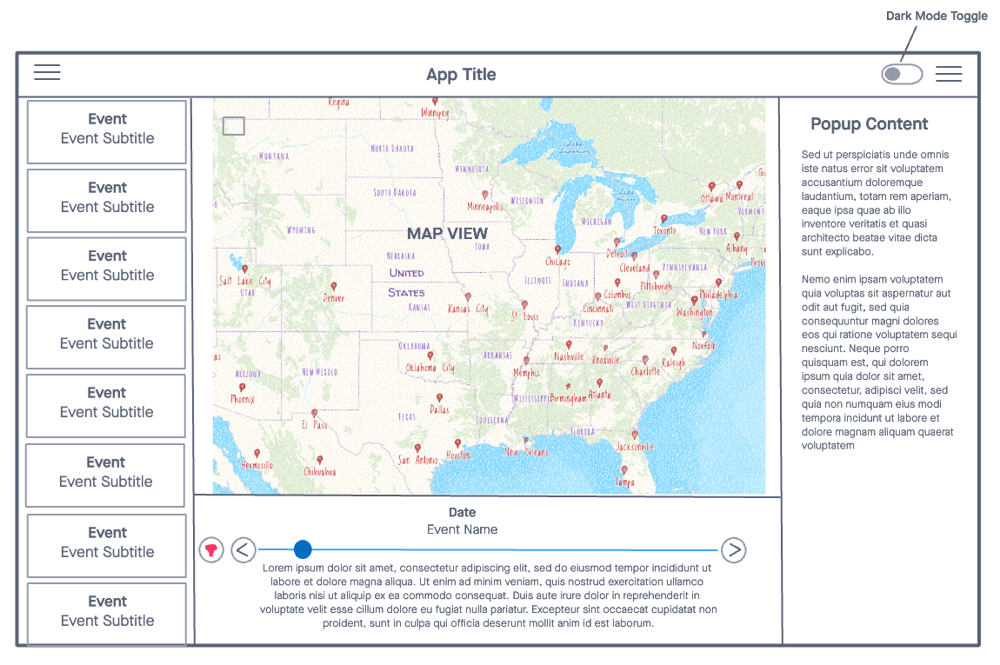

## Creating Configurable Mapping Applications with Vue.js, TypeScript, and the ArcGIS Maps SDK
This repository includes the Workshop Materials for [2023 MN GIS LIS Conference](https://www.mngislis.org/page/2023-workshops). Participants should have the following software installed:

* [Node.js](https://nodejs.org/en) - preferred version is `18.x`, but versions `^14.18 | ^16` will also suffice
  * `npm` version `8.x` is preferred 
* [VS Code](https://code.visualstudio.com/) - the preferred IDE with the following extensions:
  * [Volar](https://marketplace.visualstudio.com/items?itemName=Vue.volar) - the Vue Language Features extension (needed for SFC `.vue` files)
* [Vue.js DevTools](https://devtools.vuejs.org/) - browser extension for inspecting a Vue App and its Components, as well state properties.

### Workshop Abstract

*In this technical workshop, participants will learn how to create configurable mapping applications using Vue.js, TypeScript, and the ArcGIS Maps SDK. Emphasis will be placed on utilizing programming patterns to promote flexibility and reusability, allowing for a common code base with customizable options via configuration files. The workshop will begin with an introduction to the necessary tools and frameworks, including Vue.js, TypeScript, and Vite. TypeScript interfaces will also be covered in detail to ensure proper data types are used. Having prior experience with JavaScript would be beneficial. Upon completion of the workshop, participants will have a solid grasp of creating simple, configurable mapping applications with Vue.js and will be equipped with the skills required to build more intricate applications in the future. Additionally, attendees will receive access to a working example project and comprehensive documentation to reference for their personal projects.*

# Introduction

This workshop will focus on creating a simple, but fully configurable and functional web mapping application that will take the end user through a geographic timeline of events. The configuration options provided will allow for multiple applications with their own look and feel to be deployed using the same code base. Each different application deployment can have its own color theme, map data and widgets, custom splash screen content, and dynamic charts. The source code used for this application will be in [Vue.js](https://vuejs.org/) and [TypeScript](https://www.typescriptlang.org/), however, the programming patterns used can be applied to vanilla JS or any other framework.

### Key Features of Application

The application we will build for this workshop will have the following features:

* support multiple deployments from the same code base via configuration files
  * support custom theme colors
  * point to an [ArcGIS Webmap](https://doc.arcgis.com/en/arcgis-online/reference/what-is-web-map.htm) to decouple mapping layers, popups, and symbology from code
* dark mode toggle
* dynamic ArcGIS Maps SDK Widget loading
* display timeline event list and sync with a slider to allow for easy navigation through timeline events
  * highlight and zoom to timeline events when the current event is changed 

  

### Application Design

With the key features defined, we can conceptualize a simple wireframe for the look and feel of the application:

### Map Data

For this workshop, we will be creating a simple geographic timeline viewer as shown in the wire frame above. Because this has a emphasis on making these highly configurable to support multiple deployments, we can use whatever WebMap and Data we want. The **only** requirement is the WebMap needs to have a layer inside that has features that contain a geometry and a date field for the date of the event. For the workshop, I have set up 3 WebMaps:

* [Civil War Map](https://bmi.maps.arcgis.com/home/item.html?id=246abd2b6b71403b9edbe6538ebc8534) - A map showing Civil War Battles. I made a copy of the data from this [original source](https://www.arcgis.com/home/item.html?id=06d5f638e7cb462f9fe665145755a95a) by [jhughe66_GISandData](https://www.arcgis.com/home/user.html?user=jhughe66_GISandData).
  
  
* [Revolutionary War Map](https://bmi.maps.arcgis.com/home/item.html?id=79cd2fca5b0345f8acbedbd3e53a7116) - A map showing Revolutionary War Battles. I made a copy of this [original source](https://www.arcgis.com/home/item.html?id=c1effa92e3f2476385991d4bf4fc84ee) by [Esri_GeoInquery_History](https://www.arcgis.com/home/user.html?user=Esri_GeoInquiry_History).
  
  
* [Golden State Killer Map](https://bmi.maps.arcgis.com/home/item.html?id=552911b9c87f4ac6b1d40fff31dd4c23) - A map showing the crimes of the [Golden State Killer](https://en.wikipedia.org/wiki/Joseph_James_DeAngelo) throughout California in the 1970s and 1980s. The data was gleaned from the LA Times "[Man in the Window](https://www.latimes.com/projects/man-in-the-window-crime-map-golden-state-killer-serial/)" publication.
  
  

Because the WebMap requirements are so simple, you can choose to use your own WebMaps to create a timeline viewer of any data you want, so long as it has a valid date field. This workshop will demonstrate how to create configurations for multiple deployments so you can easily use your own data.

> note: a timeline viewer may seem like a pretty trivial application, and I would agree that it is. However, the techniques used in this workshop are to demonstrate methods for creating highly configurable applications. By the end of the workshop you will have the knowledge and skills to scale these patterns up for developing more complex applications with much more configurable options.

## Getting Started

This repository has step by step instructions for building this application from start to finish. Each part is broken down into a section and if you follow along, code snippets with explanations will walk you through each part of the application. There are also different branches with the solution for each section so you can `git checkout <section-branch-name>` if you don't want to type out all the code snippets. 

To get started, proceed to [Section 1 - Getting Started](./sections/001-GettingStarted.MD)

#### The completed Application

**TL;DR** - the completed application code can be found [here]().

> note: This workshop material ended up being a little too ambitious for the allotted time, so of the more complex supplemental features have been stripped out as they are outside the scope of this workshop. The following features not considered to be part of the "core" app are only present in the Demo App:
> * Dynamic Widget Loading
> * Splash Screen
> * Configurable Charts

Once you have successfully went through all the sections, you should end up with an app that looks like this: 

one deployment shows civil war battles:

with a splash screen (Demo only):

and charts (Demo Only):

interacting with timeline events:

with filtered events:

light mode: 

Another deployment with crime mapping:

with another splash screen (Demo Only):

chart data summarized by category (Demo Only - crime type by county in this case):

pie chart (Demo Only):

To get started, proceed to [Section 1 - Getting Started](./sections/01-GettingStarted.md)
