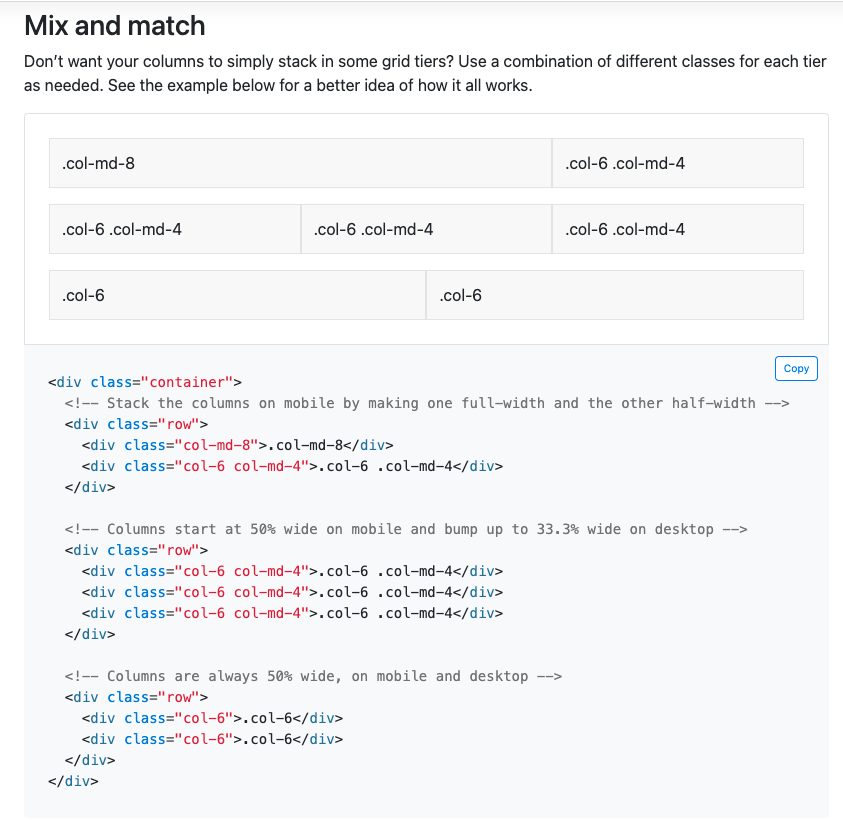

<!-- TOC start (generated with https://github.com/derlin/bitdowntoc) -->

- [Section 1 - Getting Started](#section-1---getting-started)
  - [Initial UI](#initial-ui)
    - [The Application Header Component](#the-application-header-component)

<!-- TOC end -->

<!-- TOC --><a name="section-1-getting-started"></a>
# Section 1 - Getting Started

> note: if you do not want to manually type out all this code, you can just checkout the solution branch by doing:
>  `git checkout 001-getting-started`
> Please note that you will still need to run `npm install` to install the necessary dependencies.


To get started, we will create a new project using the [create-vue](https://github.com/vuejs/create-vue) scaffolding tool. Open up a terminal and navigate to a folder location where you will want to build this application and enter the following command: 

```sh
npm create vue@latest
```

> note: running the `create-vue` command is only necessary if you are building this application **outside** of this repository. I have already ran this command for this repo and the files can be found in the `timeline-mapper` folder. The manual creation step is documented for completeness.

This will take you through some interactive prompts to set up your project. Use the following answers for the prompts:

* `Project Name > timeline-mapper`
* `Add Typescript > Yes` (use arrow key to navigate)
* `Use JSX > No` (this is the default, but if you come from React you may find this more comfortable)
* `Add Vue Router for Single Page Application development > No` - this is useful for creating single page apps, but for our purposes we do not need it here
* `Add Pinia for state management > Yes`
* `Add Vitest for Unit Testing > Yes`
* `Add an End-to-End Testing Solution > No` - this is something you should add for your own projects, but we will not use it here as it is outside the scope of the workshop
* `Add ESLint for code quality > No`


As the prompts say, go ahead and run the commands:

```sh
cd timeline-mapper
npm install
npm run dev
```

You should also open this in VS Code now and make sure you have [Volar (Vue Language Tools Extension)](https://marketplace.visualstudio.com/items?itemName=Vue.volar) installed. 

By default, this will launch at [http://localhost:5173](http://localhost:5173) if port `5173` is open. Go ahead and navigate there now to see the application in action. 

> note: this dev server uses [vite](https://vitejs.dev/guide/), which is a lightning fast dev server with hot module replacement (HMR). Vite was created by [Evan You](https://github.com/yyx990803), who is also the creator of Vue.js. While it initially was created for Vue, `vite` also supports other frameworks such as React, Svelte, SolidJS or even plain old Vanilla JS/TS.

if you see the following app, everything worked successfully.


Next, take a look at the file structure that the `create-vue` has scaffolded out. As shown below, the entry point is the `main.ts` file and it is importing the `App.vue` file which is the root `App` component file.


We do not need any of the existing components that were created so they can be deleted (`HelloWorld.vue`, `TheWelcome.vue`, `WelcomeItem.vue`, and the `__tests__/HelloWorld.spec.ts`). Also, once the components are deleted, the `App.vue` file will throw errors so we should strip down `App.vue` to bare bones:

```vue
<!-- App.vue -->
<script setup lang="ts">
  // typescript code goes here
</script>

<template>
  <!-- template markup will go here -->
</template>

<style scoped>
  /** our root level styles can go here */
</style>
```

Note that this is using the [setup script](https://vuejs.org/api/sfc-script-setup.html) syntax with TypeScript (`lang="ts"`) for Single File Vue Components. This provides us with some powerful Vue Macros to create a rich developer experience. For this app we will be using the [Composition API](https://vuejs.org/guide/typescript/composition-api.html) and [composable functions](https://vuejs.org/guide/reusability/composables.html) pattern which will help break the application up into smaller chunks and make it easy for code reusability and unit testing.

<!-- TOC --><a name="initial-ui"></a>
## Initial UI

There are many UI Frameworks for Vue.js such as [Quasar](https://quasar.dev), [BootstrapVue](https://bootstrap-vue-next.github.io/bootstrap-vue-next/), [Vuetify](https://vuetifyjs.com/en/), [PrimeVue](https://primevue.org/) and many others. For larger production projects, using one of these battle tested UI component libraries can significantly speed things up. However, for this workshop we will not use any specific component library as building things manually will provide a better learning experience. With that being said, we will use the CSS/SCSS of [Bootstrap 5](https://getbootstrap.com/docs/5.0/getting-started/introduction/) on it's own to take advantage of the [grid system](https://getbootstrap.com/docs/5.0/layout/grid/) and some basic styling. 

If we take another look at our wire frame, we want to create a pretty simple layout that has a header, two sidebars and a main content area in the middle:


The Bootstrap Grid System has some nice utility classes that will make this layout easy. Content can be laid out inside of a `container` or `container-fluid` and grouped into rows (horizontal elements) and responsive columns (vertical alignment). Each row can be broken into 12 columns, and you can also specify columns by different breakpoints depending on the device size. 

> note: For this workshop, we are not really going to focus on making this responsive for smaller devices as the purpose is to just demonstrate creating a simple app. However, this can be tweaked fairly easily to be more responsive on smaller devices.

Here is a quick look of the grid system in action:



As you can see in the above example, each row is grouped into different sized columns, but the value is always adding up to `12` to fill the entire width. You do not always have to fill the full width and if the column widths exceed 12, the overflow items will automatically be added to a "new line" within that same row. Based on that knowledge and our wire frame, we will want to use 3 columns. But first, we need to install bootstrap:

```sh
npm i bootstrap
```

We are also going to be using Sass/SCSS so we need to install `sass` as a dev dependency

```sh
npm i -D sass
```

If you look inside the `src/main.ts` file, it is importing `./assets/style.css`. This is another file we do not need. In fact, we should remove all the files in the `src/assets` folder and start new. We are going to instead use a "style`.scss`" file and place it in a new folder called `styles` inside the `src/assets` folder (full path being `src/assets/styles/style.scss`). To clean out the `src/assets` folder and add the new styles:

```sh
rm -rf src/assets/*
mkdir src/assets/styles && touch src/assets/styles/style.scss
```

For now, all we will do in this file is bring in the `bootstrap` css:

```scss
// src/assets/styles/style.scss
// Import all of Bootstrap's CSS
@import "~bootstrap/scss/bootstrap";
```

Save the `styles.scss` file and f your dev server is not still running, make sure it is by doing `npm run dev`. You should see an error after `vite` does its hot module replacement:


This is stating the obvious, but `vite` is complaining because it cannot find the `bootstrap` scss source files because the path `~bootstrap` does not exist because the source files reside in the `node_modules/bootstrap` folder. In this case, we can add a [path alias in vite](https://vitejs.dev/config/shared-options.html#resolve-alias) for `node_modules/bootstrap`, however, to make this work it needs to be registered with the vite config. Fortunately, this is an easy step. In the root directory of the project, find the `vite.config.ts` file open it in VS Code. Here, we need to import the `path` module (line 4) to make a path alias to the `node_modules/bootstrap` folder (line 14).

```ts
// vite.config.ts
import { fileURLToPath, URL } from 'node:url'
import { defineConfig } from 'vite'
import vue from '@vitejs/plugin-vue'
import path from 'path'

// https://vitejs.dev/config/
export default defineConfig({
  plugins: [
    vue(),
  ],
  resolve: {
    alias: {
      '@': fileURLToPath(new URL('./src', import.meta.url)),
      '~bootstrap': path.resolve(__dirname, 'node_modules/bootstrap'),
    }
  }
})
```

Once you save that, the error should go away because `vite` now knows how to find the bootstrap source files within the `node_modules` folder. While we are in this file, some other things to note is that `vite` is using the `@vitejs/plugin-vue` plugin for building and running the Vue app. There was also already another path alias of `@` which provides a nice shorthand way to import any files relative to the `src` folder (line 13). That will come in handy in a bit when we start creating new files.

Now that our `src/assets/styles/style.scss` file is working properly, we can set up the basic skeleton for our app with our three columns to match the wireframe. Go back to the `App.vue` file and update the empty `<template>` tag to contain: 

```html
<template>
  <div class="app container-fluid">
    <!-- header -->
    <div class="row">
      <div class="col px-0">
        header
      </div>
    </div>

    <div class="row">
      <!-- left panel -->
      <div class="col-md-2 border">
        sidebar
      </div>

      <!-- main section -->
      <div class="col-md-8 border">
        main content
      </div>
      
      <!-- right panel -->
      <div class="col-md-2 border">
        sidebar
      </div>
    </div>
  </div>
  
</template>
```

Here we have defined a root element with the `container-fluid` class to make a responsive bootstrap grid container that will take up the entire width (regular `container` has some extra padding) and we have defined two `rows`. The first row will contain just one column which will render the app header, and the second row is the main focus which has our 3 columns. Once this file is saved, the app should look like this (*please ignore the absurd amount of tabs that are open* 🤦‍♂️): 


Here we have a layout, but it still isn't quite right. We want the main row to take up the rest of the space from the header down to the bottom of the page. We can see our column widths seem appropriately sized though if you are on a larger screen (we will account for some responsive screen size issues soon). Now what we should so is add some height to both the header row and the main content area. A standard header `height` that is commonly used is `50px`. We will use that for the header height and can make a simple calculation to set the height for the main area row. These standard sizes are something that will be useful in other parts of the app, so we can make some scss variables for easy reusability. In the `src/assets/styles` folder, create another file called `_variables.scss` (shell code: `touch src/assets/styles/_variables.scss`) and add the following code:

```scss
// src/assets/_variables.scss
/** height of our navbar header */
$navbar-height: 50px;

/** maximum height for any container, anything beyond this will overflow */
$max-height: calc(100vh - $navbar-height);

/** maximum height for any content, this will take up almost all
 * the height but leaves an extra 10px to leave a little padding
 */
$max-content-height: calc(100vh - 60px);
```

We are using the following CSS Units here:
* `vh` - 1 percent of the view height
* `px` - 1 pixel

Save this file and go back to `App.vue` and add a `<style>` tag at the bottom. As discussed in the lecture, Vue Single File Components (SFC) can contain the markup, script, and style all in one file which is convenient for isolating functionality. Add the following code:

```html
<!-- src/App.vue -->
<style lang="scss">
@import "@/assets/styles/variables";

.sidebar {
  height: $max-height;
}

.app-navbar {
  height: $navbar-height;
}
</style>
```

Also, update the `class` on line 8 to add the new `app-navbar` class we just created:

```html
<div class="row app-navbar">
```

The first thing to note is we are creating a `style` tag and specifying the language to be `scss` (`lang="scss"`). Next, we are importing the variables file we just created (sass will interpret `variables` as our `_variables.scss` file automatically) and creating a class for the `sidebar` and the `app-navbar`. These classes will just set the initial height of our elements. Finally, we added the`app-navbar` to the `row` that will contain the header to make sure it is set to `50px`. The full `App.vue` component code should now look like this:


> note: you do not have to use `<style>` within the `.vue` files. There is nothing stopping you from having a global css/scss/sass file to style everything. Having the style with each component does provide a nice way to separate concerns and you can also use [scoped css](https://vuejs.org/api/sfc-css-features.html#scoped-css), where the css is limited to the scope of the component itself.

Now save the changes and the app skeleton should now look like this:


<!-- TOC --><a name="the-application-header-component"></a>
### The Application Header Component

Now that we have a basic app skeleton to work with, we can create our first component which will be a simple application header. Create a component called `AppHeader.vue` inside the `src/components` folder:

```sh
touch src/components/AppHeader.vue
```

Add the following code:

first the `<script>` tag (we'll add more to this soon):

```vue
<!-- src/components/AppHeader.vue -->
<script lang="ts" setup>

</script>

<template>
  <header>
    <nav class="navbar app-navbar bg-primary">
      <div class="container-fluid">
        <span class="float-right d-flex justify-content-between mt-1">
          <!-- placeholder for left drawer collapse icon -->
        </span>
        <span class="navbar-brand mb-0 h1 text-light">Timeline Mapper</span>
        
        <span class="float-right d-flex justify-content-between mt-1">
           <!-- placeholder for right drawer collapse icon and dark mode toggle -->
        </span>
      </div>
    </nav>
  </header>
</template>
```

In the steps above, we just added an empty script tag and set the language to TypeScript. Next, we added a new `header` element and added some Bootstrap 5 nav classes to render how we want. We are using another nested `container-fluid` element and within that adding placeholders for buttons on the top left and right using `<span>` elements and `d-flex` (shorthand for display flex) for setting [simple flexbox properties](https://css-tricks.com/snippets/css/a-guide-to-flexbox/). We have also placed the app title in a `<span>` in the middle and added the `h1` class, which will apply default bootstrap styling for an `h1` (header 1) element. The `bg-primary` class was also added to the navbar to give it the default primary background color. We also added a hardcoded temporary title of "Timeline Mapper". This is just a placeholder for now as things like application title and color schemes will be configurable for each deployment. Save this file.

Next, we can bring the `AppHeader.vue` component into our `App.vue`. To do this, we simply import it and reference it in the `<template>`:


We were able to `import AppHeader from '@/components/AppHeader.vue'` using the relative path shortcut beginning with `@` because of the path alias provided in the `vite.config.ts` that we covered earlier, which was already scaffolded out for us from the `create-vue` tool. Next, we just replaced the "header" placeholder text with the instance of the `AppHeader` component. 

One **important** thing to note here, is that we imported the component as the name `AppHeader`. In our markdown, we could have also used `<app-header />` as well. This is because one shortcut that Vue will provide automatically is to allow anything that is `PascalCase`, to be aliased with as all lower case using dashes to separate each word (i.e. as `kebab-case`). In SFCs, it is recommended to use `PascalCase` tag names for custom components to differentiate from native HTML elements. This same thing also works for properties that get passed to components. Another shorthand is that components that do not have slots, i.e. do not inject any content inside the tag itself, is you can add self closing tags. So instead of `<AppHeader></AppHeader>` or `<app-header></app-header>` , you can add self closing tags by doing `<{name} />`, which in our case we just did  `<AppHeader />`. Once you save and the app is reloaded, it should look like this:


Things are starting to come together! If we refer back to the wireframe, we also need to add some buttons to the header. These will allow us to do things like collapse the side panels and also toggle dark mode. However, this is where we should take a step back and think about how to handle this from application architecture standpoint. Properties such as the state of side panels being open/closed and the overall application theme (`dark` or `light` mode) are probably things that need to be accessible across the entire app. To accomplish this, we should look into creating a shared state with [pinia](https://pinia.vuejs.org/). However, this is a good stopping point for the first section. Proceed to [Section 2](./02-CreatingApplicationState.md) where we will learn to set up a `pinia` store.

