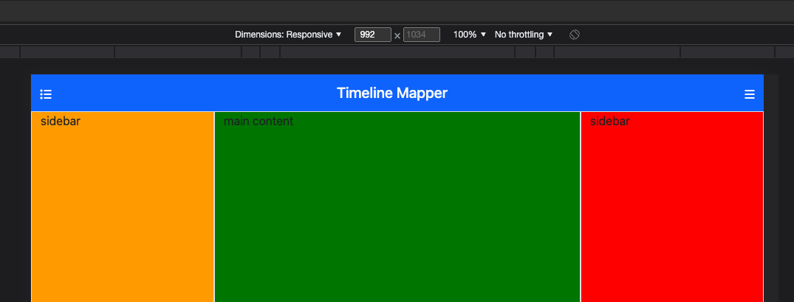

<!-- TOC start (generated with https://github.com/derlin/bitdowntoc) -->

- [Section 2 - Creating Application State](#section-2---creating-application-state)
  - [A little about pinia...](#a-little-about-pinia)
  - [Defining a Pinia Store](#defining-a-pinia-store)
    - [Our App State](#our-app-state)
  - [Adding our Panel Buttons](#adding-our-panel-buttons)
    - [Accessing our Pinia Stores](#accessing-our-pinia-stores)
    - [Wiring up the panel collapse behavior](#wiring-up-the-panel-collapse-behavior)
    - [Tracking the Device Size](#tracking-the-device-size)
- [Making the Panels and Main Content Responsive](#making-the-panels-and-main-content-responsive)
    - [Adding Dark Mode Support (just the UI for now)](#adding-dark-mode-support-just-the-ui-for-now)
- [Optional - Supplemental Content](#optional---supplemental-content)
    - [Adding Tooltips](#adding-tooltips)
      - [Console Cleanup](#console-cleanup)

<!-- TOC end -->

<!-- TOC --><a name="section-2-creating-application-state"></a>
# Section 2 - Creating Application State

> note: if you do not want to manually type out all this code, you can just checkout the solution branch by doing:
>  `git checkout 002-creating-application-state`

<!-- TOC --><a name="a-little-about-pinia"></a>
## A little about pinia...

First things first, using a `pinia` store for state management IS NOT a requirement. In fact, the way Vue3 was created isolated the reactivity functionality so the developer can have fine grained control over things that need to be reactive and things that can be static. In Vue2, reactivity was only possible in the scope of components or in the app initialization scope. To save global state in Vue2, the [Vuex](https://vuex.vuejs.org/) library was commonly used.

While Vuex was useful for handling issues in Vue2, it was also verbose and not super developer friendly. One nice feature it did provide though was a timeline of state updates in the [Vue.js Dev Tools](https://devtools.vuejs.org/). For Vue3, the dev tools also allow you to inspect a pinia store's history, to see all changes to the state with timestamps. With that being said, storing global state properties in a `pinia` store is simply a convenience and useful for debugging state changes or organizing stores/grouping state in one place. But, you can accomplish pretty much everything you can in `pinia` using the fine grained reactivity in Vue by itself through the Composition API patterns, but without the dev tools history inspection.

With that out of the way, we will create a `pinia` store to share some application state. When creating a store, you can use the same declarative syntax as the Vue Composition API or they also provide an "Options style" way to do it which would look very familiar to Vuex users. The Composition API syntax provides numerous improvements over the Options API style so we'll stick with that.

<!-- TOC --><a name="defining-a-pinia-store"></a>
## Defining a Pinia Store

One thing the `create-vue` tool did when scaffolding out the project, is we did tell it to create a `pinia` store for state management. With Pinia, you can define as many stores as you want, and they are typically driven by the category of state you are creating. The generic example that was created with our app is in the `src/stores/counter.ts` file. This looks like a regular Vue Composable function, the only real difference is the composable function is wrapped in the [defineStore()](https://pinia.vuejs.org/api/modules/pinia.html#defineStore) function from `pinia`. The `counter.ts` should contain something like this:

```ts
import { ref, computed } from 'vue'
import { defineStore } from 'pinia'

export const useCounterStore = defineStore('counter', () => {
  const count = ref(0)
  const doubleCount = computed(() => count.value * 2)
  function increment() {
    count.value++
  }

  return { count, doubleCount, increment }
})
```

If you are familiar with Vuex or Pinia (the Options style), the `count` ref becomes a `state` property, the `computed` `doubleCount` will become a `getter`, and the `increment` function will become an `action`. The composition API is less code and easier to read and write, but to demonstrate an options API style store, the code would look something like this:

```ts
import { defineStore } from 'pinia';

export const useCounterStore = defineStore('counter', {
  state: ()=> ({
    count: 0
  }),

  getters: {
    doubleCount: (state)=> state.count * 2
  },

  actions: {
    increment() {
      /** in the scope of an action, we need to use "this" to 
       * access the state and cannot use an arrow function!
       */
      this.count++
    }
  }
})
```

As you can see, the Composition API is much shorter and more elegant. The cool thing is that TypeScript will automatically infer the store's `state`, `getters`, and `actions` based on the reactivity type. This is because when Vue3 was created, it was created from scratch with TypeScript and has very good TypeScript inference support because TS is now a first class citizen in Vue3.

The Options Style inference:


There appears to be a little more Voodoo under the hood for inferring the Composition API types, but you'll get intellisense that is just as helpful:


<!-- TOC --><a name="our-app-state"></a>
### Our App State

Ok, now that we have all that out of the way we can think about the state that *this app* needs to store. Some initial things are the left and right panel states (open or closed) and the theme (`light` or `dark`). Before creating a store, we should start creating some typings that will be used throughout the app to promote more stable code. Inside the `src` folder, create a new `types` folder and within that create an `index.ts` and an `app.ts` file:

```sh
mkdir src/types
touch src/types/index.ts src/types/app.ts
```

Inside the `src/types/app.ts` add a type for the theme:

```ts
// src/types/app.ts

/**
 * the app theme type, can be light or dark
 */
export type ThemeType = 'light' | 'dark'
```

Because we will be creating other typings files, we can make things easier for ourselves by making the `types` itself behave like a regular package so we can import all types from `@/types`. To do this, in the `src/types/index.ts` we can export everything from `app.ts`:

```ts
// src/types/index.ts

export * from './app'
```

Save those two files and now we can go into the `src/store` folder and add a new file called `app.ts`. Here is where we will define our initial app state store:

```ts
// src/stores/app.ts
import { defineStore } from "pinia"
import { ref, computed } from 'vue'
import type { ThemeType } from "@/types"

export const useAppStore = defineStore('app', ()=> {
 
  /**
   * will be true if the app is dark mode
   */
  const darkMode = ref(false)

  /**
   * state for the left panel, true when open
   */
  const leftPaneOpen = ref(true)

  /**
   * state for the left panel, true when open
   */
  const rightPaneOpen = ref(true)

   /**
   * the current theme for the app
   */
  const theme = computed<ThemeType>(()=> darkMode.value ? 'dark': 'light')

  /**
   * will toggle a panel in open or closed state, depending on the current open state
   * @param panel - the panel side to toggle
   * @returns the current state of the panel (true is open, false is closed)
   */
  const togglePanel = (panel: 'left' | 'right') => {
    const target = panel === 'left' 
      ? leftPaneOpen
      : rightPaneOpen
    target.value = !target.value
    return target.value
  }

  return {
    theme,
    darkMode,
    leftPaneOpen,
    rightPaneOpen,
    togglePanel
  }
})
```

What we have defined here is a simple store that tracks the state of the left and right panel being open via the `leftPaneOpen` and `rightPaneOpen` refs which are `boolean` types. We have also included a `togglePanel` function that will toggle the visibility of the selected panel. Finally, we are tracking another state variable called `darkMode` which is set to `true` if the app is in dark mode. We are also exposing a computed property called `theme` which will update whenever the `darkMode` changes and will be `dark` when `darkMode` is `true`, or `light` when `darkMode` is `false`. 

<!-- TOC --><a name="adding-our-panel-buttons"></a>
## Adding our Panel Buttons

The `app` store properties we just defined are all important to our `AppHeader` component, but by exposing them in a store will make the functionality to expand/collapse the side panels or change to `darkMode` available everywhere in our app. Now that we are tracking this state, we can implement the UI. Let's refer back to the wireframe again:


We want to add hamburger buttons on each side to control the panel visibility and also add a dark mode toggle to allow the user to switch between light or dark mode. We can use the freely available icons from [font awesome](https://fontawesome.com/). This library provides icons with options at a free or paid tier. The free tier icons suffice in most cases and will provide everything we need for this app. In addition to the icons, they also provide an [svg-core](https://fontawesome.com/docs/web/dig-deeper/svg-core) package that allows you to register only the icons you are using in your app to provide better [tree-shaking](https://developer.mozilla.org/en-US/docs/Glossary/Tree_shaking) for the build of your app instead of shipping all of font awesome in the app bundle. There are also helper libraries for the popular frameworks, including Vue. the `@fortawesome/vue-fontawesome` is a small library that includes a Vue component for a font awesome icon. To install what we need from font awesome, run the following command:

```sh
npm install @fortawesome/fontawesome-svg-core @fortawesome/free-solid-svg-icons @fortawesome/vue-fontawesome@latest-3
```

Now that font awesome is installed, we should utilize a couple [icons](https://fontawesome.com/icons). In our wireframe mockup, both the left and right side have a hamburger style icon for controlling the visibility of the panels. However, for the left icon, because the left panel will be rendering a list of timeline events, perhaps the [list icon](https://fontawesome.com/icons/list?f=classic&s=solid) is more appropriate:


The documentation is helpful in that it even provides the `vue-fontawesome` implementation. But before we can use it, we need to register the font awesome vue component with our app. Since this is a fairly generic component that could be used all over the app, it is best to register the component globally which can be accomplished in the `main.ts` file. Here we just need to import the component and register it:

```ts
// main.ts
import { createApp } from 'vue'
import { createPinia } from 'pinia'
import { FontAwesomeIcon } from '@fortawesome/vue-fontawesome'
import App from './App.vue'

const app = createApp(App)

app
  // use the pinia plugin
  .use(createPinia())
  // register font awesome component globally
  .component('font-awesome-icon', FontAwesomeIcon)

app.mount('#app')
```

Once the `FontAwesomeIcon` component is imported, we registered it globally by calling `app.component('<component-tag-name>, Component')` method. Note that the `app.use()` (register a plugin) method or the `app.component()` (register a component) method can be chained because these always return the app instance object. Now that font awesome is ready to be used in our app, we should take advantage of the `svg-core` package so we can register only the components we will be using to keep the build size as small as possible. To do this, create a new folder in the `src/assets` folder called `font-awesome` and add an `index.ts` file:

```sh
mkdir src/assets/font-awesome && touch src/assets/font-awesome/index.ts
```

Then inside the file, we can import just the icons we need. This list will grow as we build other parts out of the app:

```ts
import { library } from '@fortawesome/fontawesome-svg-core';

import { 
  faBars, 
  faCircleHalfStroke, 
  faList,
  
} from '@fortawesome/free-solid-svg-icons'

const faIcons = [
  faBars,
  faList,
  faCircleHalfStroke,
]

for (const icon of faIcons){
  library.add(icon)
}
```

This can be a little tricky, but finding the correct icons by the named export usually align with the icon name. For example, in the earlier screenshot we want to use the `list` icon which seems to have a named export of `faList`. I have found the easiest solution is to just start typing `import { fa<iconName> } from '@fortawesome/free-solid-svg-icons'` and let the auto complete of intellisense help me find the correct icons. So here we are importing 3 icons, the `list` for our left panel state, the `bars`, for the right panel state, and I also found the `circle-half-stroke` icon which will be a good visual for dark mode. These are then put into an array called `faIcons` so it can be iterated over to register each icon with the library for tree shaking. This list will only get bigger as we add more icons. Save that file and now we should import it into our `App.vue` file right above the import of the `style.scss` file:


Save the `App.vue` file and now we can add the icons into the `AppHeader`
component. Before we add the icons to the `template`, we should think about the behavior of the buttons first. When we click on the sidebar icons, they should toggle the visibility state of the panels. Since we defined that logic in our `app` store, we can bring in that to the `AppHeader` component. In the `<script>` tag we need to first import the store:

```html
<script lang="ts" setup>
import { useAppStore } from '@/stores';
</script>
```

<!-- TOC --><a name="accessing-our-pinia-stores"></a>
### Accessing our Pinia Stores

One thing to know about using a pinia store, is you can use the entire `appState` object that is returned from the store like this:


or, you can destructure the state to access the properties that were returned by the store (or exposed via the options style):


At first glance from a typings perspective, this looks good because it is inferring the `rightPaneOpen` property as a `boolean`. However, this introduces on major caveat: those properties are static when destructured like this. The `togglePanel` is fine, because that is a function whose memory reference or value won't change. In our store definition, we defined the `leftPaneOpen`, `rightPaneOpen` and `darkMode` as refs with `boolean` types, which is inferred as `Ref<boolean>`, marking these properties are reactive. Because the pinia store returns a regular [reactive](https://vuejs.org/api/reactivity-core.html#reactive) object for the state, destructuring like this will get the values at the static state, i.e. what those values were at the time of the property destruction. 

in the first example when we do `const appState = useAppStore()`, the `appState` object is relative and accessing `appState.leftPaneOpen` **will always** give you the current value of the reactive property. But, if you wish to use property destructuring, pinia does provide a way to do that using the [storeToRefs](https://pinia.vuejs.org/api/modules/pinia.html#storeToRefs) function. This **will allow** to destructure the properties as reactive so accessing them will give you the current value:


Notice this time that the `rightPaneOpen` is properly inferred as a reactive `boolean` ref (with type `Ref<boolean>`) thus ensuring you are getting the current value. One other important distinction to make is that the `storeToRefs` will only allow you to destructure the reactive props, i.e. things wrapped in `ref`, `shallowRef`, `reactive` and `shallowReactive`. So if we want to use the `togglePanel` and destructure those values you could do something like this:


In this example, I am creating a variable to hold the entire app store as `appStore`, passing that into the `storeToRefs` to destructure the `leftPaneOpen` and `rightPaneOpen` so we can have those reactive properties, and then because `togglePanel` is just a function, we can do a normal destructure. We also could have done `const togglePanel = appStore.togglePanel` or when we need to use that function just do `appStore.togglePanel('left')`. As you can see, there are a lot of different ways you can do this. Personally, I only destructure if the store is large and is holding a lot of state and in that case you can just pick out the properties you want to work with. Otherwise, if the store is fairly small which our current `app` store is, we can just use the `appStore` directly.

In our case, we really just need to use the `togglePanel` to allow the buttons we are going to create to expand or collapse the side panels. We also need to access the `darkMode` property, so that we can add a toggle switch that will enable dark mode. Let's update the script to use the app store:

```html
<script lang="ts" setup>
import { useAppStore } from '@/stores';
const appStore = useAppStore()
</script>
```

Still inside the `AppHeader` component, update the `<template>` to add the icons we registered earlier with font awesome to represent our panel buttons:

```html
<template>
  <header>
    <nav class="navbar app-navbar bg-primary">
      <div class="container-fluid">
        <span class="float-right d-flex justify-content-between mt-1">
          <font-awesome-icon 
            icon="fa-solid fa-list"
            color="white"
            @click="appStore.togglePanel('left')"
          />
        </span>
        <span class="navbar-brand mb-0 h1 text-light">Timeline Mapper</span>
        
        <span class="float-right d-flex justify-content-between mt-1">
          <font-awesome-icon 
            icon="fa-solid fa-bars"
            color="white"
            @click="appStore.togglePanel('right')"
          />
        </span>
      </div>
    </nav>
  </header>
</template>
```

Here we added two `<font-awesome-icon>` components and added a `@click` handler to toggle the panel visibility state when they are clicked. Because we registered the `FontAwesomeIcon` component globally in our `main.ts` file, we did not have to import it into this file nor will we anywhere else in our app because it is automatically available everywhere. Now we can save this file and take a look at the app:


Nice, our buttons are there but when we click on them nothing happens! That is because our `togglePanel()` function only changes the values of the `leftPaneOpen` and `rightPaneOpen` to `true` or `false`. 

<!-- TOC --><a name="wiring-up-the-panel-collapse-behavior"></a>
### Wiring up the panel collapse behavior

To actually implement the panel expand and collapse behavior, we should conditionally render the panels using `v-if` inside our `App.vue` file. Let's do that now. 

Go into the `App.vue` and update the `script` tag to bring in our `app` store:

```html
<script setup lang="ts">
import "@/assets/font-awesome"
import "@/assets/styles/style.scss"
import { useAppStore } from "./stores";
import AppHeader from '@/components/AppHeader.vue'
const appStore = useAppStore()
</script>
```

And now, let's update the template to add the `v-if` statements. Also, just to help us visualize panels better, we will temporarily add some hard coded styles in each panel to add some background color.

```html
<template>
  <div class="app container-fluid">
    <!-- header -->
    <div class="row app-navbar">
      <div class="col px-0">
        <AppHeader />
      </div>
    </div>

    <div class="row">
      <!-- left panel -->
      <div 
        v-if="appStore.leftPaneOpen" 
        class="col-md-2 border sidebar" 
        style="background-color: orange;"
      >
        sidebar
      </div>

      <!-- main section -->
      <div 
        class="col-md-8 border" 
        style="background-color: green;"
      >
        main content
      </div>
      
      <!-- right panel -->
      <div 
        v-if="appStore.rightPaneOpen" 
        class="col-md-2 border sidebar" 
        style="background-color: red;"
      >
        sidebar
      </div>
    </div>
  </div>
  
</template>
```

Once you save, the app should look like this:


That is nice and colorful and things look good, but what happens when we actually click the buttons?


Oof, that is not what we want at all. There are a couple issues here. The first is that we have hard coded the column classes for the grid system, with each of the panels being set to `col-md-2` and the main content set to `col-md-8`. This works nicely when all three panels are open because the values add up to 12 (`2 + 8 + 2`), but when one or both panels are collapsed the main content is still set to 8 columns wide, thus not stretching. Another issue is that we only set the height for the `sidebar` class to be the `$max-height` variable, so when at least one panel is open the main content stretches vertically to match the width of the sidebar. Rather than setting the height for the panels, we should just change the `sidebar` class to something like `main-content` and instead apply that to the parent row, so that way the row itself is at maximum height.

Let's tackle the column width problem first. One solution here is to use variable widths for the elements, or because we are using the grid system already, we can dynamically update the column width classes based on the number of panels that are open. Basically, as panels expand and collapse, we want to ensure the remaining visible columns are taking up the full width of 12 columns. Since the main content column will **always** be visible, we know that the column width at minimum should be 8 when both panels are expanded, or at 10 when either the left or right panel is expanded, or take up the full 12 column width if both columns are collapsed. One other assumption I made is that a column width of 2 for the side panels will look good on smaller devices, smaller in this case meaning something like a 13 inch laptop or a tablet, phones would likely need a different layout all together.


with these panels currently not having much for content, they do not look too small (and this screenshot isn't really doing it justice). However, once we add content they will look a bit awkward. Maybe column widths of 2 for the panels only works well for devices wider than `1200` pixels, which is the bootstrap breakpoint for the `extra large` category, which really isn't that large. For devices with a width less than `1200` pixels (i.e. the "medium" devices), let's try setting the panel widths to 3 columns and the default width for the main panel would be 6. 

<!-- TOC --><a name="tracking-the-device-size"></a>
### Tracking the Device Size

To start, we will want to track the window size and ideally have that be reactive for the cases where someone is viewing the app on a tablet where the orientation can change. While this is pretty straightforward to do with Vue, there is a great library called [vueuse](https://vueuse.org/) that has many composables for common tasks. One that is of particular use is the [useWindowSize](https://vueuse.org/core/useWindowSize/), which will give us reactive properties tracking the width and height of the browser window, and more importantly update when the orientation changes. Let's install this library so we can use the window size helpers:

```sh
npm i @vueuse/core
```

So now that we have an easy way to track the window size, do you know a good way to handle handle the main content column width? How about with a [computed](https://vuejs.org/api/reactivity-core.html#computed) property. Before we jump right in, let's take a step back and think about device size properties. This sounds like something that would be useful to know anywhere in our app. Taking that a step further, it may also be useful to track whether the device is in portrait or landscape mode and even the device size according to the bootstrap breakpoints:


Since this is information that could be useful in multiple places, rather than limiting it to the `App.vue` component, we should track this info as part of our existing `app` store. But first, we should add a typing for device orientation that is either `"portrait" | "landscape"`. Let's add this type to our `src/types/app.ts` file:

```ts
// src/types/app.ts
/**
 * the app theme type, can be light or dark
 */
export type ThemeType = 'light' | 'dark'

/**
 * the device orientation types
 */
export type DeviceOrientation = 'portrait' | 'landscape'
```

Now we can reference this new `DeviceOrientation` typing in our `app` store and add some helpful state properties. Open up the `src/stores/app.ts` and make the following tweaks:

```ts
// src/stores/app.ts
import { defineStore } from "pinia"
import { ref, computed } from 'vue'
import { useWindowSize } from '@vueuse/core'
import type { ThemeType, DeviceOrientation } from "@/types"

export const useAppStore = defineStore('app', ()=> {

  const { width, height } = useWindowSize()
 
  /**
   * will be true if the app is dark mode
   */
  const darkMode = ref(false)

  /**
   * state for the left panel, true when open
   */
  const leftPaneOpen = ref(true)

  /**
   * state for the left panel, true when open
   */
  const rightPaneOpen = ref(true)

   /**
   * the current theme for the app
   */
  const theme = computed<ThemeType>(()=> darkMode.value ? 'dark': 'light')

  /**
   * will toggle a panel in open or closed state, depending on the current open state
   * @param panel - the panel side to toggle
   * @returns the current state of the panel (true is open, false is closed)
   */
  const togglePanel = (panel: 'left' | 'right') => {
    const target = panel === 'left' 
      ? leftPaneOpen
      : rightPaneOpen
    target.value = !target.value
    return target.value
  }

  /**
   * the device orientation
   */
  const orientation = computed<DeviceOrientation>(()=> height.value > width.value ? 'portrait': 'landscape')
  
  // the below properties are based exclusively on the width
  /**
   * will be true when it is a small device (the width is < 577 pixels)
   */
  const isSmallDevice = computed(()=> width.value < 577)

  /**
   * will be true when it is a medium sized device (the width is between 576 and 992 pixels)
   */
  const isMediumDevice = computed(()=> width.value > 576 && width.value < 993)

  /**
   * will be true when it is a large sized device (the width is > 992 < 1201 pixels)
   */
  const isLargeDevice = computed(()=> width.value > 992 && width.value < 1201)

  /**
   * will be true when it is a large sized device (the width is > 992 pixels)
   */
  const isExtraLargeDevice = computed(()=> width.value > 1200)

  return {
    theme,
    width,
    height,
    orientation,
    isSmallDevice,
    isMediumDevice,
    isLargeDevice,
    isExtraLargeDevice,
    darkMode,
    leftPaneOpen,
    rightPaneOpen,
    togglePanel
  }
})
```

Ok, so we did a lot of things here. But the first thing to note is we are importing the  `useWindowSize` composable from `@vueuse/core` and using and exporting the `width` and `height` properties within our store. Those will already come in as `Ref<number>` types, so nothing special we need to do from a reactivity standpoint there. Next, we defined a bunch of computed properties. The first is to track the device orientation, which will be `landscape` if the width is greater than the height, or `portrait` if the height is greater than the width. If by chance the device is a square, it will assume `landscape`. Finally, we just created a bunch of convenience properties to let us know which bootstrap breakpoint we are working with.

<!-- TOC --><a name="making-the-panels-and-main-content-responsive"></a>
# Making the Panels and Main Content Responsive

Now that we have these helpful properties, let's try them out in the our `App.vue` file. Since we can use conditional column width classes for the panels based on the breakpoints, we can simply assign the classes for the side panel columns to be `"col-md-3 col-xl-2"` so that any device whose width is between 720 and 1200 pixels will get assigned a column width of 3, and larger devices will use a column width of 2.

The tricky part is how to treat the main content column. For medium devices, it needs to be 6 if both side panels are open, 9 if only one panel is open, or 12 if none are open. On larger devices, it should be 8, 10 or 12 based on the same conditions. So with that knowledge our equation is:

```py
mainContentCols = 12 - (numOpenCols * panelWidth)
```

where:

* `numOpenColumns` is the number of expanded columns (1 or 2), and the
* `panelWidth` will be 3 for medium devices or 2 for larger devices
* `mainContentCols` is the resulting column width for the main content based on the prior conditions and device size

For really small devices, we won't even expose the panels as there isn't enough screen real estate. Ok, so now that we know the plan we can implement it. 

But first we should consider if we really need to calculate the number of columns for the main content. This seems overly complicated and perhaps there is the better way. Fortunately, there is because the grid system also supports a very powerful class called `col` which can stretch automatically to fill space up to the 12 column size limit:


Let's go back into our `App.vue` and update the `template`:

```html
<template>
  <div class="app container-fluid">
    <!-- header -->
    <div class="row app-navbar">
      <div class="col px-0">
        <AppHeader />
      </div>
    </div>

    <div class="row main-content-row">
      <!-- left panel -->
      <div 
        v-if="appStore.leftPaneOpen && !appStore.isSmallDevice" 
        class="col-md-3 col-xl-2 border sidebar" 
        style="background-color: orange;"
      >
        sidebar
      </div>

      <!-- main section -->
      <div 
        class="col"
        style="background-color: green;"
      >
        main content
      </div>
      
      <!-- right panel -->
      <div 
        v-if="appStore.rightPaneOpen && !appStore.isSmallDevice" 
        class="col-md-3 col-xl-2 border sidebar" 
        style="background-color: red;"
      >
        sidebar
      </div>
    </div>
  </div>
  
</template>
```

And that is all there is to it. For the two side panels we added an extra check to not show panels at all if it is a small device and we were able to hardcode the breakpoint dependent column widths as `"col-md-3 col-xl-2"`. For the main content column, we were able to use the `col` class to automatically stretch to the  appropriate column width. One other thing you may have not noticed is we added a `main-content-row` class to the main content row. We can simply rename our previously defined `.sidebar` class to `.main-content-row` in the `<style>` tag so the entire row takes up the full height minus the app header:

```html
<style lang="scss">
@import "@/assets/styles/variables";

.main-content-row {
  height: $max-height;
}

.app-navbar {
  height: $navbar-height;
}
</style>
```

> note: I left the "sidebar" class in each of the panels even though there is no css definition for it at the moment.

Go ahead and save all the files and try it out:



And for a larger screen (1200 pixels wide):


And now if we watch it in action, things should be looking much better:


Now that we have this working correctly, we need to go back and address our `AppHeader` component. Since we won't be using the side panels for small devices, we should only show the panel buttons if we are on medium or larger devices. We also still need to add our dark theme toggle button. Inside the `AppHeader` component, make the following changes to the `template`:

```html
<!-- AppHeader.vue -->
<template>
  <header>
    <nav class="navbar app-navbar bg-primary">
      <div class="container-fluid">
        <span class="float-right d-flex justify-content-between mt-1">
          <font-awesome-icon 
            v-if="!appStore.isSmallDevice"
            icon="fa-solid fa-list"
            color="white"
            @click="appStore.togglePanel('left')"
          />
        </span>
        <span class="navbar-brand mb-0 h1 text-light">Timeline Mapper</span>
        
        <span class="float-right d-flex justify-content-between mt-1">
          <font-awesome-icon 
            v-if="!appStore.isSmallDevice"
            icon="fa-solid fa-bars"
            color="white"
            @click="appStore.togglePanel('right')"
          />
        </span>
      </div>
    </nav>
  </header>
</template>
```

Here we have just added the same `v-if` statement to hide these buttons if it is a small device. Note that we did leave the span elements in place for the flex spacing and the last span will still contain the dark mode toggle, even on small devices.

Now if we check on a smaller device size our side panels and buttons disappear and in this case the user will only see the map and timeline slider:


<!-- TOC --><a name="adding-dark-mode-support-just-the-ui-for-now"></a>
### Adding Dark Mode Support (just the UI for now)

The last thing we need to do to our `AppHeader` component for now is to add the dark mode toggle. This will combine a simple bootstrap [toggle switch](https://getbootstrap.com/docs/5.0/forms/checks-radios/#switches) and a helper icon. To keep things simple, let's create a new component:

```sh
touch src/components/DarkModeToggle.vue
```

For now, in the script we just need to bring in the `app` store so we can access the `darkMode` property:

```html
<!-- src/components/DarkModeToggle.vue -->
<script lang="ts" setup>
import { useAppStore } from '@/stores';

const appState = useAppStore()
</script>
```

Nothing fancy there, now let's add the `template`:

```html
<!-- src/components/DarkModeToggle.vue -->
<template>
  <div class="d-flex dark-mode-toggle px-1 cursor-pointer">
    <div class="form-check form-switch">
      <input 
        v-model="appState.darkMode"
        class="form-check-input" 
        type="checkbox" 
        role="switch" 
        id="flexSwitchCheckDefault" 
      >
      <label class="form-check-label" for="flexSwitchCheckDefault">
        <font-awesome-icon icon="fa-solid fa-circle-half-stroke" class="upside-down"/>
      </label>
    </div>
  </div>
</template>
```

Here, we just made a `div` that will contain the toggle switch and the icon. An `input` element was added with the type of `checkbox` and a class of `form-check-input` with a `role` of `switch`. This will apply the appropriate bootstrap switch look and feel. The other important thing is we used `v-model` to bind the `appState.darkMode` value to the checkbox, which will provide `boolean` data binding. Next we just added a new `font-awesome-icon` with the [half stroke circle](https://fontawesome.com/icons/circle-half-stroke?f=classic&s=solid) and applied a class we will create momentarily called `upside-down`, which will just render the icon upside down to flip the dark side to the right.

And add a little style: 

```html
<!-- src/components/DarkModeToggle.vue -->
<style>
  .dark-mode-toggle {
    color: white;
    border-radius: 4px;
  }

  .updside-down {
    -moz-transform: scaleX(-1);
    -o-transform: scaleX(-1);
    -webkit-transform: scaleX(-1);
    transform: scaleX(-1);
    filter: FlipH;
    -ms-filter: "FlipH";
  }
</style>
```

Go ahead and save that and now that this is created we can bring it into the `AppHeader` component. First we need to import it:

```html
<!-- src/components/AppHeader.vue -->
<script lang="ts" setup>
import { useAppStore } from '@/stores';
import DarkModeToggle from '@/components/DarkModeToggle.vue'
const appStore = useAppStore()
</script>
```

Then add the new component to the last `span` element on the right. Since we will be adding dark mode support, we should also update the `navbar` class to `navbar-light` or `navbar-dark` depending on the theme:

```html
<nav :class="`navbar navbar-${appStore.theme} app-navbar bg-primary`">
```

And also add the `mt-1` class to the `fa-bars` icon and the `align-middle` to the parent span. After those changes the `template` should look like this:


> **Important** - in the screenshot above it is **not** highlighted in red, but we also need to add the `<DarkModeToggle />` component into the `template`.

Once you save, it should look like this on small and regular screens:


There is one problem though, when you hit the toggle and it goes in the `checked` state, the background color is set the bootstrap primary color. This causes a conflict because we are currently using the primary color for the navbar background:


We can override the background so that it stands out a little better. We can do this in the `src/assets/styles/style.scss` file:

```scss
// src/assets/styles/style.scss
// Import all of Bootstrap's CSS
@import "~bootstrap/scss/bootstrap";

.cursor-pointer, .svg-inline--fa, .form-check-input {
  cursor: pointer !important;
}

.form-check-input:checked {
  background-color: $secondary !important;
  border-color: $secondary !important;
}
```

You may have also noticed we used a `cursor-pointer` class in the `DarkModeToggle` component. We also have implemented that here as a shorthand to turn the cursor to a pointer on hover and also applied that to bootstrap `form-check-input` elements and the `svg-inline--fa`, which automatically is added by font awesome so we get the pointer when using font awesome icons. We also are making the `form-check-input:checked` use the bootstrap `$secondary` Sass variable so that when we have check boxes or toggles on a primary color background they will stand out. Later, we will see how to use configuration files to override the bootstrap color theme with our own colors, so each deployment of the application can be customized to have its own look and feel. Save the `styles.scss` file and let's see how the toggle looks now:


The default secondary color from bootstrap doesn't look super great with the primary background, but that is okay because this will get overwritten when we start configuring the applications. We have our dark mode toggle, which does not actually toggle dark mode yet. But we will set that up soon in Section 3.

At this point, we have the initial layout and panel behavior completed. The content below is *not a requirement* for the application but it does provide some nice functionality for the end users which is adding tooltips for our buttons when we hover over them. If you want to skip ahead to [Section 3 - Adding a Map](./03-AddMap.md) proceed now. Otherwise, if you want to go through the steps to add tooltips continue on to the [Adding Tooltips](#adding-tooltips) selection below. 

> note: if you want to skip going through the steps but want to have the code for adding the tooltips, you can `git pull 02-creating-application-state`.

# Optional - Supplemental Content

<!-- TOC --><a name="adding-tooltips"></a>
### Adding Tooltips

Now our app skeleton is looking pretty good, however, it may be helpful to show [tooltips](https://getbootstrap.com/docs/5.2/components/tooltips/) for our buttons so the user knows what each button does:


These tooltips provide nice popups when you hover over elements so you can present the user with information on what the button or target element does. This is controlled by the `data-bs-toggle="tooltip"` attribute and will use either the element's `title` or `data-bs-title` attribute for the content if it exists. One thing to note, using tooltips does rely on the third party [Popper](https://popper.js.org/) library for positioning the tooltips and must be loaded before using tooltips.

One thing to think about here is how should we implement this. The tooltip itself doesn't seem to fall in line with a Component, but rather something we should be able to add to **any** element in our app, ideally by passing in attributes like shown in the example above. If we have to add this manually for each element, that is a lot of extra typing and on top of that, you have to manually create tooltips for every element which can be done fairly easily like this:

```ts
const tooltipTriggerList = document.querySelectorAll('[data-bs-toggle="tooltip"]')
const tooltipList = [...tooltipTriggerList]
  .map(tooltipTriggerEl => new bootstrap.Tooltip(tooltipTriggerEl))
```

However, Vue provides an elegant way to implement with [Directives](https://vuejs.org/guide/reusability/custom-directives.html). Ideally, we want to be able to add tooltips as easily as possible so that instead of this:

```html
<button
  type="button"
  class="btn btn-secondary"
  data-bs-toggle="tooltip"
  data-bs-placement="bottom"
  data-bs-custom-class="custom-tooltip"
  data-bs-title="This button will do something crazy"
>
  Custom tooltip
</button>
```

We can do this with a directive:

```html
<button 
  class="btn btn-secondary"
  v-popover="{ 
    content: 'This button will do something crazy', 
    placement: 'bottom' 
  }">Custom tooltip</button>
```

While the comparison does not seem to save a lot of typing with the directive, the thing that doesn't show up here is that our directive will also create the tooltip behind the scenes. Let's try and build this now. Inside the `src/assets` directory, let's create a new folder called `bootstrap` and add an `index.ts` file inside of it:

```sh
mkdir src/assets/bootstrap && touch src/assets/bootstrap/index.ts
```

As the docs told us, we will also need to install the `Popper` js lib:

```sh
npm i @popperjs/core
```

Since we will be extending bootstrap a bit, we also need to bring in the Bootstrap Typings, which are not automatically included in the regular `bootstrap` package. We should install these as a `dev` dependency:

```sh
npm i -D @types/bootstrap
```

Now inside the `src/assets/bootstrap/index.ts` file, let's create the new Directive:

```ts
// src/assets/bootstrap/index.ts
import '@popperjs/core'
import type { DirectiveBinding, Directive } from 'vue'
import { 
  Popover
} from 'bootstrap'

export type PopoverProps = Partial<Popover.Options>;

const DefaultOptions: Partial<Popover.Options> = {
  trigger: 'hover',
  placement: 'auto',
  title: ''
}
/**
 * Directive used to initialize Popover (must be done manually for performance reasons)
 */
export const PopoverDirective = {
  mounted(el: HTMLElement, binding: DirectiveBinding<PopoverProps>){
    console.log('initializing Popover Directive with the following options: ', binding.value, ' on the target element: ', el)
    const options: PopoverProps = {
      ...DefaultOptions,
      ...(binding.value ?? {})
    }
    el.setAttribute('data-bs-toggle', 'tooltip')
    el.setAttribute('data-bs-trigger', options.trigger ?? 'focus')
    const popover = new Popover(el, options)
    return popover
  },

  unmounted(el: HTMLElement){
    const attrs = ['data-bs-toggle', 'data-bs-trigger']
    for (const attr of attrs){
      el.removeAttribute(attr)
    }
  }
} as Directive<HTMLElement, PopoverProps>;
```

The very first thing we did in this file is to import the `@popperjs/core` so we can use the tooltip functionality of Bootstrap. Next we imported the helper typings from `vue` for the `DirectiveBinding` and `Directive` types so we can properly define the `PopoverDirective` as a valid Vue 3 `Directive` type. Next, we need to bring in `Popover` from Bootstrap to create the actual tooltip.

When creating a custom directive, you need to override some lifecycle hooks, with the most common being the `mounted` and `unmounted` for when the directive is mounted to the app (or in this case to the target element) and when it is `unmounted` (or removed/destroyed). These are really the only two we need to override for our purposes. 

First, let's focus on the `mounted` hook:

```ts
mounted(el: HTMLElement, binding: DirectiveBinding<PopoverProps>){}
```

This takes two arguments, one being the `el` or the target element of type `HTMLElement`, and the second is the binding of type `DirectiveBinding`, and this is where we can pass our popover options which will be exposed as the `.value` property of the `binding` argument. Basically, when the directive is attached to the target element, we need to initialize a new `Popper` instance and bind it to the element passed from the directive. First, we created some `DefaultOptions` and then initialize the `Popper` in that mounted lifecycle hook and pass in our defaults and what is passed from the directive itself:

```ts
mounted(el: HTMLElement, binding: DirectiveBinding<PopoverProps>){
  console.log('initializing Popover Directive with the following options: ', binding.value, ' on the target element: ', el)
  const options: PopoverProps = {
    ...DefaultOptions,
    ...(binding.value ?? {})
  }
  el.setAttribute('data-bs-toggle', 'tooltip')
  el.setAttribute('data-bs-trigger', options.trigger ?? 'focus')
  const popover = new Popover(el, options)
  return popover
}
```

The `unmounted` hook is much simpler, here we just clean up any bootstrap attributes if they were added:

```ts
unmounted(el: HTMLElement){
  const attrs = ['data-bs-toggle', 'data-bs-trigger']
  for (const attr of attrs){
    el.removeAttribute(attr)
  }
}
```

And then we typed the `PopoverDirective` as a `Directive<HTMLElement, PopoverProps>` so that vue will recognize it as a directive. Now that we have this new directive, it just needs to be registered with Vue which we can accomplish in the `main.ts` file:

```ts
// src/main.ts
import { createApp } from 'vue'
import { createPinia } from 'pinia'
import { FontAwesomeIcon } from '@fortawesome/vue-fontawesome'
import { PopoverDirective } from './assets/bootstrap'
import App from './App.vue'

const app = createApp(App)

app
  // use the pinia plugin
  .use(createPinia())
  // register font awesome component globally
  .component('font-awesome-icon', FontAwesomeIcon)
  // register the popover directive
  .directive('popover', PopoverDirective)

app.mount('#app')
```

Not much going on here, except importing our `PopoverDirective` and registering it with our Vue instance using the `.directive(<name>, Directive)` method. The first argument of the `directive` method is to name the directive, for which we supplied `popover`. All Vue directives including custom ones will be prefixed with `v-<name>`, so that means to use our new directive we need to use `v-popover`. Let's go ahead and try that in our `AppHeader` component:

```html
<!-- src/components/AppHeader.vue -->
<template>
  <header>
    <nav :class="`navbar navbar-${appStore.theme} app-navbar bg-primary`">
      <div class="container-fluid">
        <span class="float-right d-flex justify-content-between mt-1">
          <font-awesome-icon 
            v-if="!appStore.isSmallDevice"
            icon="fa-solid fa-list"
            color="white"
            v-popover="{ content: 'toggle timeline list panel' }"
            @click="appStore.togglePanel('left')"
          />
        </span>
        <span class="navbar-brand mb-0 h1 text-light">Timeline Mapper</span>
        
        <span class="float-right d-flex justify-content-between mt-1 align-middle">
          <DarkModeToggle />
          <font-awesome-icon 
            v-if="!appStore.isSmallDevice"
            icon="fa-solid fa-bars"
            color="white"
            class="mt-1 ms-2"
            v-popover="{ content: 'toggle event information panel' }"
            @click="appStore.togglePanel('right')"
          />
        </span>
      </div>
    </nav>
  </header>
</template>
```

The parts we added are in red. One other thing I adjusted was to add the `ms-2` (margin start 2) class to the right side font awesome icon to add a little more spacing between the dark mode toggle and the icon:


Next, let's add one more tooltip to the `DarkModeToggle` switch so the user knows what that will do too:

```html
<!-- src/components/DarkModeToggle.vue -->
<template>
  <div class="d-flex dark-mode-toggle px-2 cursor-pointer">
    <div class="form-check form-switch"
      v-popover="{ content: 'Toggle dark mode' }"
    >
      <input 
        v-model="appState.darkMode"
        class="form-check-input" 
        type="checkbox" 
        role="switch" 
        id="flexSwitchCheckDefault" 
      >
      <label class="form-check-label" for="flexSwitchCheckDefault">
        <font-awesome-icon icon="fa-solid fa-circle-half-stroke" class="updside-down"/>
      </label>
    </div>
  </div>
</template>
```

And the change highlighted in red (be sure to place this directive **before** the closing `>` tag):


Now we can save all the files and see the tooltips in action:


<!-- TOC --><a name="console-cleanup"></a>
#### Console Cleanup

This is looking good. One last thing, you may have noticed we added a `console.log` in the directive code. Logs are useful for debugging and in our case, it is useful to see what properties were passed in for each target element:


It is generally not great practice to leave console logs in production apps. While it is fine for a demo app like this, there are better ways to handle it. One option is to drop all console logs using the build tools as Webpack, Vite, Parcel, Rollup etc all have simple plugins for dropping console logs. But isn't it always better to be able to have your cake and eat it too? Do you notice anything different about the `[vite] <message>...` logs in the above screenshot? Why are they blue and ours are not? I'm going to guess they are using the [debug](https://www.npmjs.com/package/debug) package!


What makes this package so cool? Easy, you can create as many different debug loggers as you want and each has its own prefix that will show up in the console (or terminal if used in Node.js). The prefixes used above are `worker:a` and `worker:b`, so that way you can separate your logs based on categories, processes, or whatever you want. The best part though is they are only visible if debugging is enabled in the `NODE_ENV` in Node.js or in the browser if `localStorage.debug=<your-debugger-name>`. When you call out specific debuggers, you can use `wildcards` like `worker:*` or just `*` to show all debuggers:


Let's refactor our `console.log` to use the `debug` package instead. This seems like it is a useful utility we might use all over our app, so lets create a new folder called `utils` in the `src` folder so we can start organizing some helper modules:

```sh
mkdir src/utils && touch src/utils/logger.ts && touch src/utils/index.ts
```

And then install `debug` and it's typings:

```sh
npm i debug
npm i -D @types/debug
```

> note: if you aren't familiar with libraries and type declaration files (`.d.ts`) you may be wondering what is going on with installing dev dependencies like `@types/<name>`. This is referencing a library called [Definitely Typed](https://github.com/DefinitelyTyped/DefinitelyTyped). This is an open source initiative where people who want to use TypeScript can add type declaration files to third party packages that were written in JavaScript but do not include any `.d.ts` files in their distributions. This will allow your IDE to help you when using the third party libraries and will silence the warnings that say TypeScript cannot find any type definition files.

Now inside the `src/utils/logger.ts`, create a new debugger:

```ts
// src/utils/logger.ts
import debug from 'debug'

export const log = debug('[timeline-mapper]')
```

And then to expose this from the `@/utils` namespace, update the `src/utils/index.ts` file:

```ts
// src/utils/index.ts
export * from './logger'
```

Save those and let's refactor our `PopoverDirective` in the `src/assets/bootstrap/index.ts` file to use the new `log` function:


Save that and refresh the browser if necessary and check the dev tools:


Oh no! What happened to our logs? Oh, that's right, we need to enable them in the browser using local storage. In the console, type:

```js
localStorage.debug = '*' // or if you want to be explicit, set it to '[timeline-mapper]'
```

Now refresh the page and you should see the logs:


Look at all the pretty colors! 


Ok, that was a lot to get our basic app layout and tooltips and all the other things.But now it is time to start thinking about the actual purpose of this application, which is to show a geographic timeline. So what does that mean? It's time to bring in a map view and some data! Please proceed to [Section 3](./03-AddMap.md) for the next steps.

