# Section 3 - Adding the Map

> note: if you do not want to manually type out all this code, you can just checkout the solution branch by doing:
>  `git checkout 003-add-map`

## Map Data

Now that we are ready to get our hands dirty and add a map, lets think about the big picture again for a second. Our goal here is to be able to use the same code base to create a configurable app so we can have multiple deployments. What that means is we need to create a way to pass in configuration, where each configuration is used for a separate deployment instance. If you remember from the introduction, we have 3 different Web Maps of sample data. We have a Civil War Battles map, Revolutionary War Battles, and the Crimes of the Golden State Killer. With this in mind, our configuration needs to be able to accept some configurable properties:

* a [WebMap](https://developers.arcgis.com/javascript/latest/api-reference/esri-WebMap.html) - These are nice because you can add whatever layers you want and customize the symbology as well as set up popups to display information. The other benefit is this removes the responsibility for keeping track of what layers we are using the way the behave outside of our code base. This also means when you update the Webmap, the changes will be immediately reflected in our app.
* An Application Title - the name of our deployment, i.e. Civil War, Golden State Killer, etc.
* A color theme - this will allow us to customize the look and feel for each deployment

There will be more properties we expose to the configuration later, but these are a good starting point. Now that we have a basic set of properties we want to make configurable, how do we get them into the application? Do we use url parameters, i.e. `?webmapId=<some-id>&title=Civil%20War`?

Using URL parameters is an effective technique, but that works best simple properties. Perhaps it will be better to store configuration in some configuration files. For this we can use [JSON](https://www.json.org/json-en.html) or [YAML](https://yaml.org/) to store the properties we need to pass to the application. This seems like a good idea, but what should we use to dynamically pull a webmap? Use the Webmap ID? A [PortalItem](https://developers.arcgis.com/javascript/latest/api-reference/esri-portal-PortalItem.html)? Let's take a look at the docs:

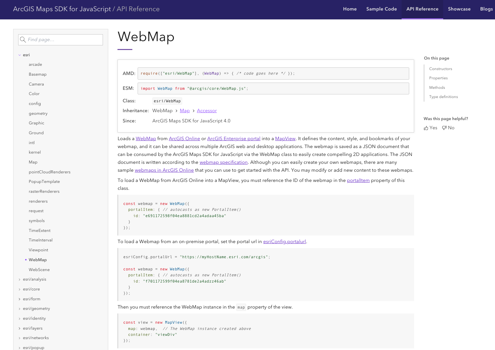

Based on how to initialize a Webmap instance, it seems it would be best to allow the Webmap config to accept the constructor properties. With that knowlege, we can take full advantage of TypeScript to start scaffolding out some configuration properties. But first, in order to be able to pull ArcGIS Specific typings we should install the ArcGIS Maps SDK for JS, AKA `@arcgis/core`.

```sh
npm i @arcgis/core
```

Just going to throw out a warning here, [@arcgis/core](https://www.npmjs.com/package/@arcgis/core) is a disgustingly huge library and it will cause your application bundle to be quite large compared to other mapping libraries like OpenLayers or Mapbox. Unfortunately there's not much we can do about that, but there are ways we will be able to defer the initial load of those resources that we will see later.

> note: while this workshop is using the ArcGIS Maps SDK, the configurable patterns we use can be applied to **any framework** or any **mapping SDK**, and you would just swap out the ArcGIS Specific things with comparable features in whatever mapping API you're using.

### Typing the Configuration

Earlier, we created a `types` folder that has some initial typings that are used throughout this application. Now we can extend this to include typings for the expected configurations for each deployment. Let's create a new file to store the typings (`src/types/config.ts`):

```sh
touch src/types/config.ts
```

Let's start simple with an `AppInfo` typing that includes only the `title` and the color theme options:

```ts
// src/types/config.ts
/**
 * the Bootstrap Color Types
 */
export type BootstrapColorType = 
  | 'primary' 
  | 'secondary' 
  | 'info'
  | 'success'
  | 'danger'
  | 'warning'
  | 'light'
  | 'dark'

/**
 * the Color Theme map `{ color-name: color-hex | rgba | sass-variable }`
 */
export type ColorTheme = Partial<Record<BootstrapColorType, string>>;

/**
 * the application information
 */
export interface AppInfo { 
  /** the deployment title */
  title: string;
  /** the color theme */
  theme?: ColorTheme;
}
```

Nothing too fancy here. The `title` property of the `AppInfo` interface is just a simple string, but the color theme is a little more complicated. We want to be able to override the default [bootstrap theme color types](https://getbootstrap.com/docs/5.0/utilities/colors/#map):

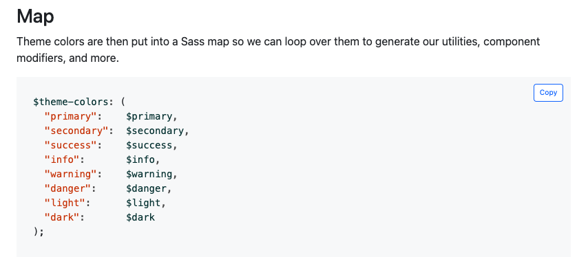

Our `BootstrapColorType` refers to the keys of the `$theme-colors` sass map, and the `ColorTheme` type basically is the TypeScript equivalent of the `$theme-colors` object. The recommended way to override the theme colors is to use sass files to customize things. However, this is not ideal as that would require hardcoding color themes in the app code. We want to inject custom colors at runtime via config files. So that means we must accomplish this on the client side. That is not our focus at the moment as we just want to spec out our config typings so we will come back to that one.

Next, let's define some basic map properties. We can access any of the typings for ArcGIS Maps SDK objects using the `__esri` namespace. Let's start with defining a `MapConfig` interface to store webmap properties:

```ts
// src/types/config.ts
// ...previous types hidden brevity
/**
 * the map configuration options
 */
export interface MapConfig {
  /**
   * the arcgis {@link https://developers.arcgis.com/javascript/latest/api-reference/esri-WebMap.html WebMap} constructor properties
   */
  webmap: __esri.WebMapProperties;
  /**
   *  {@link https://developers.arcgis.com/javascript/latest/api-reference/esri-views-MapView.html MapView} properties for initial state such as
   * center, scale, etc
   */
  mapView?: __esri.MapViewProperties;
   /**
   * the default basemap id for the light theme
   */
  defaultLightBasemapId?: string;
  /**
   * the default basemap id for the dark theme
   */
  defaultDarkBasemapId?: string;
}
```

You may have encountered an issue while trying to add these typings that reference the `__esri` namespace:

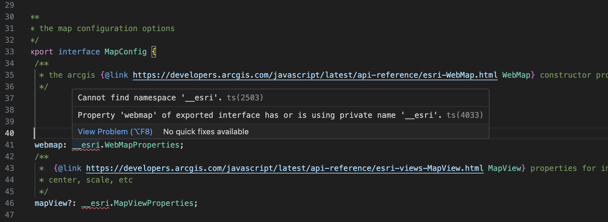


If we have not yet imported anything from `@arcgis/core` in our app, tye TypeScript interpreter won't know what `__esri.WebMapProperties` is or more importantly the `__esri` namespace. We can trick it into pulling in the esri typings by adding a [reference path](https://www.typescriptlang.org/docs/handbook/triple-slash-directives.html#-reference-path-) to the top of the file:

```ts
/// <reference types="../../node_modules/@arcgis/core/kernel.d.ts" />
```

> note: later in the app when we start using stuff from `@arcgis/core` to render the map, this reference path can be removed. However, there is no harm in leaving it in the file.

After this is added to the top, the typings *should be* recognized:

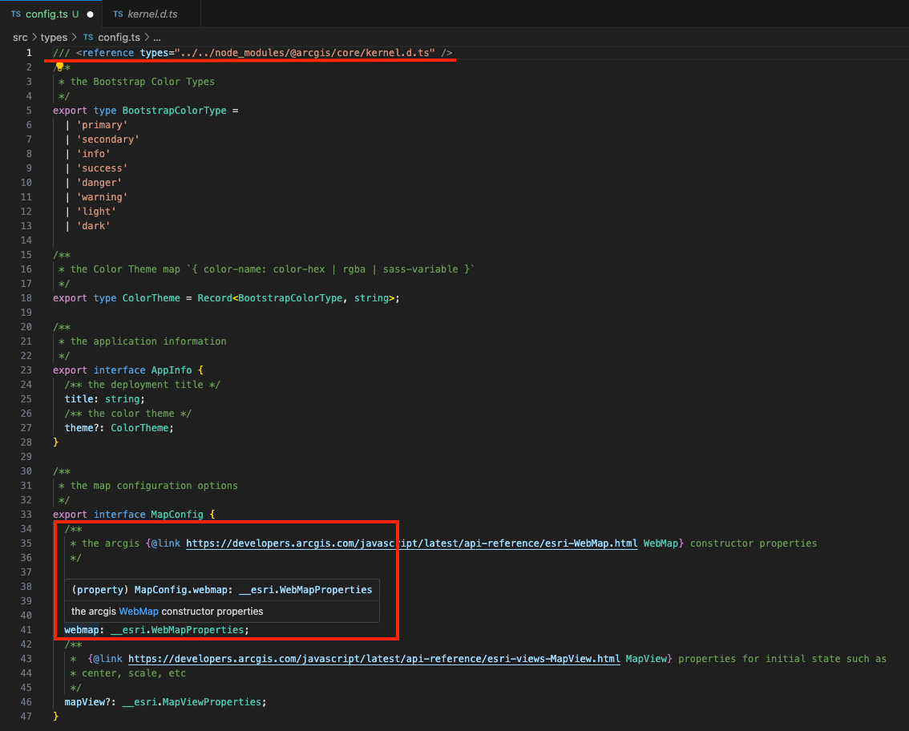

To recap, we just referenced an arbitrary type declaration file from `@arcgis/core` to jog it loose. If we had already imported and created a `Map` somewhere in our app, the typings would have been available, but because `@arcgis/core` was installed but not imported anywhere in our app yet, that reference path will allow us to use the typings in this file.

Now let's focus on the important stuff that was added. We just defined a simple `MapConfig` interface which at this time is only tracking `webmap` and `mapView` properties. The type for these are the properties that are available for each constructor, which is very helpful for intellisense but also will make the TypeScript interpreter happy. Another trick is we added some links to the interfaces to bring us to the documentation should we need it (`{@link <url> DisplayName}`). To see that nice intellisense in action, you can start using that interface in VS Code:

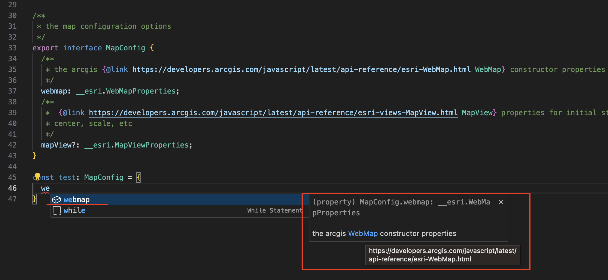

Finally, we just need to add a typing for the root configuration object: 

```ts
/**
 * the application configuration options
 */
export interface AppConfig { 
  /** 
   * the app information 
   */
  app: AppInfo;
  /** 
   * the map configuration options 
   */
  map: MapConfig;
}
```

The entire `src/types/config.ts` file should now look like this:

```ts
// src/types/config.ts
/// <reference types="../../node_modules/@arcgis/core/kernel.d.ts" />
/**
 * the Bootstrap Color Types
 */
export type BootstrapColorType = 
  | 'primary' 
  | 'secondary' 
  | 'info'
  | 'success'
  | 'danger'
  | 'warning'
  | 'light'
  | 'dark'

/**
 * the Color Theme map `{ color-name: color-hex | rgba | sass-variable }`
 */
export type ColorTheme = Partial<Record<BootstrapColorType, string>>;

/**
 * the application information
 */
export interface AppInfo { 
  /** the deployment title */
  title: string;
  /** the color theme */
  theme?: ColorTheme;
}

/**
 * the map configuration options
 */
export interface MapConfig {
  /**
   * the arcgis {@link https://developers.arcgis.com/javascript/latest/api-reference/esri-WebMap.html WebMap} constructor properties
   */
  webmap: __esri.WebMapProperties;
  /**
   *  {@link https://developers.arcgis.com/javascript/latest/api-reference/esri-views-MapView.html MapView} properties for initial state such as
   * center, scale, etc
   */
  mapView?: __esri.MapViewProperties;
  /**
   * the default basemap id for the light theme
   */
  defaultLightBasemapId?: string;
  /**
   * the default basemap id for the dark theme
   */
  defaultDarkBasemapId?: string;
}

/**
 * the application configuration options
 */
export interface AppConfig { 
  /** 
   * the app information 
   */
  app: AppInfo;
  /** 
   * the map configuration options 
   */
  map: MapConfig;
}
```

We will continue to extend these configuration typings as we add support for more configurable properties.

## Creating our first Configuration

Now we are ready to set up our first configuration. Let's start with adding a configuration for the [Civil War Battles Webmap](https://bmi.maps.arcgis.com/home/item.html?id=246abd2b6b71403b9edbe6538ebc8534):


Based on the typings we defined, we can create a basic JSON configuration for the Civil War Map like this: 

```json
{
  "app": {
    "title": "Civil War Battles",
    "theme": {
      "primary": "#ffa500",
      "secondary": "#FFD93D",
      "info": "#00A7E1",
      "dark": "#1D1D1D",
      "success": "#21BA45",
      "danger": "#ac0b30",
      "warning": "#F2C037"
    }
  },
  "map": {
    "defaultDarkBasemapId": "streets-night-vector",
    "defaultLightBasemapId": "topo-vector",
    "webmap": {
      "portalItem": {
        "id": "246abd2b6b71403b9edbe6538ebc8534",
        "portal": {
          "url": "https://bmi.maps.arcgis.com/"
        }
      }
    },
    "mapView": {
      "zoom": 4,
      "center": [
        -79.87481095392569,
        32.752114229033296
      ]
    }
  }
}
```

Here, we have defined some very basic properties, most importantly defining the [PortalItem](https://developers.arcgis.com/javascript/latest/api-reference/esri-portal-PortalItem.html) representing the webmap. We also defined a color theme to go with the map and some initial mapView properties. One other thing we haven't discussed yet is the `defaultDarkBasemapId` and the `defaultLightBasemapId`. These can be used to update the basemap when switching from `light` to `dark` mode. If the app starts out in light mode and is using a light basemap such as [ArcGIS Topographic](https://www.arcgis.com/home/item.html?id=67372ff42cd145319639a99152b15bc3), if the user toggles to dark mode it won't match very well and it would make sense to swap out the basemap to one better suited for a dark theme. We can control that with those default basemaps based on the theme.

Because the application config will be used in multiple places, it makes sense to put it in our `app` store. Eventually, we will want to dynamically define a configuration from the client side but for now we can hardcode this config into the `app` store so we can start building out the application functionality. In the `src/stores/app.ts` update it with the following additions:

```ts
// src/stores/app.ts
import { defineStore } from "pinia"
import { ref, computed } from 'vue'
import { useWindowSize } from '@vueuse/core'
import type { ThemeType, DeviceOrientation, AppConfig } from "@/types"

const testConfig: AppConfig = {
  app: {
    title: "Civil War Battles",
    theme: {
      primary: "#ffa500",
      secondary: "#FFD93D",
      info: "#406ac9",
      dark: "#1D1D1D",
      success: "#21BA45",
      danger: "#ac0b30",
      warning: "#F2C037"
    }
  },
  map: {
    defaultDarkBasemapId: 'streets-night-vector',
    defaultLightBasemapId: 'topo-vector',
    webmap: {
      portalItem: {
        id: "246abd2b6b71403b9edbe6538ebc8534",
        portal: {
          url: "https://bmi.maps.arcgis.com/"
        }
      }
    },
    mapView: {
      zoom: 4,
      center: [
        -79.87481095392569,
        32.752114229033296
      ]
    }
  }
}

export const useAppStore = defineStore('app', ()=> {

  const { width, height } = useWindowSize()

  /**
   * store the application config
   */
  const config = ref<AppConfig>(testConfig)
  
  /**
   * will be true if the app is dark mode
   */
  const darkMode = ref(false)

  /**
   * state for the left panel, true when open
   */
  const leftPaneOpen = ref(true)

  /**
   * state for the left panel, true when open
   */
  const rightPaneOpen = ref(true)

   /**
   * the current theme for the app
   */
  const theme = computed<ThemeType>(()=> darkMode.value ? 'dark': 'light')

  /**
   * will toggle a panel in open or closed state, depending on the current open state
   * @param panel - the panel side to toggle
   * @returns the current state of the panel (true is open, false is closed)
   */
  const togglePanel = (panel: 'left' | 'right') => {
    const target = panel === 'left' 
      ? leftPaneOpen
      : rightPaneOpen
    target.value = !target.value
    return target.value
  }

  /**
   * the device orientation
   */
  const orientation = computed<DeviceOrientation>(()=> height.value > width.value ? 'portrait': 'landscape')
  
  // the below properties are based exclusively on the width
  /**
   * will be true when it is a small device (the width is < 577 pixels)
   */
  const isSmallDevice = computed(()=> width.value < 577)

  /**
   * will be true when it is a medium sized device (the width is between 576 and 992 pixels)
   */
  const isMediumDevice = computed(()=> width.value > 576 && width.value < 993)

  /**
   * will be true when it is a large sized device (the width is > 992 < 1201 pixels)
   */
  const isLargeDevice = computed(()=> width.value > 992 && width.value < 1201)

  /**
   * will be true when it is a large sized device (the width is > 992 pixels)
   */
  const isExtraLargeDevice = computed(()=> width.value > 1200)

  return {
    theme,
    config,
    width,
    height,
    orientation,
    isSmallDevice,
    isMediumDevice,
    isLargeDevice,
    isExtraLargeDevice,
    darkMode,
    leftPaneOpen,
    rightPaneOpen,
    togglePanel
  }
})
```

If you are using TypeScript `5.x`, you may notice your IDE complaining about the typings when we are defining the `useAppStore` function when you hover over it:

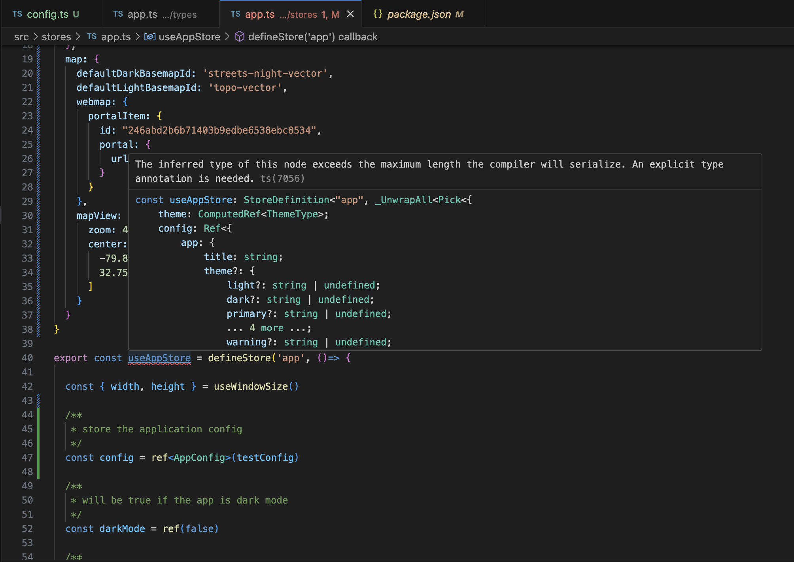

The error being thrown is:

```
Typescript: "The inferred type of this node exceeds the
maximum length the compiler will serialize. An explicit type 
annotation is needed."
```

I think this is happening due to inferring the `__esri.WebMapProperties` and the `__esri.MapViewProperties`. The actual interfaces Esri has created for these are quite large and have circular references in some cases. Even though we are passing the generic into the `ref` definition `const config = ref<AppState>(testConfig)`, TypeScript appears to be inferring on the fly rather than showing the type as `Ref<AppConfig>`:

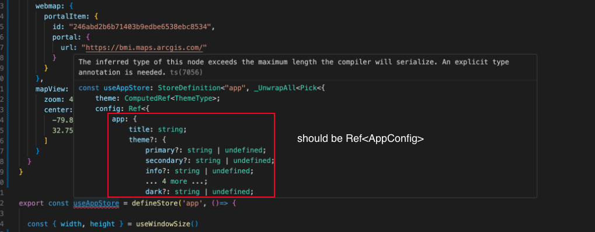

We can get around this by making an even more explicit typing for the `config` (note you'll also have to import `type Ref` from `vue`):


```ts
/**
 * the application config
 */
const config: Ref<AppConfig> = ref(testConfig as any)
```

And now your IDE should not complain as it should be properly typed:

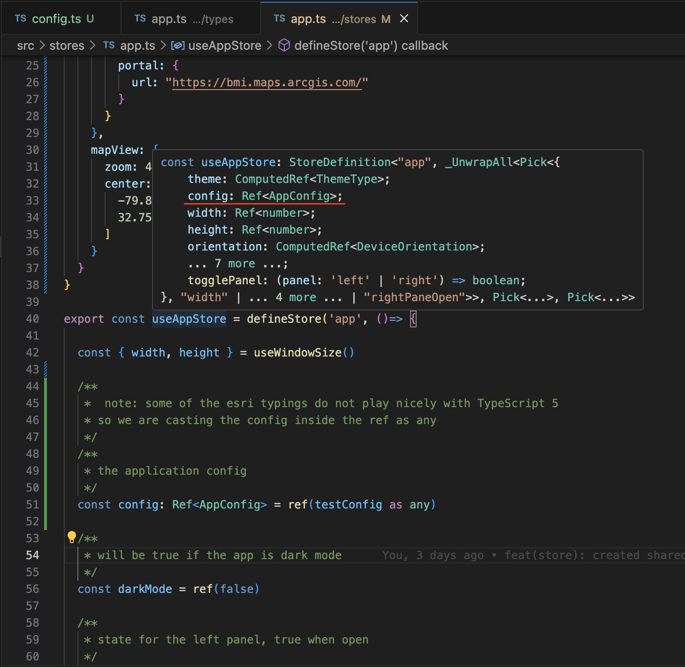

So now the full code for `src/stores/app.ts` should be:

```ts
// src/stores/app.ts
import { defineStore } from "pinia"
import { ref, computed, type Ref } from 'vue'
import { useWindowSize } from '@vueuse/core'
import type { ThemeType, DeviceOrientation, AppConfig } from "@/types"

const testConfig: AppConfig = {
  app: {
    title: "Civil War Battles",
    theme: {
      primary: "#ffa500",
      secondary: "#FFD93D",
      info: "#406ac9",
      dark: "#1D1D1D",
      success: "#21BA45",
      danger: "#ac0b30",
      warning: "#F2C037"
    }
  },
  map: {
    defaultDarkBasemapId: 'streets-night-vector',
    defaultLightBasemapId: 'topo-vector',
    webmap: {
      portalItem: {
        id: "246abd2b6b71403b9edbe6538ebc8534",
        portal: {
          url: "https://bmi.maps.arcgis.com/"
        }
      }
    },
    mapView: {
      zoom: 4,
      center: [
        -79.87481095392569,
        32.752114229033296
      ]
    }
  }
}

export const useAppStore = defineStore('app', ()=> {

  const { width, height } = useWindowSize()

  /**
   *  note: some of the esri typings do not play nicely with TypeScript 5
   * so we are casting the config inside the ref as any
   */
  /**
   * the application config
   */
  const config: Ref<AppConfig> = ref(testConfig as any)
  
  /**
   * will be true if the app is dark mode
   */
  const darkMode = ref(initialTheme === 'dark')

  /**
   * state for the left panel, true when open
   */
  const leftPaneOpen = ref(true)

  /**
   * state for the left panel, true when open
   */
  const rightPaneOpen = ref(true)

   /**
   * the current theme for the app
   */
  const theme = computed<ThemeType>(()=> darkMode.value ? 'dark': 'light')

  /**
   * will toggle a panel in open or closed state, depending on the current open state
   * @param panel - the panel side to toggle
   * @returns the current state of the panel (true is open, false is closed)
   */
  const togglePanel = (panel: 'left' | 'right') => {
    const target = panel === 'left' 
      ? leftPaneOpen
      : rightPaneOpen
    target.value = !target.value
    return target.value
  }

  /**
   * the device orientation
   */
  const orientation = computed<DeviceOrientation>(()=> height.value > width.value ? 'portrait': 'landscape')
  
  // the below properties are based exclusively on the width
  /**
   * will be true when it is a small device (the width is < 577 pixels)
   */
  const isSmallDevice = computed(()=> width.value < 577)

  /**
   * will be true when it is a medium sized device (the width is between 576 and 992 pixels)
   */
  const isMediumDevice = computed(()=> width.value > 576 && width.value < 993)

  /**
   * will be true when it is a large sized device (the width is > 992 < 1201 pixels)
   */
  const isLargeDevice = computed(()=> width.value > 992 && width.value < 1201)

  /**
   * will be true when it is a large sized device (the width is > 992 pixels)
   */
  const isExtraLargeDevice = computed(()=> width.value > 1200)

  return {
    theme,
    config,
    width,
    height,
    orientation,
    isSmallDevice,
    isMediumDevice,
    isLargeDevice,
    isExtraLargeDevice,
    darkMode,
    leftPaneOpen,
    rightPaneOpen,
    togglePanel
  }
})
```

### Planning for the Map

Now that we have a test config created, we can focus on creating a map view. If we refer to the [Intro to MapView Sample](https://developers.arcgis.com/javascript/latest/sample-code/sandbox/?sample=intro-mapview) things are pretty straightforward:

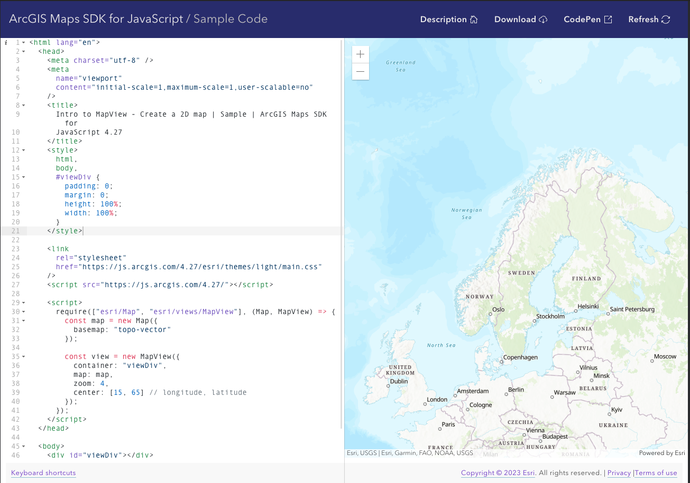

This is pretty much the bare minimum for rendering an ArcGIS Maps SDK MapView. The things to note here are:

* everything is contained in one `html` file
* modules are being loaded [AMD Style](https://www.devbridge.com/articles/understanding-amd-requirejs/) via their CDN links
* the css is also loaded via their CDN links. Also, you **must** import the esri `main.css` into your application or the map content will not render properly
  * this was loaded with the `light` theme 
* A [Map](https://developers.arcgis.com/javascript/latest/api-reference/esri-Map.html) is first instantiated with a topographic basemap using it's well known basemap id of `topo-vector`
  * it is not shown here, but the `Map` can also be a [WebMap](https://developers.arcgis.com/javascript/latest/api-reference/esri-WebMap.html)
* the `Map` or `WebMap` gets passed to a new instance of a [MapView](https://developers.arcgis.com/javascript/latest/api-reference/esri-views-MapView.html) 
  * The `MapView` is only for 2D graphics, but the SDK also supports 3D through a [SceneView](https://developers.arcgis.com/javascript/latest/api-reference/esri-views-SceneView.html) 

So from our perspective things will be a little different. For starters, we are using build tools with `Node.js` and `vite`, and also referencing the Maps SDK as ES Modules as `@arcgis/core`. We will be dynamically loading a `WebMap` that will be loaded into the `MapView`. We also want to support both `light` and `dark` mode for our app. 

Since we do have to load the `main.css` before we can render the `MapView`, we need to bring that in. Because we are using build tools, we can simply bring in the css into a map component from our `node_modules` with: 

```js
import '@arcgis/core/assets/esri/themes/light/main.css'
```

However, this immediately presents us with a problem. We have just hard coded the `light` theme as the style we are importing. While this is great if we are in light mode, it won't work for dark mode. We could import both, but then the css that is applied will be the last one imported and we cannot really "unimport" the css. So how can we dynamically load the appropriate `light` or `dark` `main.css` file based on our current light or dark theme? One relatively easy option is we can programmatically add `<style>` tags to the `<head>` element based on the current theme. If we are doing that we can also save a little on our app bundle size by referencing the `main.css` from Esri's CDN, rather than bundling with our app.

Let's experiment with dark mode in the sandbox by updating the CDN url for the css theme:

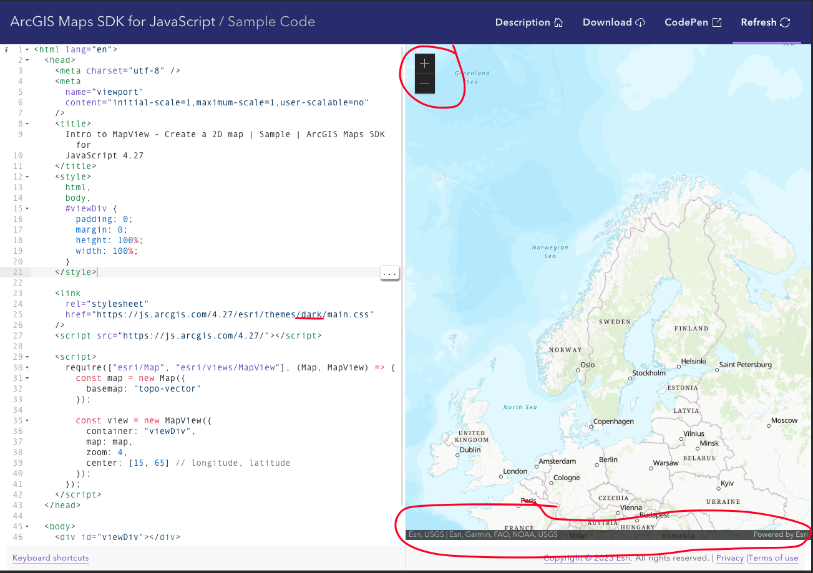

Changing the theme from `light` to `dark` updated the CSS and the buttons and elements are now dark themed, but it looks a little awkward with the `topo-vector` map that is better suited for light themes. Let's update the `basemap` to something that better fits a dark theme such as `dark-gray-vector`:

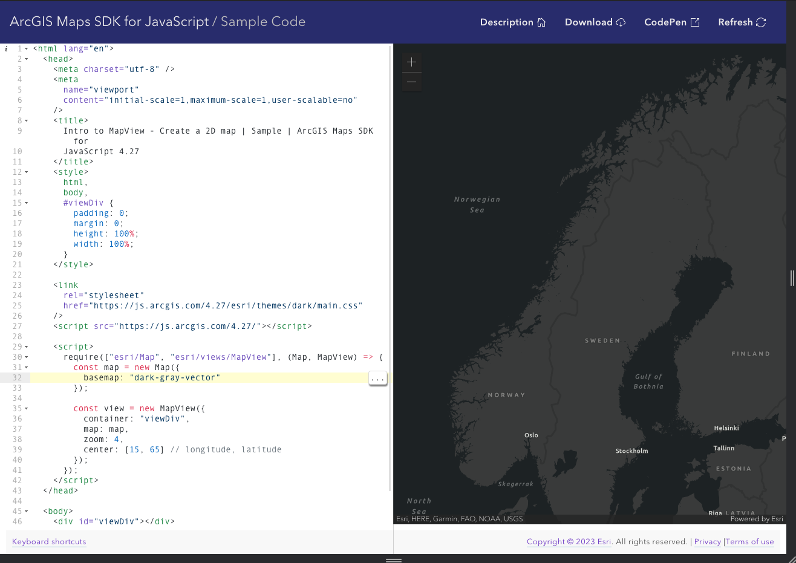

That looks more like a dark mode application. This same behavior is exactly why we added the `defaultDarkBasemapId` and `defaultLightBasemapId` to our `MapConfig` typing, so that we can control which basemap is displayed when the user toggles between light and dark mode. 

**The most important thing to remember when building a configurable application is to always keep the big picture in mind.** What this means is try to keep things as generic as possible while thinking of the different ways the end user will be using the application. In our case, if we know we want to support both light and dark mode, we need to consider how to be flexible and implement it as simply as possible. If the solution is too clunky, it will introduce [technical debt](https://en.wikipedia.org/wiki/Technical_debt) and will be harder to maintain. With that in mind, let's start with actually implementing the functionality to toggle between light and dark mode in our app.

#### Adding Dark Mode Support (for real this time)

#### Update the Bootstrap Theme

In addition to supporting dark mode for the map, we also need to handle dark mode from the bootstrap side of things too. Fortunately, this is pretty easy and can be controlled via the root `html` tag by adding a `data-bs-theme` attribute:

```html
<html lang="en" data-bs-theme="dark">
    <!-- OR light mode -->
<html lang="en" data-bs-theme="light">
```

Since we will need to do a few things to programmatically switch between themes, we should write some helper functions to accomplish these tasks. In section 1 we created a `utils` package at `src/utils`. This seems like a logical place to add some theme setting utilities. Let's create a new `theme.ts` file in the `utils` package:

```sh
touch src/utils/theme.ts
```

Let's start with adding support for changing the Bootstrap theme first. One thing that most modern browsers support now is persistent preferences for if the user prefers `light` or `dark` themes. With this knowledge, when the user loads our application, we can detect if they have the `dark` preference, and if so render the app in `dark` mode by default. In the `src/utils/theme.ts` add the following code:

```ts
// src/utils/theme.ts
import type { ThemeType } from "@/types"
import { log } from "./logger"

/** 
 * light and dark theme style tags
 */
const rootHtml = document.getElementsByTagName('html')[0]

/**
 * check user's browser's preferences to see if dark mode is preferred
 * @returns 
 */
export const getPreferredTheme = (): ThemeType => window?.matchMedia('(prefers-color-scheme:dark)').matches ? 'dark' : 'light'

/** 
 * sets the bootstrap theme to light or dark
 * @param theme - the light or dark theme
 */
export const setBootstrapTheme = (theme?: ThemeType) => {
  theme = theme ?? getPreferredTheme()
  rootHtml.setAttribute('data-bs-theme', theme)
  log(`updated the bootstrap theme to "${theme}"`)
}
```

Here we have brought in our `ThemeType` typing and the `log` function. Next, we created a variable for the `rootHtml` element, which is the `html` element for our app. We need this to update the bootstrap theme.

Next, we created a function to try and detect if the user has a theme preference by using the [window.matchMedia](https://developer.mozilla.org/en-US/docs/Web/API/Window/matchMedia) function to see if the `prefers-color-scheme` matches `dark` and if so return the `dark` `ThemeType` otherwise will fallback to `light`. Finally, we just added a simple function to set the Bootstrap theme. The `setBootstrapTheme` function takes an optional argument of `theme` which is of `ThemeType` (a string matching either `'light'` or `'dark'`). If there is no `theme` argument passed, it will use the `getPreferredTheme` to try and find the preferences from the browser. The function will then set the `data-bs-theme` attribute to the `theme` variable. 

Now that we have these functions available to update the Bootstrap Theme we should try it out. If you recall in our `app` store we defined a `darkMode` variable that we hard coded to `false`. 

```ts
const darkMode = ref(false)
```

This is no longer ideal as we now have a way to detect if the user prefers dark and we can use that to set the default theme. Let's do a quick refactor. First let's import `watch` from `vue` and import our `getPreferredTheme` and `setBootstrapTheme` functions:

```ts
// src/stores/app.ts
// ... other imports hidden for brevity
import { ref, computed, watch, type Ref } from 'vue'
import { setBootstrapTheme, getPreferredTheme } from "@/utils"
```

Then let's refactor the `darkMode` state property:

```ts
// src/stores/app.ts
/**
 * will be true if the app is dark mode
 */
const darkMode = ref(getPreferredTheme() === 'dark')

// update the bootstrap theme whenever the dark mode changes from the toggle
watch(
  ()=> darkMode.value,
  (isDark)=> {
    setBootstrapTheme(isDark ? 'dark': 'light')
  },
  // run watch handler immediately
  { immediate: true }
)
```

Now we have improved this so that rather than hardcoding `false` for default state of our `darkMode` ref value, we are now making a better choice by using the browser preferences if they are set. The other thing is we have added a `watcher` to react to changes to the `darkMode.value`. We are adding a callback that takes the current value of `darkMode` which is passed in as `isDark` and then we are updating the bootstrap theme using our `setBoostrapTheme` function. The last part is also important. We have set the `immediate` flag to `true`, which will run the `watch` callback function immediately upon initialization, while also handling any future changes. This will handle the crucial functionality of making sure the appropriate bootstrap theme is applied when the app loads. The full source code for `src/stores/app.ts` should now be:

```ts
// src/stores/app.ts
import { defineStore } from "pinia"
import { ref, computed, watch, type Ref } from 'vue'
import { useWindowSize } from '@vueuse/core'
import type { ThemeType, DeviceOrientation, AppConfig } from "@/types"
import { setBootstrapTheme, getPreferredTheme } from "@/utils"

const testConfig: AppConfig = {
  app: {
    title: "Civil War Battles",
    theme: {
      primary: "#ffa500",
      secondary: "#FFD93D",
      info: "#406ac9",
      dark: "#1D1D1D",
      success: "#21BA45",
      danger: "#ac0b30",
      warning: "#F2C037"
    }
  },
  map: {
    defaultDarkBasemapId: 'streets-night-vector',
    defaultLightBasemapId: 'topo-vector',
    webmap: {
      portalItem: {
        id: "246abd2b6b71403b9edbe6538ebc8534",
        portal: {
          url: "https://bmi.maps.arcgis.com/"
        }
      }
    },
    mapView: {
      zoom: 4,
      center: [
        -79.87481095392569,
        32.752114229033296
      ]
    }
  }
}

export const useAppStore = defineStore('app', ()=> {

  const { width, height } = useWindowSize()

  /**
   *  note: some of the esri typings do not play nicely with TypeScript 5
   * so we are casting the config inside the ref as any
   */
  /**
   * the application config
   */
  const config: Ref<AppConfig> = ref(testConfig as any)
  
  /**
   * will be true if the app is dark mode
   */
  const darkMode = ref(getPreferredTheme() === 'dark')

  // update the bootstrap theme whenever the dark mode changes from the toggle
  watch(
    ()=> darkMode.value,
    (isDark)=> {
      setBootstrapTheme(isDark ? 'dark': 'light')
    },
    // run watch handler immediately
    { immediate: true }
  )

  /**
   * state for the left panel, true when open
   */
  const leftPaneOpen = ref(true)

  /**
   * state for the left panel, true when open
   */
  const rightPaneOpen = ref(true)

   /**
   * the current theme for the app
   */
  const theme = computed<ThemeType>(()=> darkMode.value ? 'dark': 'light')

  /**
   * will toggle a panel in open or closed state, depending on the current open state
   * @param panel - the panel side to toggle
   * @returns the current state of the panel (true is open, false is closed)
   */
  const togglePanel = (panel: 'left' | 'right') => {
    const target = panel === 'left' 
      ? leftPaneOpen
      : rightPaneOpen
    target.value = !target.value
    return target.value
  }

  /**
   * the device orientation
   */
  const orientation = computed<DeviceOrientation>(()=> height.value > width.value ? 'portrait': 'landscape')
  
  // the below properties are based exclusively on the width
  /**
   * will be true when it is a small device (the width is < 577 pixels)
   */
  const isSmallDevice = computed(()=> width.value < 577)

  /**
   * will be true when it is a medium sized device (the width is between 576 and 992 pixels)
   */
  const isMediumDevice = computed(()=> width.value > 576 && width.value < 993)

  /**
   * will be true when it is a large sized device (the width is > 992 < 1201 pixels)
   */
  const isLargeDevice = computed(()=> width.value > 992 && width.value < 1201)

  /**
   * will be true when it is a large sized device (the width is > 992 pixels)
   */
  const isExtraLargeDevice = computed(()=> width.value > 1200)

  return {
    theme,
    config,
    width,
    height,
    orientation,
    isSmallDevice,
    isMediumDevice,
    isLargeDevice,
    isExtraLargeDevice,
    darkMode,
    leftPaneOpen,
    rightPaneOpen,
    togglePanel
  }
})
```

Now let's see it in action! But first, as you may recall earlier we added random colors to the three panels in our `App.vue` so we could see the panels easier while we were testing the expand and collapse functionality. Let's remove those hard coded inline `style` attributes as shown in red below:

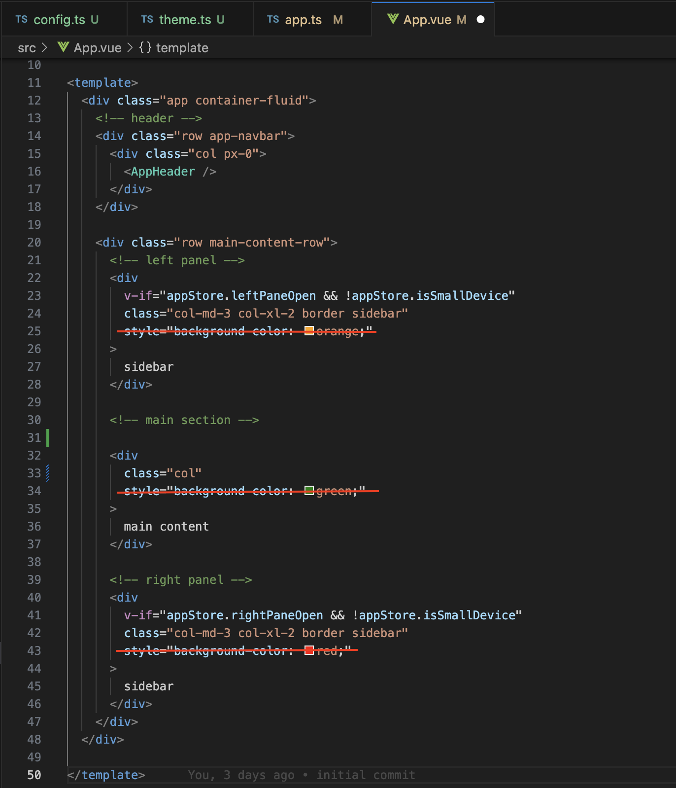

After removing those, save all files and test it out. If your browser settings have a dark theme set for the appearance, your app should render in dark mode. 

Here is how to check your preferences in Chrome, other browsers will vary:

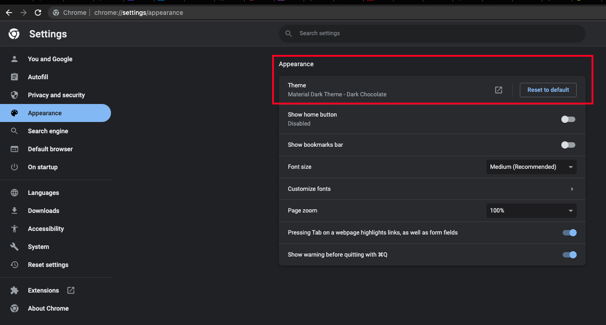

Our app in both `light` and `dark` mode.

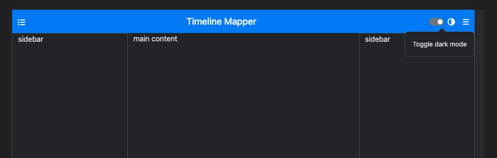

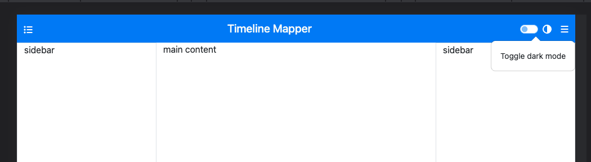

When you change the bootstrap theme, it has downstream effects everywhere. As shown above the background color for our panels changes automatically as well as the default text colors and tooltips background.

##### Create the Map View

Now that the Bootstrap Dark Mode is working, let's turn our attention to bringing in the MapView. But first, we need to create our utilities for loading the esri theme based on our `darkMode` state property. Go back to the `src/utils/theme.ts` file and we will add some utilities to load the esri theme css and update it when `darkMode` is toggled.

After the `rootHtml` definition add two new refs:

```ts
// src/utils/theme.ts
const lightThemeStyleLink = ref<HTMLLinkElement>()
const darkThemeStyleLink = ref<HTMLLinkElement>()
```

Here we are adding refs to store a reference to two `<style>` Element tags we will create; one being for the `light` theme and the other for the `dark` theme. We could also use just one `<style>` tag and update the `href` property, however, it may provide better performance to add a tag for each and disable the inactive theme as our browser can cache it a little easier this way. Now we can add some helper functions. First let's focus on adding a function to load the css style tags:

```ts
// src/utils/theme.ts
// update the imports first!
import { version as arcgisVersion } from "@arcgis/core/kernel"
import type { ThemeType } from "@/types"
import { useAppStore } from "@/stores"
import { log } from "./logger"
import { ref } from 'vue'

// ... bootstrap functions hidden for brevity

/**
 * fetches the ArcGIS JS API "main.css" CDN url based on a light or dark theme
 * @param theme - the light or dark theme
 * @returns the url to the "main.css" file with the appropriate theme
 */
export const getThemeUrl = (theme: ThemeType) => `https://js.arcgis.com/${arcgisVersion}/esri/themes/${theme}/main.css`

/**
 * will deactivate a stylesheet link by providing an impossible media query
 * @param link - the stylesheet link to disable
 * 
 * @see https://stackoverflow.com/a/54441305/3005089
 */
export const deactivateStyleLink = (link: HTMLLinkElement) => {
  link.setAttribute('media', 'max-width: 1px')
}

/**
 * will remove the impossible media query from a stylesheet link causing it to be enabled
 * @param link - the stylelink sheet to enable
 * 
 * @see https://stackoverflow.com/a/54441305/3005089
 */
export const activateStyleLink = (link: HTMLLinkElement) => {
  if (link.hasAttribute('media')){
    link.removeAttribute('media')
  }
}

/** 
 * loads the ArcGIS Maps SDK "main.css" file based on the current theme
 */
export const loadEsriCss = () => {
  const appStore = useAppStore()

  for (const theme of ['light', 'dark'] as ThemeType[]){
    const targetRef = theme === 'light' 
      ? lightThemeStyleLink
      : darkThemeStyleLink
    
    // check if the link has been created
    if (!targetRef.value){
      const link = document.createElement('link') as HTMLLinkElement
      link.id = `esri-theme-${theme}-link`
      link.setAttribute('rel', 'stylesheet')
      link.setAttribute('href', getThemeUrl(theme))
      document.head.append(link)
      log(`created esri theme link with id: "${link.id}"`)
      targetRef.value = link
      // check if this is not the active theme
      if (appStore.theme !== theme){
        deactivateStyleLink(link)
        log(`deactivated esri style link for theme: "${theme}"`)
      }
    }
  }
}
```

The first thing we need is a utility function to build a proper url to the esri theme css assets. The `getThemeUrl` function will take in a `theme` argument and return the appropriate url for each theme. Notice how we also grab the current `arcgisVersion` from the `@arcgis/kernel` module so that we always pull the correct version from the CDN. Dynamically pulling the ArcGIS Maps SDK version will make it so we don't have breaking changes in the future that could occur if we hard coded a version and we updated the `@arcgis/core` package.

Next, we created two functions:

* `activateStyleLink` - will ensure the correct style link is active when the theme changes
* `deactivateStyleLink` - will ensure the unused style link is disabled when the theme changes.

These functions use a [handy trick](https://stackoverflow.com/a/54441305/3005089) to apply an impossible [media query](https://developer.mozilla.org/en-US/docs/Web/CSS/CSS_media_queries/Using_media_queries) to the `<style>` tag to disable. In our case, we are setting it to a device width of `1px`. While it is technically possible for someone to create a device with a screen width of `1px`, so as long as the device width is greater than 1 pixel, the tag will be ignored due to the media query.

Next, the `loadEsriCss()` function will create the `<style>` tags if they don't exist and ensure the current `theme` is applied. Now that we can load the css, we still need to create a function to set the theme after the app loads, i.e. when the user toggles the theme:

```ts
// src/utils/theme.ts
/**
 * sets the theme for the ArcGIS Maps SDK
 * @param theme - the light or dark theme
 * @returns 
 */
export const setEsriTheme = (theme?: ThemeType)=> {
  if (!darkThemeStyleLink.value || !lightThemeStyleLink.value) return
  theme = theme ?? getPreferredTheme()
  if (theme === 'dark'){
    activateStyleLink(darkThemeStyleLink.value)
    deactivateStyleLink(lightThemeStyleLink.value)
  } else {
    activateStyleLink(lightThemeStyleLink.value)
    deactivateStyleLink(darkThemeStyleLink.value)
  }
}
```

The `setEsriTheme` is pretty lean and its main purpose is to make sure the proper style tag is active and the unsed theme is disabled. The full `src/utils/theme.ts` should now look like this:

```ts
// src/utils/theme.ts
import { version as arcgisVersion } from "@arcgis/core/kernel"
import type { ThemeType } from "@/types"
import { useAppStore } from "@/stores"
import { log } from "./logger"
import { ref } from 'vue'

/** 
 * light and dark theme style tags
 */
const rootHtml = document.getElementsByTagName('html')[0]
const lightThemeStyleLink = ref<HTMLLinkElement>()
const darkThemeStyleLink = ref<HTMLLinkElement>()

/**
 * check user's browser's preferences to see if dark mode is preferred
 * @returns 
 */
export const getPreferredTheme = (): ThemeType => window?.matchMedia('(prefers-color-scheme:dark)').matches ? 'dark' : 'light'

/** 
 * sets the bootstrap theme to light or dark
 * @param theme - the light or dark theme
 */
export const setBootstrapTheme = (theme?: ThemeType) => {
  theme = theme ?? getPreferredTheme()
  rootHtml.setAttribute('data-bs-theme', theme)
  log(`updated the bootstrap theme to "${theme}"`)
}

/**
 * fetches the ArcGIS JS API "main.css" CDN url based on a light or dark theme
 * @param theme - the light or dark theme
 * @returns the url to the "main.css" file with the appropriate theme
 */
export const getThemeUrl = (theme: ThemeType) => `https://js.arcgis.com/${arcgisVersion}/esri/themes/${theme}/main.css`

/**
 * will deactivate a stylesheet link by providing an impossible media query
 * @param link - the stylesheet link to disable
 * 
 * @see https://stackoverflow.com/a/54441305/3005089
 */
export const deactivateStyleLink = (link: HTMLLinkElement) => {
  link.setAttribute('media', 'max-width: 1px')
}

/**
 * will remove the impossible media query from a stylesheet link causing it to be enabled
 * @param link - the stylelink sheet to enable
 * 
 * @see https://stackoverflow.com/a/54441305/3005089
 */
export const activateStyleLink = (link: HTMLLinkElement) => {
  if (link.hasAttribute('media')){
    link.removeAttribute('media')
  }
}

/** 
 * loads the ArcGIS Maps SDK "main.css" file based on the current theme
 */
export const loadEsriCss = () => {
  const appStore = useAppStore()

  for (const theme of ['light', 'dark'] as ThemeType[]){
    const targetRef = theme === 'light' 
      ? lightThemeStyleLink
      : darkThemeStyleLink
    
    // check if the link has been created
    if (!targetRef.value){
      const link = document.createElement('link') as HTMLLinkElement
      link.id = `esri-theme-${theme}-link`
      link.setAttribute('rel', 'stylesheet')
      link.setAttribute('href', getThemeUrl(theme))
      document.head.append(link)
      log(`created esri theme link with id: "${link.id}"`)
      targetRef.value = link
      // check if this is not the active theme
      if (appStore.theme !== theme){
        deactivateStyleLink(link)
        log(`deactivated esri style link for theme: "${theme}"`)
      }
    }
  }
}

/**
 * sets the theme for the ArcGIS Maps SDK
 * @param theme - the light or dark theme
 * @returns 
 */
export const setEsriTheme = (theme?: ThemeType)=> {
  if (!darkThemeStyleLink.value || !lightThemeStyleLink.value) return
  theme = theme ?? getPreferredTheme()
  if (theme === 'dark'){
    activateStyleLink(darkThemeStyleLink.value)
    deactivateStyleLink(lightThemeStyleLink.value)
  } else {
    activateStyleLink(lightThemeStyleLink.value)
    deactivateStyleLink(darkThemeStyleLink.value)
  }
}
``` 

The last thing to do with the `theme` utilities is to export them as part of the `utils` package. We can do this in the `src/utils/index.ts` file:

```ts
// src/utils/index.ts
export * from './logger'
export * from './theme'
```

Save all the files and now we can focus on instantiating the esri Map with our configuration options. Since we will have a fair amount of logic dealing with the map and timeline data, we should try and break it up into smaller chunks. This is a great opportunity to make use of some [composable functions](https://vuejs.org/guide/reusability/composables.html). We can start with one that will handle the map instantiation. First create a `composables` folder and we will add a `mapping.ts` and `index.ts` file:

```sh
mkdir src/composables && touch src/composables/mapping.ts src/composables/index.ts
```

In the `src/composables/mapping.ts` file add the following code:

```ts
// src/composables/mapping.ts
import { watch } from 'vue'
import type { MapConfig } from "@/types"
import { useAppStore } from "@/stores"
import { log, loadEsriCss, setEsriTheme } from "@/utils"
import WebMap from '@arcgis/core/WebMap'
import MapView from '@arcgis/core/views/MapView'

/**
 * helper functions for initializing a map and view
 * @param container - the container element for the map
 * @param options - the map configuration options
 */
export const useMap = (container: HTMLDivElement) => {
  const appStore = useAppStore()
  loadEsriCss()

  const options = appStore.config.map as MapConfig

  // check for default basemap based on theme
  const basemap = options.defaultDarkBasemapId && appStore.darkMode 
    ? options.defaultDarkBasemapId!
    : options.defaultLightBasemapId && !appStore.darkMode   
      ? options.defaultLightBasemapId
      : undefined

  // set default basemap based on theme if not provided in webmap properties
  if (basemap && !options.webmap.basemap){
    log(`overriding "${appStore.theme}" theme basemap: "${basemap}"`)
    options.webmap.basemap = basemap
  }

  // initialize map and view
  const map = new WebMap(options.webmap)
  log('created map: ', map)

  const view = new MapView({
    ...options.mapView ?? {},
    container,
    map
  })
  log('created view: ', view)

  // update the esri theme and basemap when dark mode changes
  watch(()=> appStore.theme,
    (theme)=> {
      setEsriTheme(theme)
      // update basemap if there is a default basemap for this theme
      const newBasemapId = theme === 'dark'
        ? options.defaultDarkBasemapId
        : options.defaultLightBasemapId
      if (newBasemapId){
        // @ts-ignore // it will autocast
        map.basemap = newBasemapId
      }
    }
  )

  return { 
    map,
    view
  }

}
```

We start out by bringing in the esri theme helper functions as well as our `app` store and the `Map` and `MapView` from `@arcgis/core`. Next we define a composable function called `useMap` that takes an argument for a `container` that is of type `HTMLDivElement`, which will be used to set the `container` property for the [MapView](https://developers.arcgis.com/javascript/latest/api-reference/esri-views-MapView.html#container). Next, we make an alias for the `MapConfig` and called it options:

```ts
const options = appStore.config.map as MapConfig
```
> note: TypeScript 5.x seems to struggle with these massive `__esri.` typings so for some reason I have been having to force cast the `appStore.config.map` as `MapConfig`.

Next we check if there is a default basemap we should use from the `MapConfig.webmap` options or if there is a default basemap based on the theme type.

```ts
// check for default basemap based on theme
const basemap = options.defaultDarkBasemapId && appStore.darkMode 
  ? options.defaultDarkBasemapId!
  : options.defaultLightBasemapId && !appStore.darkMode   
    ? options.defaultLightBasemapId
    : undefined

// set default basemap based on theme if not provided in webmap properties
if (basemap && !options.webmap.basemap){
  log(`overriding "${appStore.theme}" theme basemap: "${basemap}"`)
  options.webmap.basemap = basemap
}
```

Next we just initialize the `WebMap` and `MapView` and pass in the options from the configuration:

```ts
// initialize map and view
const map = new WebMap(options.webmap)
log('created map: ', map)

const view = new MapView({
  ...options.mapView ?? {},
  container,
  map
})
log('created view: ', view)
```

Next, similar to how we handled the bootstrap theme change, we are using `watch` to detect changes to the `theme` and adjusting the esri theme with our `setEsriTheme` function and swapping out the basemap based on the `theme`:

```ts
// update the esri theme and basemap when dark mode changes
watch(()=> appStore.theme,
  (theme)=> {
    setEsriTheme(theme)
    // update basemap if there is a default basemap for this theme
    const newBasemapId = theme === 'dark'
      ? options.defaultDarkBasemapId
      : options.defaultLightBasemapId
    if (newBasemapId){
      // @ts-ignore // it will autocast
      map.basemap = newBasemapId
    }
  }
)
```

And finally, we are just returning the `map` and `view` objects so they can be used elsewhere:

```ts
return {
  map,
  view
}
```

Save this file and now to expose the new composable, open the `src/composables/index.ts` file and export the mapping stuff:

```ts
// src/composables/index.ts
export * from './mapping'
```

Save and close this file.

#### ArcGIS Maps SDK and Vue Reactivity

One thing we cannot do with Vue is store ArcGIS Maps SDK objects as a `ref` or `reactive` object. This is due to conflicts between the `getters` and `setters` of the esri [Accessor](https://developers.arcgis.com/javascript/latest/api-reference/esri-core-Accessor.html) (the base class for pretty much everything in ArcGIS Objects) and the [Proxy](https://developer.mozilla.org/en-US/docs/Web/JavaScript/Reference/Global_Objects/Proxy) objects used by Vue for handling reactivity. See this issue for more details.

This is not really an issue though as the `Accessor` base class will allow for any property to be watched via the [@arcgis/core/reactiveUtils](https://developers.arcgis.com/javascript/latest/api-reference/esri-core-reactiveUtils.html) which behaves very similar to the vue [watch](https://vuejs.org/api/reactivity-core.html#watch) function.

There are still ways to use the Vue reactivity system with ArcGIS JS Objects though and that is through the use of the [shallowRef](https://vuejs.org/api/reactivity-advanced.html#shallowref) or [shallowReactive](https://vuejs.org/api/reactivity-advanced.html#shallowreactive). These shallow reactivity objects only react to changes when the memory reference is changed, i.e. when the `shallowRef.value` is changed and it does not track any nested property changes. This is the ideal behavior because the Accessor has it's own way to watch for changes.

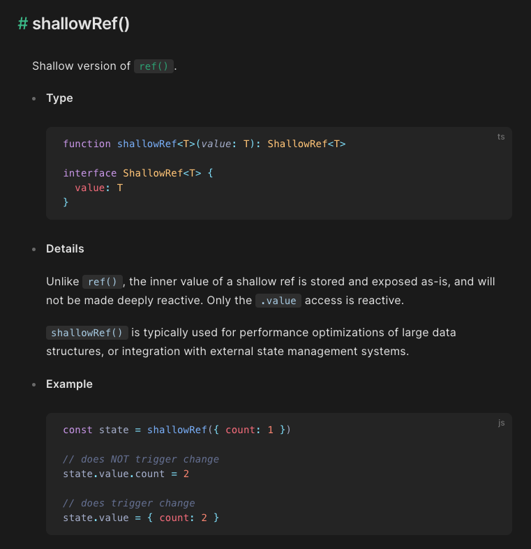

to apply this to an ArcGIS Maps SDK example:

```ts
import { shallowRef, watch } from 'vue'
import Map from '@arcgis/core/Map'
import reactiveUtils from '@arcgis/core/reactiveUtils'

// create shallowRef for map
const map = shallowRef(new Map({ basemap: 'topo-vector' }))

// another map
const map2 = new Map({ basemap: 'dark-gray-vector' })

// does NOT trigger change (use watchUtils instead)
map.value.basemap = 'streets-night-vector'

// DOES trigger change
map.value = map2

// vue watcher
watch(
  ()=> map.value,
  (mp)=> console.log('the map changed!', mp)
)

// arcgis watcher
reactiveUtils.watch(
  ()=> map.value.basemap,
  (basemap)=> console.log("the map's basemap changed: ", basemap)
)
```

#### Create the Map Component

Now we have everything we need to create the mapping component so let's do that now by creating a new `views` folder in `src` and adding a `MapView.vue` component:

```sh
mkdir src/views && touch src/views/MapView.vue
```

And add the following code: 

```vue
<!-- src/views/MapView.vue -->
<script lang="ts" setup>
import { ref, onMounted } from 'vue'
import { useMap } from '@/composables'

const esriMap = ref()

onMounted(()=> {
  const { view, map } = useMap(esriMap.value)
})
</script>

<template>
  <div class="map-wrapper">
    <div id="esri-map" ref="esriMap"></div>
  </div>
</template>

<style lang="scss">
.map-wrapper {
  width: 100%;
  height: calc(100vh - 300px);
}

#esri-map {
  height: 100%;
  width: 100%;
}
</style>
```

For now, this component is pretty lean but that will change as we continue to build the app functionality. First we bring in `ref` and `onMounted` from `vue` and then import our new `useMap` composable. The first thing we need to do is create an empty `ref()` for our `esriMap` container via a [template ref](https://vuejs.org/guide/essentials/template-refs.html) (not to be confused with the [reactivity ref](https://vuejs.org/api/reactivity-core.html#ref)):

```ts
const esriMap = ref()
```

and in the `template` we created a template ref like this:

```vue
<div id="esri-map" ref="esriMap"></div>
```

Template Refs are handy for getting access to any underlying DOM elements and `ref` as an HTML attribute is treated as a special attribute, so if you define a reactivity ref with the same name as the `ref` attribute (`ref="esriMap"`) like `const esriMap = ref()`, the `esriMap` will automatically get bound to our template ref with the matching name. This is important because this is how we will pass a `container` to the `MapView`. One other important distinction is that the setup script (`<script lang="ts" setup>`) has specific lifecycle hooks, and the `<div id="esri-map" ref="esriMap">` is not available in the setup context until the `mounted` lifecycle hook is called. We can get hooks into this easily in the setup context by calling the `onMounted` function:

```ts
onMounted(()=> {
  // the esriMap template ref should exist now
  const { view, map } = useMap(esriMap.value)
})
```

Finally, we just added some styling to make sure our `map-wrapper` element is taking up the full vertical space. We are also leaving room for the timeline slider to go underneath the map by setting the `height` to `calc(100vh - 300px)`. Save and close the `MapView.vue` component.

Now for the moment we have been waiting for, we can finally use our map. To do that, we need to bring it into our `App.vue` component:

```vue
<!-- src/App.vue -->
<script setup lang="ts">
import { useAppStore } from "./stores";
import "@/assets/font-awesome"
import "@/assets/styles/style.scss"
import AppHeader from '@/components/AppHeader.vue'
import MapView from '@/views/MapView.vue'
const appStore = useAppStore()
</script>

<template>
  <div class="app container-fluid">
    <!-- header -->
    <div class="row app-navbar">
      <div class="col px-0">
        <AppHeader />
      </div>
    </div>

    <div class="row main-content-row">
      <!-- left panel -->
      <div 
        v-if="appStore.leftPaneOpen && !appStore.isSmallDevice" 
        class="col-md-3 col-xl-2 border sidebar" 
      >
        sidebar
      </div>

      <!-- main section -->
      <div class="col">
        <MapView />    
      </div>
      
      <!-- right panel -->
      <div 
        v-if="appStore.rightPaneOpen && !appStore.isSmallDevice" 
        class="col-md-3 col-xl-2 border sidebar" 
      >
        sidebar
      </div>
    </div>
  </div>
  
</template>

<style lang="scss">
@import "@/assets/styles/variables";

.main-content-row {
  height: $max-height;
}

.app-navbar {
  height: $navbar-height;
}
</style>
```

Not a lot changed here, we just have imported the `MapView` component and added it into the main section: 

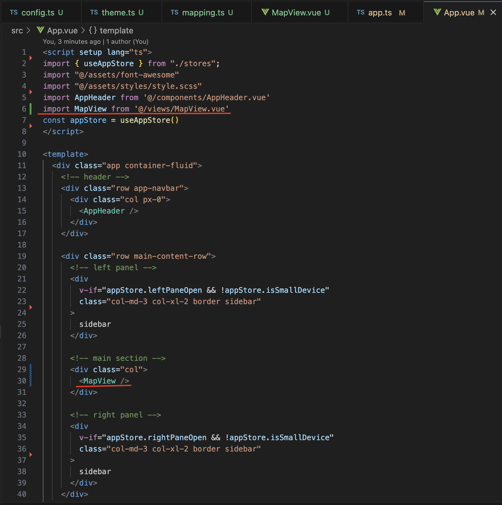

Go ahead and make sure all the files are saved and check to see if we have a map:

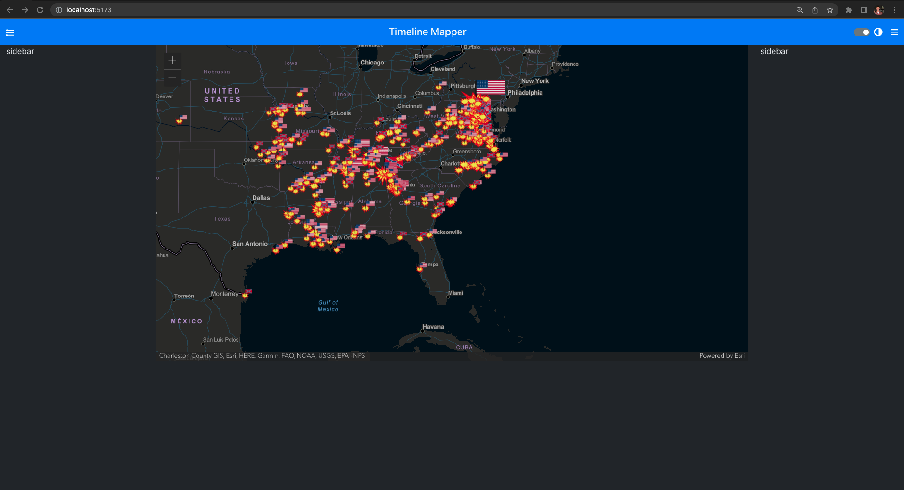

Nice! This is starting to look a little more like our wireframe design concept. Let's make sure our theme changes work:

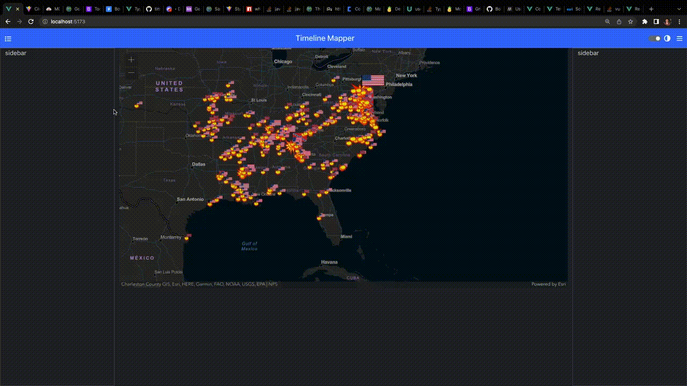

This appears to work well enough, albeit the theme is a bit slow loading sometimes. Speaking of which, we have introduced a performance hit to the initial load of our application because we are importing the `MapView.vue` component into our `App.vue`. While doing this is unavoidable in order to display our map, it would be better if we could [lazy load](https://developer.mozilla.org/en-US/docs/Web/Performance/Lazy_loading) the `MapView` component so other parts of our app can render first. The reason we want to do this is because the ArcGIS Maps SDK is huge, and even though we are currently only using the `WebMap` and `MapView` classes, these have numerous interdependencies. Fortunately these are lazy loaded within the ArcGIS Maps SDK as well, but it still can slow the initial paint of the app. 

Vue provides a nice way to lazy load components out of the box with [defineAsyncComponent](https://vuejs.org/guide/components/async.html#async-components). This handy feature allows you to asynchronously load components or create `async setup()` functions. This is useful if you need to do some pre-processing before you load a component or if you just want to defer the initial loading of the component. Not only does Vue provide that awesome feature, but it also gives you a way out of the box to handle rendering a lazy loaded component with their [Suspense Component](https://vuejs.org/guide/built-ins/suspense.html#suspense). Suspense is very cool because you can pass in any lazy loaded/async components in the default slot, and you can also include a `fallback` slot to render some content while you are waiting for the component to load. This is incredibly useful for showing things like spinners or skeletons. Now we can use these techniques to lazy load our `MapView.vue` Component. Let's refactor `App.vue`.

In the script tag change:

```ts
import MapView from '@/views/MapView.vue'
```

to:

```ts
const MapView = defineAsyncComponent(()=> import('@/views/MapView.vue'))
```
And then wrap the `<MapView />` in `<Suspense>`:

```html
<Suspense>
  <MapView />    
  <template #fallback>
    <div class="w-100 h-100" style="min-height: 700px;">
    loading...
    </div>
  </template>
</Suspense>
```

We also provided a `fallback` template to display `loading...` text. Save `App.vue` and try it out. It may be hard to tell after the first load because the chunks get cached, but if you look in the dev tools of your browser in the network tab, you can see that the `MapView.vue` is loaded after the other components: 

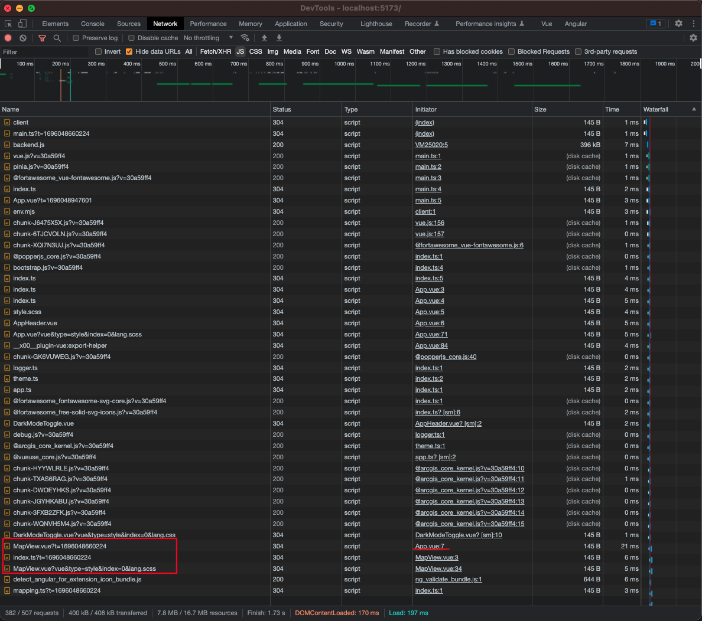

This is much better than if you were to compare where `MapView.vue` is first loaded when do not lazy load:

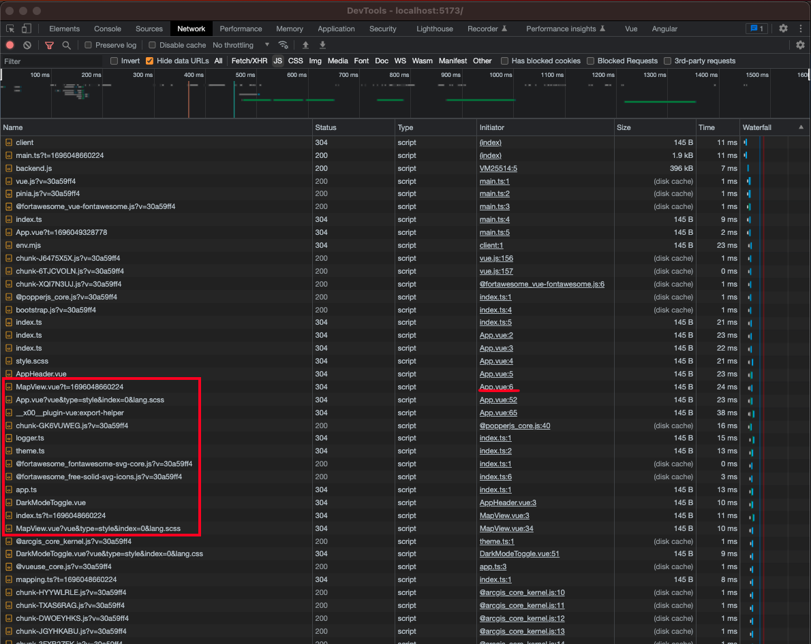

The complete code for `src/App` should now be:

```vue
<!-- src/App.vue -->
<script setup lang="ts">
import { defineAsyncComponent } from "vue";
import { useAppStore } from "./stores";
import "@/assets/font-awesome"
import "@/assets/styles/style.scss"
import AppHeader from '@/components/AppHeader.vue'
const MapView = defineAsyncComponent(()=> import('@/views/MapView.vue'))
const appStore = useAppStore()
</script>

<template>
  <div class="app container-fluid">
    <!-- header -->
    <div class="row app-navbar">
      <div class="col px-0">
        <AppHeader />
      </div>
    </div>

    <div class="row main-content-row">
      <!-- left panel -->
      <div 
        v-if="appStore.leftPaneOpen && !appStore.isSmallDevice" 
        class="col-md-3 col-xl-2 border sidebar" 
      >
        sidebar
      </div>

      <!-- main section -->
      <div class="col">
        <Suspense>
          <MapView />    
          <template #fallback>
              <div class="w-100 h-100" style="min-height: 700px;">
                loading...
              </div>
            </template>
        </Suspense>
      </div>
      
      <!-- right panel -->
      <div 
        v-if="appStore.rightPaneOpen && !appStore.isSmallDevice" 
        class="col-md-3 col-xl-2 border sidebar" 
      >
        sidebar
      </div>
    </div>
  </div>
  
</template>

<style lang="scss">
@import "@/assets/styles/variables";

.main-content-row {
  height: $max-height;
}

.app-navbar {
  height: $navbar-height;
}
</style>
```

#### Adding a Spinner Component

Because we are lazy loading this `MapView` component and will likely do the same for some others, it may be good to create "spinner" component to serve as a loading indicator. We can then swap out the simple `loading...` text in the `<Suspense>` fallback slot for loading the Map View. Create a new `Spinner.vue` file inside the `src/components` folder:

```sh
touch src/components/Spinner.vue
```

Now we can add the code:

```vue
<!-- src/components/Spinner.vue -->
<script lang="ts" setup>
import type { BootstrapColorType } from "@/types";

interface Props {
  message?: string;
  color?: BootstrapColorType;
}

// destructure props with default values
const { message = "Loading...", color = "primary" } = defineProps<Props>();
</script>

<template>
  <div class="spinner-container d-flex flex-column h-100 w-100">
    <div class="d-flex flex-grow-1 justify-content-center align-items-center">
      <div :class="`spinner-border text-${color}`" role="status">
        <span class="visually-hidden">{{ message }}</span>
      </div>
    </div>
  </div>
</template>
```

The first important thing we are doing is creating a `Props` interface to type out the `props` we want to pass to this component. In our case, we just want to be able to pass a color for the spinner and an optional message. One new pattern we are using here is we are destructuring our `props` and setting default values. This new [reactive props destructure](https://blog.vuejs.org/posts/vue-3-3#reactive-props-destructure) is available starting at Vue version `3.3`. This provides a much cleaner syntax over the method in prior versions which would look like this:

```ts
// old way in vue < 3.3
interface Props {
  message?: string;
  /** previously could not use imported types in Props type */
  color?: 'primary'| 'secondary' | 'etc' | '...'
}

const props = withDefaults(
  defineProps<Props>(),
  {
    message: 'Loading...',
    color: 'primary'
  }
)
```

As you can see that syntax is a bit awkward so this is a nice improvement and is made available through the [vue macros](https://vue-macros.sxzz.moe/). The other major improvement is we can now use imported typings in the `Props` interface which would not get properly inferred in prior versions. The last little bit is just the template, which utilizes a simple bootstrap spinner:

```vue
<!-- src/components/Spinner.vue -->
<template>
  <div class="spinner-container d-flex flex-column h-100 w-100">
    <div class="d-flex flex-grow-1 justify-content-center align-items-center">
      <div :class="`spinner-border text-${color}`" role="status">
        <span class="visually-hidden">{{ message }}</span>
      </div>
    </div>
  </div>
</template>
```

Go ahead and save that. As of the time of this writing, you have to explicitly opt in to the allow for the experimental reactive props destructuring. So in order for this to work, will have to configure that in our `vite.config.ts`:

```ts
// vite.config.ts
import { fileURLToPath, URL } from 'node:url'
import { defineConfig } from 'vite'
import vue from '@vitejs/plugin-vue'
import path from 'path'

// https://vitejs.dev/config/
export default defineConfig({
  plugins: [
    vue({
      script: {
        propsDestructure: true
      }
    }),
  ],
  resolve: {
    alias: {
      '@': fileURLToPath(new URL('./src', import.meta.url)),
      '~bootstrap': path.resolve(__dirname, 'node_modules/bootstrap'),
    }
  }
})
```

All we had to do here was add some config options for the `vue` plugin for `vite`, which meant setting `propsDestructure` to `true` in the `script` options. Now that we have the spinner ready, we can go back into our `App.vue` and add use our spinner. First we just need to:

```ts
// src/App.vue
import Spinner from '@/components/Spinner.vue'
```

And then in the template we will add it into the fallback. We should also apply some spacing classes to ensure it is centered:

```vue
<!-- src/App.vue -->
<Suspense>
  <MapView />    
  <template #fallback>
    <div class="w-100 h-100" style="min-height: 700px;">
    <Spinner class="mx-auto my-auto" />
    </div>
  </template>
</Suspense>
```

Go ahead and save that and give it a spin:

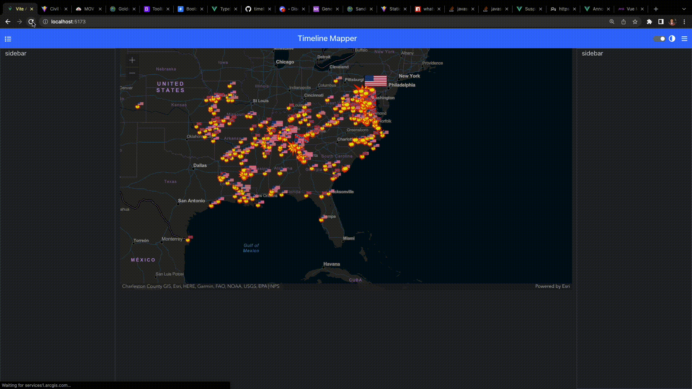

Now that we have our initial map view working, let's move on to [Section 4 - Adding a Color Theme](./04-Add-Color-Theme.md)


