<!-- TOC start (generated with https://github.com/derlin/bitdowntoc) -->

- [Section 4 - Adding a Color Theme](#section-4---adding-a-color-theme)
  - [Creating a `useColorTheme` composable](#creating-a-usecolortheme-composable)

<!-- TOC end -->

# Section 4 - Adding a Color Theme

> note: if you do not want to manually type out all this code, you can just checkout the solution branch by doing:
>  `git checkout 04-add-color-theme`

One piece of our configuration we have defined but not yet implemented is the Color Theme. By allowing a custom color theme, each deployment can be configured to have its own look and feel. As a reminder, these are the bootstrap color theme variables we want to override.


Within bootstrap itself, we can use things like `bg-primary` or `bg-<color>` to apply a background color to an element or `text-<color>` to apply a bootstrap theme color to text. If we only had one color theme, the best way to override these is to simply override the variables in a sass file. However, in our case we want to dynamically inject the color theme at runtime based on the provided configuration. One thing we can do inject them as global CSS variables through the `:root` selector. This works because this is how Bootstrap currently is setting colors for everything. You can check this by inspecting the styles used in the dev tools:

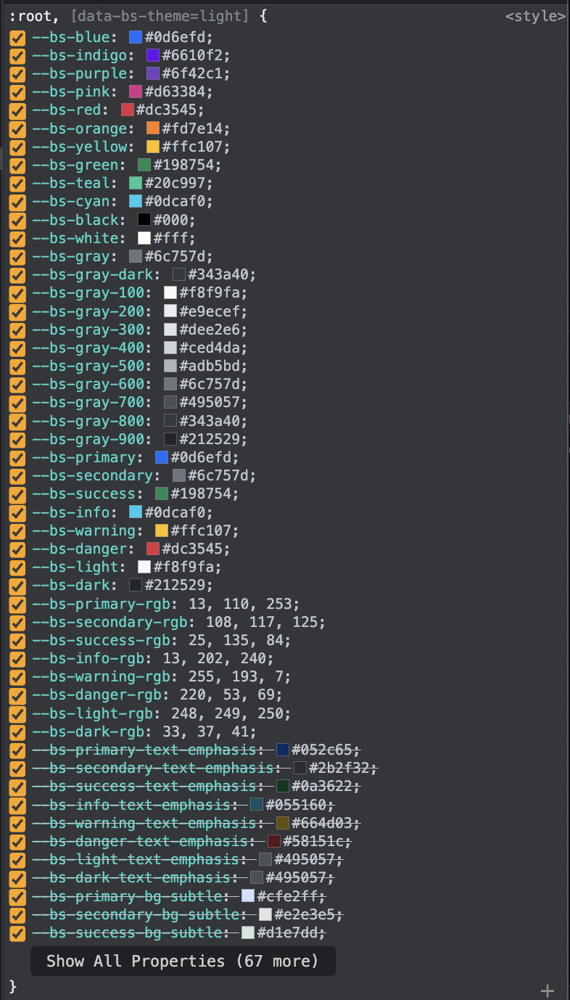

The ones we want to override are the `--bs-primary`, `--bs-secondary`, etc. One thing we can see from the variables bootstrap is using is for the main color theme, they are tracking a color as a hex value and also as rgb (`--bs-primary` and `--bs-primary-rgb`). In order to provide these values in both hex and rgb, we need a way to normalize the colors. There are two useful libraries we can use to do this called [rgb-hex](https://www.npmjs.com/package/rgb-hex) to convert rgb values to hex, and [hex-rgb](https://www.npmjs.com/package/hex-rgb) to handle the inverse. The usage for each is simple:

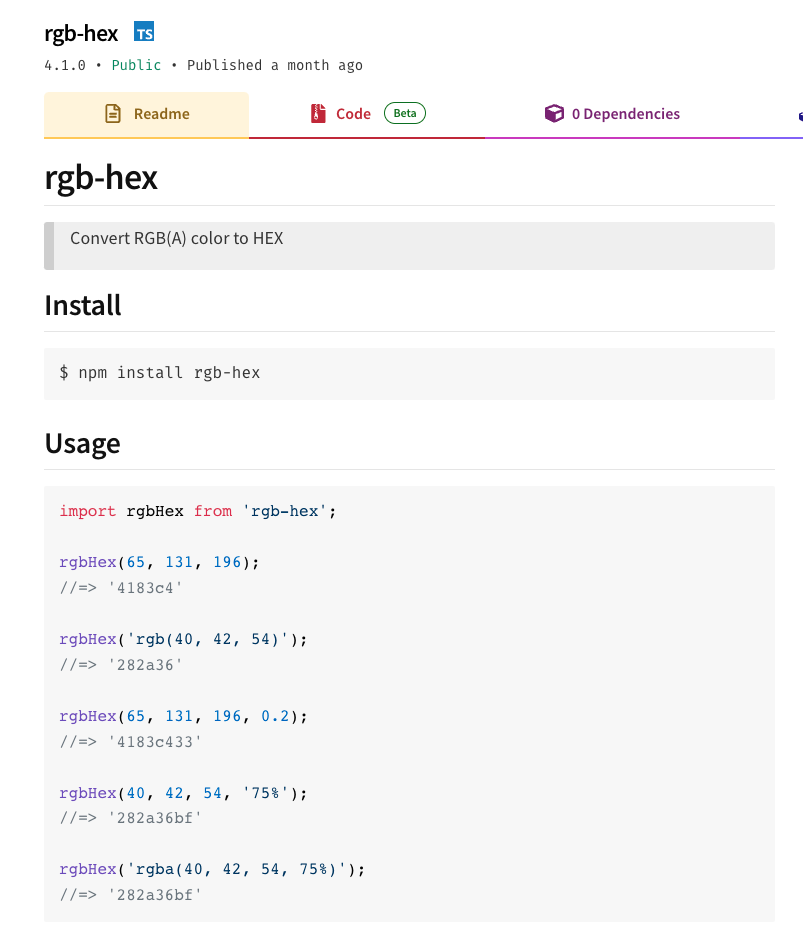

and `hex-rgb`:
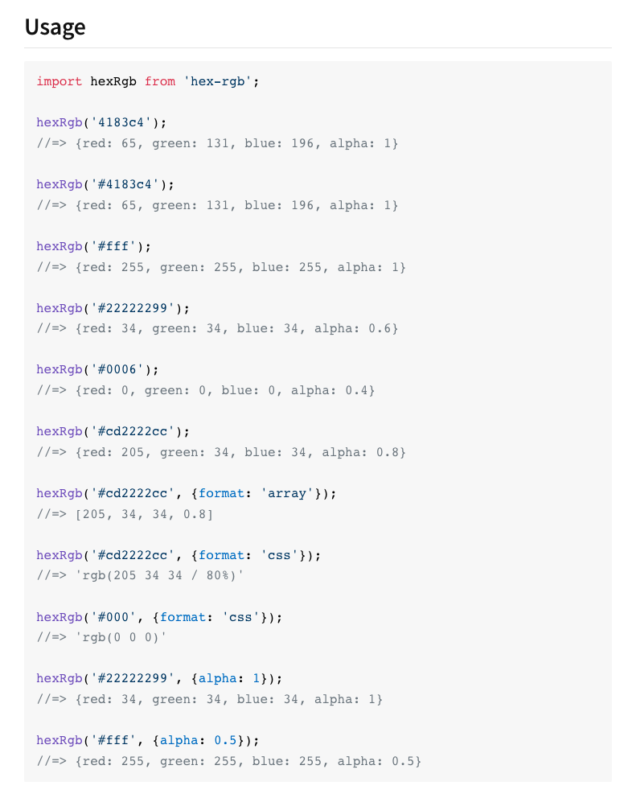

Let's go ahead and install these and start creating some color helper utilities:

```sh
npm i hex-rgb rgb-hex
```

Now create a new file called `src/utils/colors.ts`:

```sh
touch src/utils/colors.ts
```

Add the following code:

```ts
// src/utils/colors.ts
import rgbHex from 'rgb-hex'
import { 
  type Options as HexRGBOptions, 
  default as hexRgb 
} from 'hex-rgb'

// see https://stackoverflow.com/a/63856391/3005089
const HEX_REGEX = /#[a-f\d]{3}(?:[a-f\d]?|(?:[a-f\d]{3}(?:[a-f\d]{2})?)?)\b/i;
const RGB_REGEX = /^rgb\((0|255|25[0-4]|2[0-4]\d|1\d\d|0?\d?\d),(0|255|25[0-4]|2[0-4]\d|1\d\d|0?\d?\d),(0|255|25[0-4]|2[0-4]\d|1\d\d|0?\d?\d)\)$/
const RGBA_REGEX = /^rgba\((0|255|25[0-4]|2[0-4]\d|1\d\d|0?\d?\d),(0|255|25[0-4]|2[0-4]\d|1\d\d|0?\d?\d),(0|255|25[0-4]|2[0-4]\d|1\d\d|0?\d?\d),(0|0?\.\d|1(\.0)?)\)$/

/**
 * returns true if the color string is in hex format
 * @param cs - the color string to check
 * @returns true if the color string is in hex format
 */
export const isHexString = (cs: string) => HEX_REGEX.test(cs)

/**
 * returns true if the color string is in rgb or rgba format
 * @param cs - the color string to check
 * @returns true if the color string is in rgb or rgba format
 */
export const isRgbLike = (cs: string) => RGB_REGEX.test(cs) || RGBA_REGEX.test(cs)
```

We started off by creating some utilities to detect if a color string is in `hex` or `rgb`, or `rgba` format using some regular expressions I found online and the tests are done through the `isHexString` and `isRgbLike` functions.  

Next, let's add a helper to generate a random color and return it in either rgb or hex format:

```ts
// src/utils/colors.ts  (continued)
/**
 * creates a random number within a given range
 * @param min - the smallest number possible
 * @param max - the max number possible
 * @returns a number between the min and max
 */
const randomNumber = (min=0, max=255) => min + Math.floor(Math.random() * (max - min + 1))

type RandomColorOptions = Pick<HexRGBOptions, 'alpha'> & {
  format: 'hex' | 'rgb'
}
/**
 * generates a random rgb color string
 * @returns an rgb() color string
 */
export const getRandomColor = (options?: RandomColorOptions) => {
  const { alpha, format='hex' } = options ?? {}
  const r = randomNumber(0, 255)
  const g = randomNumber(0, 255)
  const b = randomNumber(0, 255)
  return format === 'hex' 
    ? rgbHex(r, g, b, alpha)
    : alpha ? `rgba(${r},${g},${b},${alpha})`: `rgb(${r},${g},${b})`
}
```

Now let's add the actual functions that will normalize our colors:

```ts
// src/utils/colors.ts (continued)
interface ToColorOptions extends HexRGBOptions {
  /**
   * option to ignore validation error
   */
  ignoreError?: boolean;
}

/**
 * will check a color string and ensure it is in hex format
 * @param cs - the color string
 * @param options - the options for how to handle the color and output
 * @returns the hex string value
 */
export function toHex(cs: string, options?: Omit<ToColorOptions, 'format'>){
  const { ignoreError=false, alpha } = options ?? {}
  if (isRgbLike(cs)){
    return rgbHex(cs)
  }
  if (isHexString(cs)){
    return cs
  }
  if (ignoreError){
    return getRandomColor()
  }
  throw Error(`Invalid color string provided: "${cs}"`)
}

/**
 * will check a color string and ensure that it is in an rgb or rgba format
 * @param cs - the color string
 * @param options - the options for how to handle the color and output
 * @returns the rgb or rgba string value
 */
export function toRGB(cs: string, options: ToColorOptions) {
  const { ignoreError=false, alpha=1, format='array' } = options ?? {}
  if (isHexString(cs)){
    return hexRgb(cs, { alpha, format } as any)
  }
  if (isRgbLike(cs)){
    return cs
  } if (ignoreError){
    return getRandomColor({ format: 'rgb' })
  }
  throw Error(`Invalid color string provided: "${cs}"`)
}
```

The `toHex` function will take in a color string and if it is already in `hex` format, it will return it, otherwise will convert an `rgb(a?)` color string into a `hex` color. The `toRGB` does the opposite in that it will take a color string and convert it to an `rgb` or `rgba` color string. Note that both of these functions accept an `ignoreError` option, which if a valid color cannot be created for some reason a random color will be returned instead. Make sure to export these functions with our `utils` package by doing the following in the `src/utils/index.ts`:

```ts
// src/utils/index.ts
export * from './colors'
export * from './logger'
export * from './theme'
```

## Creating a `useColorTheme` composable

Now that we have the necessary utilities for normalizing and validating colors, we can implement the actual logic to override the bootstrap color theme. Create a new `color-theme.ts` file inside of the `src/composables` folder:

```sh
touch src/composables/color-theme.ts
```

Add the following code:

```ts
// src/composables/color-theme.ts
import type { ColorTheme } from "@/types";
import { log, toHex, toRGB } from "@/utils";

export function useColorTheme(){
  
  const setThemeColors = (theme: ColorTheme)=> {
    const root = document.querySelector(':root') as HTMLElement
    Object.keys(theme).forEach((key)=> {
      // override bootstrap color
      const prop = `--bs-${key}`
      const propRgb = `--bs-${key}-rgb`
      const color = theme[key as keyof ColorTheme]
      if (color){
        root?.style.setProperty(prop, toHex(color, { ignoreError: true }))
        root?.style.setProperty(propRgb, toRGB(color as string, { ignoreError: true, format: 'css' }) as string) 
        log(`set Bootstrap theme color: "${prop}" -> "${color}"`)
      }
    })

    const linkColor = theme.info ?? theme.success
    if (linkColor){
      root?.style.setProperty('--bs-link-color', toHex(linkColor, { ignoreError: true }))
      try {
        root?.style.setProperty('--bs-link-hover-color', toRGB(linkColor, { alpha: 0.7, format: 'css' }) as string) 
      } catch(err){
        console.warn('unable to set link color: ', err)
      }
    }
  }

  return { 
    setThemeColors
  }
}
```

The `setThemeColors` function will take in our color theme map as a parameter and will loop through the keys to create a `hex` version of the color by setting `--bs-${key}` and the `rgb` version by setting `--bs-${key}-rgb`. We are also getting the `root` element and applying overrides to `style` attribute of that element. Finally, we are also overriding the default bootstrap link color, which will come in handy later. Save and close this file. We can make it available as part of our `composables` package by updating the `src/composables/index.ts` file:

```ts
// src/composables/index.ts
export * from './color-theme'
export * from './mapping'
```

Save that file. Now we can test out the color theme by bringing it into our `App.vue` file.

Make the following changes in `App.vue`. First we need to import our `useColorTheme` function and apply it from the config. Update the `<script>` tag to match this:

```vue
<!-- src/App.vue -->
<script setup lang="ts">
import "@/assets/font-awesome"
import "@/assets/styles/style.scss"
import { defineAsyncComponent } from "vue";
import { useAppStore } from "@/stores";
import { useColorTheme } from '@/composables'
import AppHeader from '@/components/AppHeader.vue'
import Spinner from "@/components/Spinner.vue";
const MapView = defineAsyncComponent(()=> import('@/views/MapView.vue'))
const appStore = useAppStore()

const { setThemeColors } = useColorTheme()
setThemeColors(appStore.config.app.theme!)
</script>
```

> note: we also moved the font-awesome and `style.scss` stuff to the very top.

Save it and let's see if it worked. What *should* happen is our navbar background should change to the orange color we provided for the `primary` value of our config:

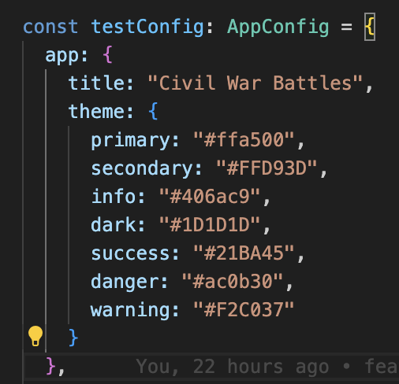

And now if we check the app:

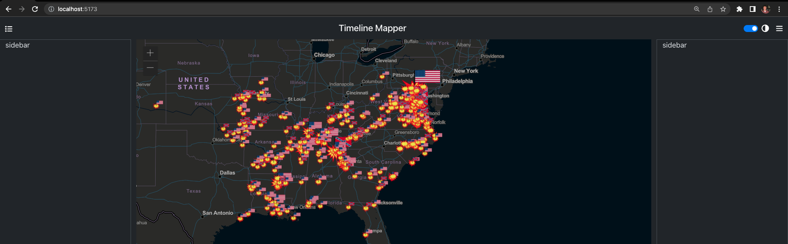

Well that's weird, the navbar went from the default bootstrap `primary` background to now a dark one. Let's check the dev tools to see if our `:root` style variables were applied:

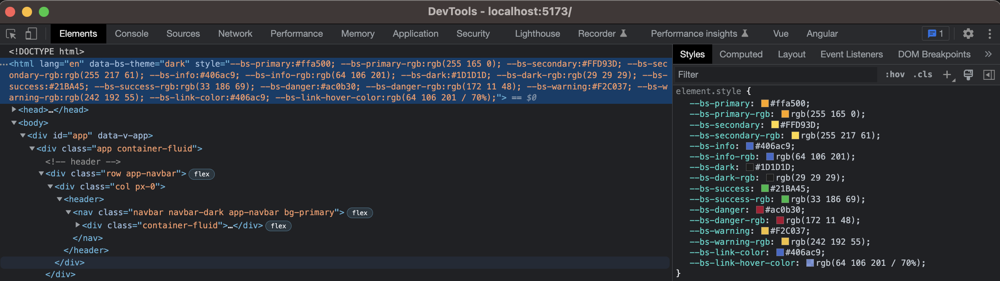

Well, applying the `--bs-${color}` variable overrides seemed to be applied to the `:root`, but what about the `AppHeader` `navbar`?

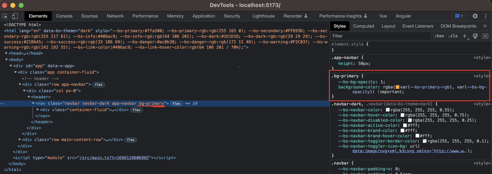

Ok, so we can see here that our `bg-primary` class for the `navbar` seems to be correct and is showing: 

```css
.bg-primary {
  --bs-bg-opacity: 1;
  background-color: rgba(var(--bs-primary-rgb), var(--bs-bg-opacity)) !important;
}
```

So why isn't this working? Honestly, I don't know 🤷‍♀️

What is weird is the dev tools are even previewing the orange color with the variable. Let's check what we are overriding for the `--bs-primary-rgb` variable in the dev tools:

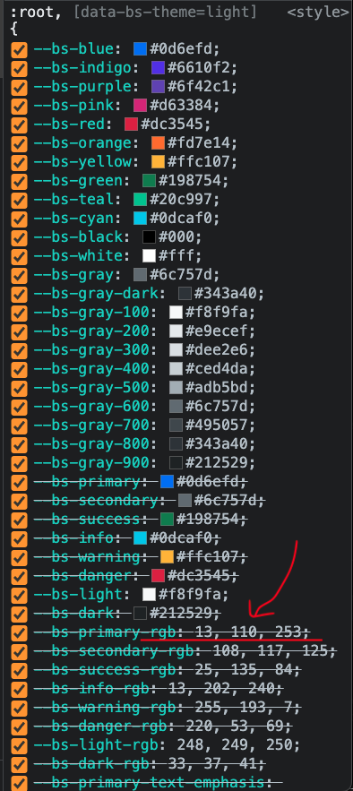

ENHANCE:

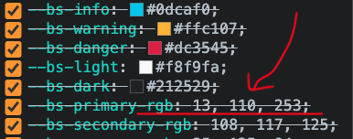

Oh there it is...The format of `--bs-<color>-rgb` needs to be in this format `255, 165, 0`, not `rgb(255 165 0)` like it currently is. It's always the mundane details 🤦‍♂️


Ok, this should be an easy fix. Let's go back into the `src/composables/color-theme.ts` file. We need to change this:

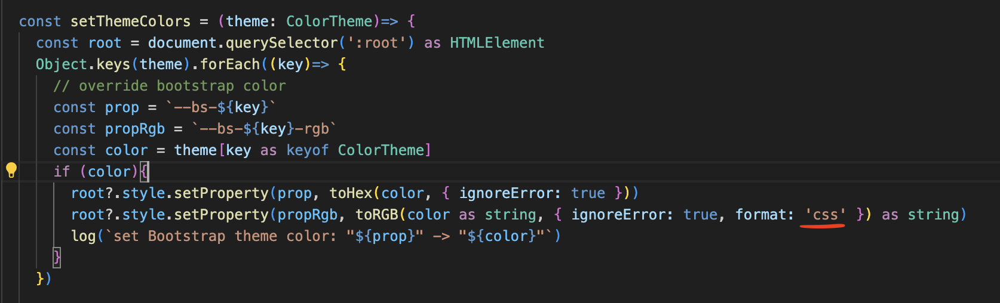

our `toRGB` function allows us to set the `format` for the `rgb` color. One of the options we can use is `array`, which will give us the `rgb` values back as an array like `[255, 165, 0]`. Let's use that to make a fix:

```ts
// src/composables/color-theme.ts
const rgbArray = toRGB(color as string, { 
    ignoreError: true, 
    format: 'array' 
}) as unknown as number[]
const bsRgb = rgbArray.slice(0,3).join(', ')
root?.style.setProperty(propRgb, bsRgb) 
```

One weird thing we had to do here is cast the output of the `toRGB` function `as unknown as number[]` when we changed the `format` to `array`. This basically is telling the TypeScript interpreter "I know you think you know what this type is, but I know better and it is actually this type". That is because the underlying `hexRgb` function has 4 overloads and when the `format` is set to `array` it is returning an `RgbaTuple` type, which is similar to our `number[]`:

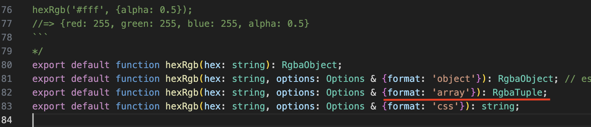

> note: we also are using `rgbArray.slice(0,3)` to get only `r`, `g`, and `b` values because the `--bs-<color>-rgb` variables do not support an `alpha` value. 

So we could do that, or, we could ditch our `toRGB` function in favor of `hexRgb`. The main difference between our `toRGB` and `hexRGB` is `toRGB` does some initial validation by checking if it is a valid hex string first. Since we know we are getting a valid hex from this line right above getting the `rgb` value:

```ts
root?.style.setProperty(prop, toHex(color, { ignoreError: true }))
```

we can simply store the result of our `toHex` function and pass that into `hexRgb` and we don't have to do any TypeScript gymnastics in our `setThemeColors` function:

```ts
// src/composables/color-theme.ts
import hexRgb from 'hex-rgb'

// ... other stuff hidden for brevity

// now in our setThemeColors()
const hex = toHex(color, { ignoreError: true })
root?.style.setProperty(prop, hex)
const rgbArray = hexRgb(hex, { format: 'array' })
const bsRgb = rgbArray.slice(0,3).join(', ')
root?.style.setProperty(propRgb, bsRgb) 
```

This is probably better, let's go with this solution. The entire `src/composables/color-theme.ts` code should now be:

```ts
// src/composables/color-theme.ts
import type { ColorTheme } from "@/types";
import { log, toHex, toRGB } from "@/utils";
import hexRgb from "hex-rgb";

export function useColorTheme(){
  
  const setThemeColors = (theme: ColorTheme)=> {
    const root = document.querySelector(':root') as HTMLElement
    Object.keys(theme).forEach((key)=> {
      // override bootstrap color
      const prop = `--bs-${key}`
      const propRgb = `--bs-${key}-rgb`
      const color = theme[key as keyof ColorTheme]
      if (color){
        const hex = toHex(color, { ignoreError: true })
        root?.style.setProperty(prop, hex)
        const rgbArray = hexRgb(hex, { format: 'array' })
        const bsRgb = rgbArray.slice(0,3).join(', ')
        root?.style.setProperty(propRgb, bsRgb) 
        log(`set Bootstrap theme color: "${prop}" -> "${color}"`)
      }
    })

    const linkColor = theme.info ?? theme.success
    if (linkColor){
      root?.style.setProperty('--bs-link-color', toHex(linkColor, { ignoreError: true }))
      try {
        root?.style.setProperty('--bs-link-hover-color', toRGB(linkColor, { alpha: 0.7, format: 'css' }) as string) 
      } catch(err){
        console.warn('unable to set link color: ', err)
      }
    }
  }

  return { 
    setThemeColors
  }
}
```

Save that file and let's see if that fixed the issue.

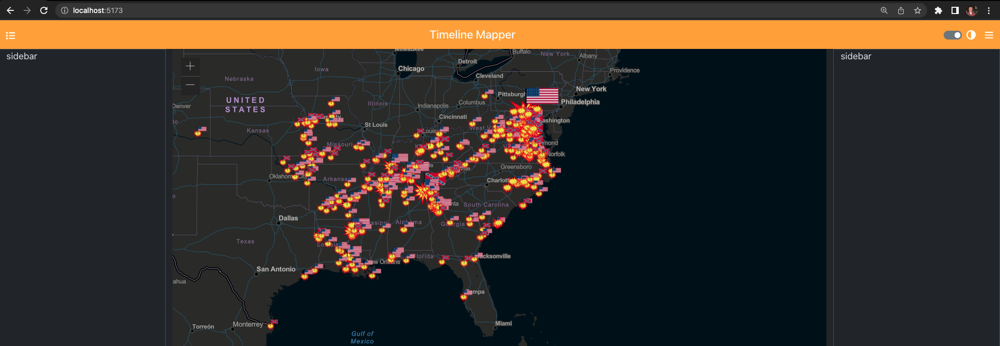

It works!


> Ok, I know I could have spared you the trouble and just not shown that I made that mistake and you would have never known. But making mistakes is part of the development process and I make **a lot** of mistakes. It builds character!


One other thing that is bothering me. Let's change the color of the toggle switch from `$secondary` to use the `--bs-info` color instead, since sometimes the `secondary` color is close to the `primary` color in a color theme. In this case, using `$secondary` is not actually pulling from the theme variables we are overriding because that is actually accessing the bootstrap sass variables. So let's change this in the `src/assets/styles/style.scss` file:

```scss
// src/assets/styles/style.scss
// Import all of Bootstrap's CSS
@import "~bootstrap/scss/bootstrap";

.cursor-pointer, .svg-inline--fa, .form-check-input {
  cursor: pointer !important;
}

// override toggle checked
.form-check-input:checked {
  background-color: var(--bs-info) !important;
  border-color: var(--bs-info) !important;
}
```

Save and close and make sure it worked:

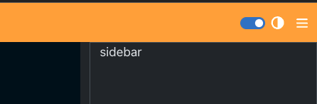

> note - it is kind of hard to tell here, but this kind of looks like the default bootstrap `primary` color, but actually it is using our `info` color of `#406ac9` which is the blue color used for the Union Soldier's uniforms.

Ok, we have succeeded in using our own color theme (we will use some of the others later in the app). Now that we have tested out the initial configuration and have things working properly, we still have a big issue which is that the config is hard coded into our `app` store (in `src/stores/app.ts`). This obviously will not work for an app that claims to be "configurable". To implement this, proceed to [Section 5 - Dynamic Configurations](./05-DynamicConfigurations.md)


