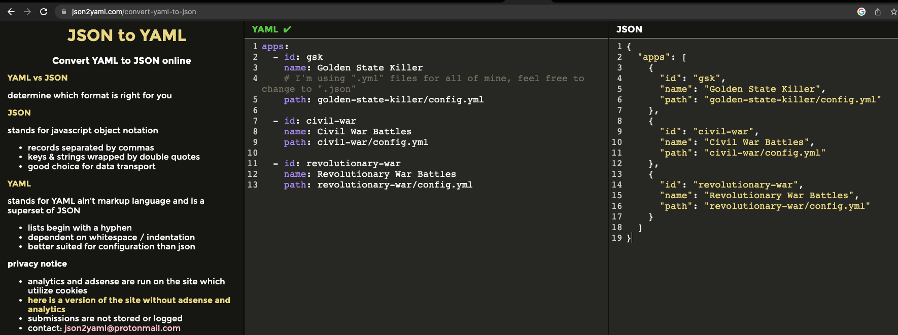
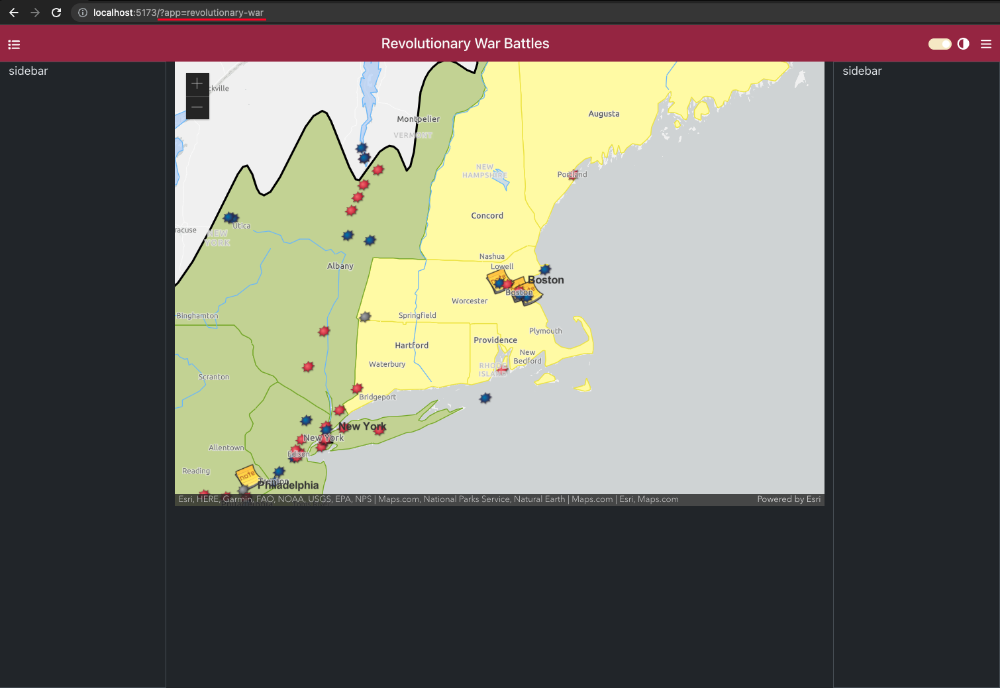

<!-- TOC start (generated with https://github.com/derlin/bitdowntoc) -->

- [Dynamic Configurations](#dynamic-configurations)
  - [Create the Registry File](#create-the-registry-file)
    - [Civil War Config](#civil-war-config)
    - [Golden State Killer Config](#golden-state-killer-config)
    - [Revolutionary War Battles Config](#revolutionary-war-battles-config)
  - [Creating a Config Loader](#creating-a-config-loader)
  - [Optional Section - \* Extra Feature \*](#optional-section----extra-feature-)
    - [How to Handle No Config](#how-to-handle-no-config)

<!-- TOC end -->

#### Copy Source config files

The selection below shows the code to build all the configuration files manually. However, this is tedious so in the interest of time I have provided the solution config files for this section in the [config resources solution folder](https://github.com/Bolton-and-Menk-GIS/configurable-maps-workshop-2023/tree/main/workshop/resources/configs/05_configs) at `workshop/resources/configs/05_configs/config` folder. I would highly recommend that you run the command below to create the entire `config` folder:

```sh
cp -R workshop/resources/configs/05_configs/config/ timeline-mapper/public/config/
```
If you ran this command, just read through the sections on creating the config files. Since you will already have these files, you don't need to do these steps manually.

<!-- TOC --><a name="dynamic-configurations"></a>
# Dynamic Configurations

> note: if you do not want to manually type out all this code, you can just checkout the solution branch by doing:
>  `git checkout 05-dynamic-config`


Now we have to find a way to inject dynamic configuration into our app based on whichever deployment the end user is accessing. Remember, we have 3 webmaps that will be the focal point of each deployment: Civil War Battles, Golden State Killer Crimes, and Revolutionary War Battles. And of course, you can create any number of other deployments that you want.

The simplest way is to store static configuration files. These can be in either `json` or `yaml` format to provide flexibility for the developer to choose which they are more comfortable with. But where should these static files exist? Should they go in the source code? They can, but that comes with a huge caveat which is that any time you add a new configuration for a new deployment or even make changes to an existing one, you would have to rebuild the app to bundle the new configuratoin file(s). This is not ideal, especially because the point of our configuration files/deployments is so we don't have to mess with the source code. The configurations and source code of our app should be independent of each other. So where should these configuration files go?

One option is the `public` folder. This is a spot where you can store static assets such as icons. When you build the app, all of the `index.html`, `js`, and `css` files will get bundled into a `dist` folder (or whatever name you have configured). This `dist` folder will also include anything you had specified in the `public` folder. If we place our configuation files in the public folder, we can decouple them from the app code. And if the app gets built and deployed onto a web server, you can simply go into that server path and add/update configs there and you won't have to rebuild your app. Of course, this has some downsides too in that you can get out of sync with the files on the server and if you're using `git` for source control, you'd want to make sure you also commit your changes there too. But you can at least skip the build step.

Ok, that was a lot of background info, but now we know where to start. Knowing we will be putting the configurations in the `public` folder, we should probably organize the configurations into a logical structure. Maybe something like this:

```
public/
  - config/
    - registry.json # this file will contain the registry of all the available configurations 

    - civil-war/
      - config.json # or config.yml

    - gsk/ 
      - config.json # or config.yml

    - revolutionary-war/
      - config.json # or config.yml
```

> note: `gsk` is short for "golden-state-killer"


Let's go ahead and scaffold this out now:

> **IMPORTANT**: if you ran the command provided above to copy the solution config you can just *read through* this section to see how we would create the files

```sh
mkdir public/config
cd public/config
mkdir civil-war && touch civil-war/config.json civil-war/config.yml
mkdir gsk && touch gsk/config.json gsk/config.yml
mkdir revolutionary-war && touch revolutionary-war/config.json revolutionary-war/config.yml
touch registry.yml
```

Here we just created the folder structure as shown above. Since we can support both `json` and `yaml` configs, we also created one of each for each deployment. Feel free to use whichever you are more comfortable with. I personally prefer `yaml` because it is less typing, but I will also show the JSON equivalent. Use whichever you are more comfortable with. I did make the executive decision to make the `public/registry.yml` as `yaml` because this file will be very little config. Your folder structure should look like this now:


<!-- TOC --><a name="create-the-registry-file"></a>
## Create the Registry File

Let's start with setting up the registry of valid configuration files in the `public/config/registry.yml` file:

```yml
# public/config/registry.yml
apps:
  - id: gsk
    name: Golden State Killer Crimes
    # I'm using ".yml" files for all of mine, feel free to change to ".json"
    path: gsk/config.yml

  - id: civil-war
    name: Civil War Battles
    path: civil-war/config.yml

  - id: revolutionary-war
    name: Revolutionary War Battles
    path: revolutionary-war/config.yml
```

> note: one other thing that makes `yaml` awesome, you can add comments!

As I mentioned, I'll be using `.yml` for each config, but if you prefer `json` files, change the `config.yml` in each deployment to `config.json`. Just know that whichever type you choose is the one you should update because that is the one that will be loaded. And as promised, here is the `json` version of the `registry.yml` if you'd rather go that route:

```json
// public/config/regisry.json
{
  "apps": [
    {
      "id": "gsk",
      "name": "Golden State Killer Crimes",
      "path": "gsk/config.yml"
    },
    {
      "id": "civil-war",
      "name": "Civil War Battles",
      "path": "civil-war/config.yml"
    },
    {
      "id": "revolutionary-war",
      "name": "Revolutionary War Battles",
      "path": "revolutionary-war/config.yml"
    }
  ]
}
```

To manually convert between the two, I am using [json2yaml.com](https://www.json2yaml.com/convert-yaml-to-json):



Each deployment we have registered has 3 properties:

* `id` - the deployment id
* `name` - the deployment name
* `path` - the depolyment path, relative to the `public/config` folder

So if we are initially creating 3 different deployments, how would we load each one? For instance, if as the end user, I wanted to access the Civil War Battles timeline how would I do that? There are many ways you can handle that. You can choose to do that on the server side and set each one to a domain like:

`https://civil-war.my-org.com`
`https://gsk.my-org.com`
`https://revolutionary-war.my-org.com`

That is a valid way to do it, or:

`https://my-org.com/timeline-mapper/civil-war`
`https://my-org.com/timeline-mapper/gsk`
`https://my-org.com/timeline-mapper/revolutionary-war`

However, doing something like that is outside the scope of this workshop and we will not be deploying to any production server. So instead, we will focus on how to do it dynamically from the client side, which is a pattern that could still be utilized for the server style through URL rewrites as an example. What we can do, is specify the app `id` in the url through query parameters (`?app=<app-id>`) like this:

`http://localhost:5173?app=civil-war`
`http://localhost:5173?app=gsk`
`http://localhost:5173?app=revolutionary-war`

And then when deployed to an actual webserver it may look like this:

`https://my-org.com/timeline-mapper?app=civil-war`

Now that we have a plan, let's put it into action and start making some deployments. We already have our initial Civil War config hard coded in our `app` store as `testConfig`. Let's pull that out and add it to the config files:


<!-- TOC --><a name="civil-war-config"></a>
### Civil War Config

```yml
# public/config/civil-war/config.yml
---
app:
  title: Civil War Battles
  theme:
    # note we have to wrap these in quotes because otherwise
    # the hex values would be interpreted as comments in yaml
    primary: "#ffa500"
    secondary: "#FFD93D"
    info: "#406ac9"
    dark: "#1D1D1D"
    success: "#21BA45"
    danger: "#ac0b30"
    warning: "#F2C037"
map:
  defaultDarkBasemapId: streets-night-vector
  defaultLightBasemapId: topo-vector
  webmap:
    portalItem:
      id: 246abd2b6b71403b9edbe6538ebc8534
      portal:
        url: https://bmi.maps.arcgis.com/
  mapView:
    zoom: 4
    center:
    - -79.87481095392569
    - 32.752114229033296
```

and the `json` version:

```json
// public/config/civil-war/config.json
{
  "app": {
    "title": "Civil War Battles",
    "theme": {
      "primary": "#ffa500",
      "secondary": "#FFD93D",
      "info": "#406ac9",
      "dark": "#1D1D1D",
      "success": "#21BA45",
      "danger": "#ac0b30",
      "warning": "#F2C037"
    }
  },
  "map": {
    "defaultDarkBasemapId": "streets-night-vector",
    "defaultLightBasemapId": "topo-vector",
    "webmap": {
      "portalItem": {
        "id": "246abd2b6b71403b9edbe6538ebc8534",
        "portal": {
          "url": "https://bmi.maps.arcgis.com/"
        }
      }
    },
    "mapView": {
      "zoom": 4,
      "center": [
        -79.87481095392569,
        32.752114229033296
      ]
    }
  }
}
```

<!-- TOC --><a name="golden-state-killer-config"></a>
### Golden State Killer Config

Here is the `yaml` config for the `gsk` deployment:

```yml
# public/config/gsk/config.yml
app:
  title: Golden State Killer Crimes
  theme:
    primary: "#741AAC"
    secondary: "#340744"
    info: "#F273E6"
    dark: "#1D1D1D"
    success: "#21BA45"
    danger: "#C10015"
    warning: "#F2C037"
map:
  defaultDarkBasemapId: streets-night-vector
  defaultLightBasemapId: streets-navigation-vector
  webmap:
    basemap: dark-gray-vector
    portalItem: 
      id: 552911b9c87f4ac6b1d40fff31dd4c23
      portal:
        url: https://bmi.maps.arcgis.com/
  mapView:
    zoom: 10
    center:
      - -121.31342930034322
      - 38.58881993999289
```

And the `json` config:

```json
// public/config/gsk/config.json
{
  "app": {
    "title": "Golden State Killer Crimes",
    "theme": {
      "primary": "#741AAC",
      "secondary": "#340744",
      "info": "#F273E6",
      "dark": "#1D1D1D",
      "success": "#21BA45",
      "danger": "#C10015",
      "warning": "#F2C037"
    }
  },
  "map": {
    "defaultDarkBasemapId": "streets-night-vector",
    "defaultLightBasemapId": "streets-navigation-vector",
    "webmap": {
      "basemap": "dark-gray-vector",
      "portalItem": {
        "id": "552911b9c87f4ac6b1d40fff31dd4c23",
        "portal": {
          "url": "https://bmi.maps.arcgis.com/"
        }
      }
    },
    "mapView": {
      "zoom": 10,
      "center": [
        -121.31342930034322,
        38.58881993999289
      ]
    }
  }
}
```

<!-- TOC --><a name="revolutionary-war-battles-config"></a>
### Revolutionary War Battles Config

Here is the `yaml` version of the revolutionary war config:

```yml
# public/config/revolutionary-war/config.yml
app:
  title: Revolutionary War Battles
  theme:
    primary: "#922C40"
    secondary: "#DC9750"
    info: "#F3EAC0"
    dark: "#1D1D1D"
    success: "#21BA45"
    danger: "#C10015"
    warning: "#F2C037"

map:
  webmap:
    basemap: gray-vector
    portalItem: 
      id: 79cd2fca5b0345f8acbedbd3e53a7116
      portal:
        url: https://bmi.maps.arcgis.com/
  mapView:
    zoom: 6
    center:
      - -71.34944000013272
      - 42.4616699997425
```

And the `json` version:

```json
// public/config/revolutionary-war/config.yml
{
  "app": {
    "title": "Revolutionary War Battles",
    "theme": {
      "primary": "#922C40",
      "secondary": "#DC9750",
      "info": "#F3EAC0",
      "dark": "#1D1D1D",
      "success": "#21BA45",
      "danger": "#C10015",
      "warning": "#F2C037"
    }
  },
  "map": {
    "webmap": {
      "basemap": "gray-vector",
      "portalItem": {
        "id": "79cd2fca5b0345f8acbedbd3e53a7116",
        "portal": {
          "url": "https://bmi.maps.arcgis.com/"
        }
      }
    },
    "mapView": {
      "zoom": 6,
      "center": [
        -71.34944000013272,
        42.4616699997425
      ]
    }
  }
}
```

<!-- TOC --><a name="creating-a-config-loader"></a>
## Creating a Config Loader

Ok, that was a bit of work, but we have the starting point for three different deployments. Now we just have to create a simple loader to consume them. Taking one step back and thinking about these config files from the big picture, `json` configs will be natively supported in JavaScript and TypeScript, however, that is not the case for `yaml`. Fear not, `yaml` is really just a superset of `json` and we can use the [js-yaml](https://www.npmjs.com/package/js-yaml) package to convert `yaml` to `json`. Let's go ahead and install that bad boy:

```sh
npm i js-yaml
```

And we will also need a simple utility function to `fetch` the config files. Since we are going to be hosting the config files with our app from the `public` folder, these files will be available through our local dev server and we'll be able to use a relative path: `./config/civil-war/config.json` as an example. Try this in your browser window (you will have to change the port if you are not on `5173`):

[http://localhost:5173/config/civil-war/config.json](http://localhost:5173/config/civil-war/config.json)

If all goes well it should load:


> note: this renders nicely for me because I use the [JSON Formatter](https://chrome.google.com/webstore/detail/json-formatter/bcjindcccaagfpapjjmafapmmgkkhgoa) browser extension.

It is also worth noting you **do not** have to store the config files with the application in the `public` folder. They can be stored anywhere on the web as long as it is accessible to your app, barring any fun stuff like `CORS` issues.

Now that we know an example of the request we must make, let's make a simple `fetch` helper. Inside the `src/utils` folder, create a new file called `fetch.ts`:

> note: don't forget to `cd` out of the `config` folder and back into the project root folder!
> 
```sh
touch src/utils/fetch.ts
```

And add the following code:

```ts
// src/utils/fetch.ts
import yaml from 'js-yaml'

/**
 * will make a fetch request to either a JSON or YAML content type (will also return plain text)
 * @param url - the url to fetch
 * @param init - any additional request options
 * @returns the response, will be typed if a typing is given
 */
export async function fetchJson<T>(url: string, init?: RequestInit): Promise<T> {
  const response = await fetch(url, init)
  const contentType = response.headers.get('content-type')
  if (contentType) {
    if (contentType.includes('application/json')){
      return await response.json() as T
    } else if (/(text\/(x-)?ya?ml|application\/(x-)?ya?ml)/gi.test(contentType)) {
      const text = await response.text()
      return yaml.load(text) as T
    } else {
      return await response.text() as any
    }
  } else {
    const text = await response.text()
    try {
      return JSON.parse(text) as T
    } catch (e) {
      return text as any
    }
  }
}
```

Here we have just created a very thin wrapper around the native browser [fetch API](https://developer.mozilla.org/en-US/docs/Web/API/Fetch_API) to give us a little better TypeScript support by adding the generic `T` type. This is optional, but we can use it cas a specific type the expected server response if we know it is ahead of time. This wrapper will also check the response headers to see if there is a `content-type` (there always should be) and if it is `application/json`, it will return the data as `json` with the type of `T`. Since we want to also support `yaml`, we also added a `content-type` check for `yaml` and if so, use the `js-yaml` package to convert the `yaml` to `json` and return that as type `T`. If it is not `json` or `yaml`, it will just return the regular response content as a `string`.

There is one little problem though. Your IDE may be yelling at you because you're using `js-yaml`:


Ugh, here we go again. Why can't people who write libraries just write them in TypeScript or at the very least include type declaration files? (`.d.ts`)

Thank goodness for [Definitely Typed](https://github.com/DefinitelyTyped/DefinitelyTyped) and the open source community. Fortunately some brave souls have added typings for `js-yaml`. Let's install those now as a dev dependency:

```sh
npm i -D @types/js-yaml
```

Yay, no more error and we now get some beautiful IDE support:


Now export the `fetchJson` function with our `@/utils` package by modifying the `src/utils/index.ts` file:

```ts
// src/utils/index.ts
export * from './colors'
export * from './fetch'
export * from './logger'
export * from './theme'
```

Save and close those files. Now we are almost ready to write our config loader helper, but first we should add a typing for our config registry items. Go into the `src/types/config.ts` file and add the following interfaces:

```ts
// src/types/config.ts

// ... other typings ommited for brevity

/**
 * represents an app deployement configuration within the Config Registry
 */
export interface RegistryItem {
  /** the deployment id */
  id: string;
  /** the deployment name */
  name: string;
  /** 
   * the deployment config file path, can be a full url or a relative
   * path to the public folder
   */
  path: string;
}

/**
 * the Configuration Registry of app deployments
 */
export interface ConfigRegistry {
  /** the registered application deployment configs */
  apps: RegistryItem[];
}
```

We just added two new interfaces to represent what we have in our `registry.yml` file. Now we can create our config loader. We should do this as a composable. Create a new file in the `src/composables` folder called `config.ts`:

```sh
touch src/composables/config.ts
```

And now we can add the following code to `src/composables/config.ts`

```ts
// src/composables/config.ts
import type { AppConfig, RegistryItem, ConfigRegistry } from '@/types'
import { useAppStore } from '@/stores'
import { fetchJson, log } from '@/utils'
import { useColorTheme } from '@/composables'

/**
 * fetches the config appId from the url parameters
 * @returns an appId if one is found
 */
export const getAppId = () => {
  const url = new URL(window.location.href)
  return url.searchParams.get('app')
}

/**
 * helpers for loading configuration files
 */
export const useConfig = () => {

  async function loadConfig(regPath='./config/registry.yml'){
    const appStore = useAppStore()
    let apps = [] as RegistryItem[]
  
    // check for appId in url (?app=<app-id>)
    let appId = getAppId()
  
    try {
  
      const resp = await fetchJson<ConfigRegistry>(regPath)
      apps.push(...resp.apps)
  
    } catch(err){
      console.warn('could not load registry!')
      throw err
    }
  
    const registryItem = apps.find(c => c.id === appId)
  
    if (!registryItem) {
      throw Error('No Configuration Found')
    }
  
     // load the config file, check if it is a relative path or not
    const config = await fetchJson<AppConfig>(
      registryItem.path.startsWith('http') 
        ? registryItem.path
        : `./config/${registryItem.path}`
    )
  
    // set config
    appStore.config = config
  
    // set theme
    if (config.app.theme){
      const { setThemeColors } = useColorTheme()
      setThemeColors(config.app.theme!)
    }
  
    // set document title
    document.title = config.app.title
    log(`successfully loaded application configuration with appId "${appId}": `, config)
    return config
    
  }

  return { 
    getAppId,
    loadConfig
  }
}
```

First, we import the necessary typings and functions. Next we added a function called `getAppId` that will parse the current `url` and check for the presence of an `?app=<some-id>` and return the appId. Next, we are adding the composable called `useConfig` which includes a function called `loadConfig`. This will do the heavy lifting.

The first thing `loadConfig(regPath)` will do is attempt to load the config registry. We have added an optional parameter called `regPath` that is hard coded with the default being `./config/registry.yml` which is the `registry.yml` we have saved in the `public/config` folder. The reason this was added as a parameter is so that if we ever wanted to host the config somewhere else we could pass the registry path in. We could even check for another url parameter for `registry` that would provide a url to a registry file, but that isn't necessary in our case. 

Inside the `loadConfig` function, we are bringing in the `appStore` and loading the registry file using the `fetchJson` function. Notice that we are adding the `AppConfig` type to the function signature so we get a response object with the type `AppConfig`: 


 We also try to get the `appId` and see if the given appId matches something an item from the registry. If so, we will use `fetchJson` again to load the config file at the given path. Since the `registry.yml` file tracks a `path` property that can be any valid url to the `config.yml|json` file, we are checking if the url starts with `http` (to capture `http://` and `https://`) use the full path provided otherwise make it relative from the `public/config` folder:

```ts
// load the config file, check if it is a relative path or not
const config = await fetchJson<AppConfig>(
  registryItem.path.startsWith('http')
    ? registryItem.path
    : `./config/${registryItem.path}`
)
```

Since we have now retrieved the actual config and we are bringing in the `appStore`, we are setting the `config` property in this function. We are also going to set the theme colors here too since that should be applied immediately after the config is loaded:

```ts
// set config
appStore.config = config

// set theme
if (config.app.theme){
    const { setThemeColors } = useColorTheme()
    setThemeColors(config.app.theme!)
}
```

And finally, we are updating the `document.title` with the `config.app.title` and returning the config. To close out the composable, it will return our `loadConfig` and `getAppId` functions. Note that we are also exporting `getAppId` separately so it can be used outside of the composable.

Now let's export the `useConfig` and `getAppId` from the `@/composables` package by altering the `src/composables/index.ts` file:

```ts
// src/composables/index.ts
export * from './color-theme'
export * from './config'
export * from './mapping'
```

Save and close that. So now that we are going to be fetching the configuration dynamically, we need to clean a couple things up. If you recall, in the `App.vue` file we were setting the theme colors there using the `useColorTheme` composable. We no longer need to do that because this is now happening immediately after the config loads in the `loadConfig()` function. Let's remove the lines that have the red line going through them from 'App.vue':


The `<script>` tag code should now be:

```vue
<!-- src/App.vue -->
<script setup lang="ts">
import "@/assets/font-awesome"
import "@/assets/styles/style.scss"
import { defineAsyncComponent } from "vue";
import { useAppStore } from "@/stores";
import AppHeader from '@/components/AppHeader.vue'
import Spinner from "@/components/Spinner.vue";
const MapView = defineAsyncComponent(()=> import('@/views/MapView.vue'))
const appStore = useAppStore()
</script>
```

Save and Close `App.vue`.

One other thing we did in the `loadConfig` function was set the `document.title` to the configured app title. But we never did anything with the hard coded display title of `"Timeline Mapper"` in our `AppHeader.vue` component. Let's fix that now to show the title from the configuration. Inside the `src/components/AppHeader.vue` update the `<template>` to reference the title:


The full `template` code should now be:

```vue
<!-- src/components/AppHeader.vue -->
<template>
  <header>
    <nav :class="`navbar navbar-${appStore.theme} app-navbar bg-primary`">
      <div class="container-fluid">
        <span class="float-right d-flex justify-content-between mt-1">
          <font-awesome-icon 
            v-if="!appStore.isSmallDevice"
            icon="fa-solid fa-list"
            color="white"
            v-popover="{ content: 'toggle timeline list panel' }"
            @click="appStore.togglePanel('left')"
          />
        </span>
        <span class="navbar-brand mb-0 h1 text-light">{{ appStore.config.app.title }}</span>
        
        <span class="float-right d-flex justify-content-between mt-1 align-middle">
          <DarkModeToggle />
          <font-awesome-icon 
            v-if="!appStore.isSmallDevice"
            icon="fa-solid fa-bars"
            color="white"
            class="mt-1 ms-2"
            v-popover="{ content: 'toggle event information panel' }"
            @click="appStore.togglePanel('right')"
          />
        </span>
      </div>
    </nav>
  </header>
</template>
```

We are almost ready to test this out, but first, let's go into the `appStore` in the `src/stores/app.ts` file and remove the hard coded `testConfig` and update the `config` ref:


The full code for the `src/stores/app.ts` file should now be:

```ts
// src/stores/app.ts
import { defineStore } from "pinia"
import { ref, computed, watch, type Ref } from 'vue'
import { useWindowSize } from '@vueuse/core'
import type { ThemeType, DeviceOrientation, AppConfig } from "@/types"
import { setBootstrapTheme, getPreferredTheme } from "@/utils"

export const useAppStore = defineStore('app', ()=> {

  const { width, height } = useWindowSize()

  /**
   *  note: some of the esri typings do not play nicely with TypeScript 5
   * so we are casting the config inside the ref as any
   */
  /**
   * the application config
   */
  const config: Ref<AppConfig> = ref({} as any)
  
  /**
   * will be true if the app is dark mode
   */
  const darkMode = ref(getPreferredTheme() === 'dark')

  // update the bootstrap theme whenever the dark mode changes from the toggle
  watch(
    ()=> darkMode.value,
    (isDark)=> {
      setBootstrapTheme(isDark ? 'dark': 'light')
    },
    // run watch handler immediately
    { immediate: true }
  )

  /**
   * state for the left panel, true when open
   */
  const leftPaneOpen = ref(true)

  /**
   * state for the left panel, true when open
   */
  const rightPaneOpen = ref(true)

   /**
   * the current theme for the app
   */
  const theme = computed<ThemeType>(()=> darkMode.value ? 'dark': 'light')

  /**
   * will toggle a panel in open or closed state, depending on the current open state
   * @param panel - the panel side to toggle
   * @returns the current state of the panel (true is open, false is closed)
   */
  const togglePanel = (panel: 'left' | 'right') => {
    const target = panel === 'left' 
      ? leftPaneOpen
      : rightPaneOpen
    target.value = !target.value
    return target.value
  }

  /**
   * the device orientation
   */
  const orientation = computed<DeviceOrientation>(()=> height.value > width.value ? 'portrait': 'landscape')
  
  // the below properties are based exclusively on the width
  /**
   * will be true when it is a small device (the width is < 577 pixels)
   */
  const isSmallDevice = computed(()=> width.value < 577)

  /**
   * will be true when it is a medium sized device (the width is between 576 and 992 pixels)
   */
  const isMediumDevice = computed(()=> width.value > 576 && width.value < 993)

  /**
   * will be true when it is a large sized device (the width is > 992 < 1201 pixels)
   */
  const isLargeDevice = computed(()=> width.value > 992 && width.value < 1201)

  /**
   * will be true when it is a large sized device (the width is > 992 pixels)
   */
  const isExtraLargeDevice = computed(()=> width.value > 1200)

  return {
    theme,
    config,
    width,
    height,
    orientation,
    isSmallDevice,
    isMediumDevice,
    isLargeDevice,
    isExtraLargeDevice,
    darkMode,
    leftPaneOpen,
    rightPaneOpen,
    togglePanel
  }
})
```

Ok, we are ready to test this out now. Make sure to save all the files and let's hit our app again to see our dynamic configs load:


Uhh, what happened to our app!? Why is nothing loading? This is expected behavior because we did not pass in an `appId` to tell our application which config file to load. Let's try it again, this time passing in some app ids. First let's try the civil war one we have become so familiar with (adjust port number as needed):

[http://localhost:5173?app=civil-war](http://localhost:5173?app=civil-war)


Alright, we are back in business and our app has loaded. But wait, there's more!


We have other deployments to test! Let's try the Golder State Killer Crimes:

[http://localhost:5173?app=gsk](http://localhost:5173?app=gsk)

If everything is correct, you should see a new deployment we haven't seen yet:


And there's still more! Now let's test the Revolutionary War deployment:

[http://localhost:5173?app=revolutionary-war](http://localhost:5173?app=revolutionary-war)

If everything is correct, you should see this:



And there you have it. Three different deployments of an app that looks similar, yet slightly different with the different color schemes and map data. Now you can see how easy it will be to add as many deployments of this as we want.


Ok, maybe this isn't that exciting or ground breaking, but it sure beats hard coding stuff.


With that, we have the core functionality done for loading different configurations. There is one thing we could do to improve this that is entirely optional as it is more of a "quality of life" improvement. As we saw from our initial test of loading the app after building our config loader, if you do not provide an `?app=<appId>` in the url, it does not load anything. If you are fine with that, we are ready to proceed to [Section 6 - Adding the Timeline Explorer](./06-AddTimelineExplorer.md). Or if you want to add a prompt to let the end user select a configuration if none is provided, proceed to the **optional** [How to Handle No Config](#how-to-handle-no-config) below.

> note: you can also skip the optional section and pull the finished code from the `05-dynamic-config` branch

<!-- TOC --><a name="optional-section-extra-feature-"></a>
## Optional Section - * Extra Feature *

<!-- TOC --><a name="how-to-handle-no-config"></a>
### How to Handle No Config

Now that we have this working to load different configurations, it may be useful to present the user with some options if they do not supply an appId into the url parameters. In other apps that maybe have sensitive data, you probably wouldn't want to do this, but for this app we are just showing timeline data. Let's add a prompt that will allow the end user to select a configuration option if they don't use an appId.

We could build a modal and do some fancy things, however, I'm lazy and will just use a library to do this. There is a cool package called [Sweet Alert 2](https://sweetalert2.github.io/). This library is handy to create highly configurable alerts, but also includes some nice features. One being that launching the alert will return a `Promise` that will not resolve until the alert is dismissed. This is especially useful because you can have it accept user input and then when the promise resolves decide what to do based on the user input. This is nicer than having to create a variable somewhere in our app to track this worry about the state of an alert or modal.


in this example, we can await and deconstruct the `value` as the name `email` and do something if an email was provided. In our case, we can do something similar in our `loadConfig` function. If a user did not supply a url parameter for the appId, we can simply let them choose one from a drop down and then load the selected config. Let's try it out. First, we should install Sweet Alert:

```sh
npm i sweetalert2
```

Right now, there are only 3 deployments configured. If we end up adding more, it may be a good idea to sort the registry items alphabetically by the `id` property. Let's add a quick utility function to sort an array of objects by a property. This seems like a generic utility and something tells me we will need to create some more generic utility functions in the future. Let's create a new `utils.ts` file in our `src/utils` folder:

```sh
touch src/utils/utils.ts
```

And let's edit this file to create a sorting function:

```ts
// src/utils/utils.ts
/**
 * Returns new array of objects sorted by property
 * @see https://flaviocopes.com/how-to-sort-array-of-objects-by-property-javascript/
 * @param arr - input array to sort
 * @param prop - property to sort by
 * @param order - order asc (ascending, default) or desc (descending)
 */
export function sortByProperty<T>(arr: T[], prop: keyof T, order: 'asc'|'desc' = 'asc'): Array<T> {
  let first = 1
  let second = -1
  if (order == 'desc'){
    first = first * -1
    second = second * -1
  }
  arr.sort((a, b) => (a[prop] > b[prop] ? first : second)) 
  return arr as T[];
}
```

Nothing too fancy here, but we are adding a generic `T` type so our IDE will interpret the sorted array as the same type of objects that were originally passed in. This does a simple sort of an object while allowing you to choose to sort by `asc` for ascending, or `desc` for descending. The other thing of significance from a TypeScript perspective is that the `prop` parameter is cast as a `keyof T`. This is a handy trick to get intellisense for the parameter so it forces you to chose a property that actually will exist within the array of objects. Save and close that file and we should expose it to the `@/utils` package by altering the `src/utils/index.ts` file:

```ts
// src/utils/index.ts
export * from './colors'
export * from './fetch'
export * from './logger'
export * from './theme'
export * from './utils'
```

Save and close this and now let's go back to the `src/composables/config.ts` file to create our helper prompt. Now update the code to add our help prompt:

```ts
// update the imports
import { fetchJson, sortByProperty, log } from '@/utils'
import Swal from 'sweetalert2'
```


first, we updated the imports to include `Swal` from `sweetalert2` and also brought in our `sortByProperty` function from `@/utils`. Next, add this code before we define the `registryItem` variable 


```ts
if (!appId){
    const sortedKeys = sortByProperty(apps, 'name')
    const options = sortedKeys.reduce((o, i) => ({ ...o, [i.id]: i.name }), {})

    // wait for user input to select an app id to load
    const { value, isDismissed } = await Swal.fire({
      icon: 'warning',
      text: 'No Application ID has been provided in the URL. Please   choose one from the drop down below:',
      input: 'select',
      inputOptions: options,
      inputPlaceholder: 'Select an application ID',
      showCancelButton: true
    })
    // set app ID to value
    appId = value

    // use default appID if none selected
    if (!appId || isDismissed){
    log('no application ID was selected, using first available appId')
    appId = apps[0].id
    }

    log('user selected appliation ID: ', appId)
    const url = new URL(window.location.href)
    url.searchParams.append('app', appId)
    const state = { additionalInformation: 'Added Application ID to url'}
    window.history.pushState(state, document.title, url.href)
}

const registryItem = apps.find(c => c.id === appId)
```

The first thing we are doing here is taking the registry items and sorting the list alphabetically using our `sortByProperty` function. Then we take the `options` list and create a new Sweet Alert prompt to gather some input:

```ts
// wait for user input to select an app id to load
const { value, isDismissed } = await Swal.fire({
    icon: 'warning',
    text: 'No Application ID has been provided in the URL. Please   choose one from the drop down below:',
    input: 'select',
    inputOptions: options,
    inputPlaceholder: 'Select an application ID',
    showCancelButton: true
})
```

As you can see above, we added a `select` input and set the `inputOptions` to be our sorted registry items. When the promise resolves, we should get a `value` parameter unless the dialog was dismissed.

Next, we set the `appId` to whatever the user picked, or default to the first config if they dismissed it. Finally, we have this bit of code that will update the browser history state to actually insert the `?app=<selected-id>` into the url parameters and we create an event within the Browser's [History API](https://developer.mozilla.org/en-US/docs/Web/API/History_API) to track our change to the state.

This is kind of tricky adding code to the middle, so here is what the complete code should be for the `src/composables/config.ts` file should be:

```ts
// src/composables/config.ts
import type { AppConfig, RegistryItem, ConfigRegistry } from '@/types'
import { useAppStore } from '@/stores'
import { fetchJson, sortByProperty, log } from '@/utils'
import { useColorTheme } from '@/composables'
import Swal from 'sweetalert2'

/**
 * fetches the config appId from the url parameters
 * @returns an appId if one is found
 */
export const getAppId = () => {
  const url = new URL(window.location.href)
  return url.searchParams.get('app')
}

/**
 * helpers for loading configuration files
 */
export const useConfig = () => {

  async function loadConfig(regPath='./config/registry.yml'){
    const appStore = useAppStore()
    let apps = [] as RegistryItem[]
  
    // check for appId in url (?app=<app-id>)
    let appId = getAppId()
  
    try {
  
      const resp = await fetchJson<ConfigRegistry>(regPath)
      apps.push(...resp.apps)
  
    } catch(err){
      console.warn('could not load registry!')
      throw err
    }

    if (!appId){
      const sortedKeys = sortByProperty(apps, 'name')
      const options = sortedKeys.reduce((o, i) => ({ ...o, [i.id]: i.name }), {})
  
      // wait for user input to select an app id to load
      const { value, isDismissed } = await Swal.fire({
        icon: 'warning',
        text: 'No Application ID has been provided in the URL. Please choose one from the drop down below:',
        input: 'select',
        inputOptions: options,
        inputPlaceholder: 'Select an application ID',
        showCancelButton: true
      })
      // set app ID to value
      appId = value
  
      // use default appID if none selected
      if (!appId || isDismissed){
        log('no application ID was selected, using first available appId')
        appId = apps[0].id
      }
    
      log('user selected appliation ID: ', appId)
      const url = new URL(window.location.href)
      url.searchParams.append('app', appId)
      const state = { additionalInformation: 'Added Application ID to url'}
      window.history.pushState(state, document.title, url.href)
    }
  
    const registryItem = apps.find(c => c.id === appId)
  
    if (!registryItem) {
      throw Error('No Configuration Found')
    }
  
    // load the config file, check if it is a relative path or not
    const config = await fetchJson<AppConfig>(
      registryItem.path.startsWith('http')
        ? registryItem.path
        : `./config/${registryItem.path}`
    )
  
    // set config
    appStore.config = config
  
    // set theme
    if (config.app.theme){
      const { setThemeColors } = useColorTheme()
      setThemeColors(config.app.theme!)
    }
  
    // set document title
    document.title = config.app.title
    log(`successfully loaded application configuration with appId "${appId}": `, config)
    return config
    
  }

  return { 
    getAppId,
    loadConfig
  }
}
```

Save and close all files and let's test this out. Take the `?app=<some-id>` out of the url or just go to:

[http://localhost:5173](http://localhost:5173) to see if it works. If it does, you should be presented with a prompt:


And when you hit the dropdown:


And when you have selected one, it should show what you picked:


Once you hit the `OK` button, it should load the selected config. Also take note that it should have updated your `url` path:


That is helpful for the user. That wraps things up for the config loader. Now we are ready to implement some of the main features of the app, namely adding a slider so we can explore the timeline events. Proceed to [Section 6 - Adding the Timeline Explorer](./06-AddTimelineExplorer.md).
