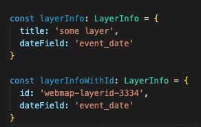

<!-- TOC start (generated with https://github.com/derlin/bitdowntoc) -->

- [Section 6 - Adding the Timeline Explorer](#section-6---adding-the-timeline-explorer)
  - [Identifying the Target Layer](#identifying-the-target-layer)
    - [Updating our Config](#updating-our-config)
  - [Use the Timeline Data](#use-the-timeline-data)
  - [Create the Timeline List](#create-the-timeline-list)
  - [Adding the Feature Widget](#adding-the-feature-widget)
  - [Updating the MapView](#updating-the-mapview)
    - [Updating the Configurations with Timeline Info](#updating-the-configurations-with-timeline-info)
  - [Adding the Timeline Slider](#adding-the-timeline-slider)
    - [Filtering Events with the Slider](#filtering-events-with-the-slider)
    - [Scrolling to the Active Event from Slider](#scrolling-to-the-active-event-from-slider)
      - [Debouncing the Slider updates](#debouncing-the-slider-updates)

<!-- TOC end -->

<!-- TOC --><a name="section-6-adding-the-timeline-explorer"></a>
# Section 6 - Adding the Timeline Explorer

> note: if you do not want to manually type out all this code, you can just checkout the solution branch by doing:
>  `git checkout 06-add-timeline-explorer`


Now that we have our dynamic configurations working to support multiple deployments it's time to add the main part of our app, which is focusing on the timeline side of the data. If we refer back to the wireframe we want to list out all the timeline events in the left panel, show the timeline slider below the map, and show the detailed view of the current event in the right panel:


The only data requirement for this app is that the webmap contains a layer that has features with geometry and an event date attribute. There should also be some sort of field that provides a description of the event. These are things that need to be made configurable since it is highly unlikely the data used for different deployments have the same schema. With that being said, we should add some more config properties. But what do we need to store? For starters, a webmap will often have more than one layer, so we shouldn't do something like look for the first layer in the map. Instead, we should have the deployment config identify a layer from the webmap by either the layer `title` or `id` property.

Deciding on either the `title` or `id` property both have their own pros and cons. Referencing a layer by its `title` can be helpful because sometimes when layers are added to a webmap, the layer `id` could change. The inverse situation is also possible if you happen if the layer gets renamed in the webmap and the configuration does not get updated. I tend to lean with the `title` being a little more stable, but we should leave that decision up to whoever is creating the deployment configurations.

<!-- TOC --><a name="identifying-the-target-layer"></a>
## Identifying the Target Layer

When using the config to find the layer with the timeline events, we need to make some other things configurable. In our wire frame, each event that is listed has an `Event` display name and an optional `Event Subtitle`. Below the map where there is the timeline slider, we have the `Date`, then `Event Name`, the timeline slider, and underneath a brief description. In the right panel, we can show more detailed information about the event. This one is the easy one and we should abstract this one entirely from our config and have that controlled from the WebMap by taking advantage of the [PopupTemplate](https://developers.arcgis.com/javascript/latest/api-reference/esri-PopupTemplate.html) content defined for the layer, particularly through using the [Feature Widget](https://developers.arcgis.com/javascript/latest/api-reference/esri-widgets-Feature.html). 

As for displaying the Event Info, we can allow for [Arcade Expressions](https://developers.arcgis.com/arcade/) in the config to give flexibility for customizing the information being displayed. Now that we have the requirements for specifying the Timeline Event layer, we can create a typing for it in our `src/types/config.ts` file:

```ts
// src/types/config.ts
/**
 * the layer info
 */
export interface LayerInfo {
  /**
   * the layer id
   */
  id?: string;
  /** 
   * the layer title
   */
  title?: string;
  /**
   * properties to apply to the layer at runtime
   */
  options?: __esri.FeatureLayerProperties;
  /**
   * the date field name that contains the timeline event 
   */
  dateField: string;
  /**
   * a query to be applied for fetching the timeline events
   */
  query?: EsriQuery;
}
```

Here we have defined some basic layer info. Since we can find a layer by `id` or `title`, both properties are optional. However, this may not be exactly what we want because while we do want to allow the configuration to call out one of these two properties, the way this currently is the typing will not throw an error if both properties are missing:


In an ideal world, we would want TypeScript to warn of us if we are missing the `id` or `title` property as **at least one of these properties should be required**. So how can we do that? 

There is a handy TypeScript Utility package called [type-fest](https://www.npmjs.com/package/type-fest) which has a helper typing perfect for this exact situation called [RequireAtLeastOne](https://github.com/sindresorhus/type-fest/blob/HEAD/source/require-at-least-one.d.ts) which will help us accomplish exactly what we want to do here. Let's install `type-fest` as a dev dependency:

```ts
npm i -D type-fest
```

> note: we install this as a dev dependency because typings are only used in the development process and when TypeScript is transpiled to JavaScript, any typings are built as declaration files, which are only relevant in an IDE.

Now we can import this into the `src/types/config.ts`:

```ts
// src/types/config.ts
import type { RequireAtLeastOne } from 'type-fest'
```

And then we simply wrap our `LayerInfo` properties in `RequireAtLeastOne` and define `id` and `title` as the two properties where at least one should be required. To make it a little more readable, we can define a `BaseLayerInfo` interface and make a new type for `LayerInfo` that will use `BaseLayerInfo` with `RequireAtLeastOne`:

```ts
// src/types/config.ts

interface BaseLayerInfo {
  /**
   * the layer id
   */
  id?: string;
  /** 
   * the layer title
   */
  title?: string;
  /**
   * properties to apply to the layer at runtime
   */
  options?: __esri.FeatureLayerProperties;
  /**
   * the date field name that contains the timeline event 
   */
  dateField: string;
  /**
   * a query to be applied for fetching the timeline events
   */
  query?: EsriQuery;
}

/**
 * the layer info
 */
export type LayerInfo = RequireAtLeastOne<BaseLayerInfo, 'id' | 'title'>
```

So now TypeScript will yell at us if we try to use this type and do not pass in either `title` or `id` properties:


Here it is yelling at us `title` is missing from our object. Let's make sure it works when we pass in `title` in one typing and `id` in another:



The TypeScript compiler is happy, so we are also happy. Now that we have our `LayerInfo` typing, we should define a `TimelineInfo` type that will combine the basic layer info we need and the timeline specific properties:

```ts
// src/types/config.ts
/**
 * arcade expression options, use this to define a script
 * with a given profile
 */
export interface ArcadeExpressionOptions {
  /**
   * the arcade script code
   */
  arcadeScript: string;
  /**
   * the arcade profile options
   */
  profile?: __esri.Profile
}

/**
 * an arcade expression. Can be a string or contain the {@link ArcadeExpressionOptions}
 */
export type ArcadeExpression = string | ArcadeExpressionOptions;

/** 
 * the timeline information
 */
export interface TimelineInfo {
  /**
   * the event title Arcade Expression which will be the display name in the
   * timeline list. 
   * 
   * This is an  {@link https://developers.arcgis.com/javascript/latest/arcade/ ArcadeExpression} as a string
   */
  titleExpression: string;
  /**
   * the event subtitle which will also be included in timeline list. 
   * 
   * This is an  {@link https://developers.arcgis.com/javascript/latest/arcade/ ArcadeExpression} as a string
   */
  subtitleExpression?: string;
  /**
   * the event description which will appear under the timeline slider. 
   * 
   * This is an  {@link https://developers.arcgis.com/javascript/latest/arcade/ ArcadeExpression} as a string
   */
  descriptionExpression?: string;
  /**
   * the date format to use for displaying event dates
   * 
   *  {@link https://day.js.org/docs/en/parse/string-format#list-of-all-available-parsing-tokens format} Function
   */
  dateFormat?: string;
  /**
   * the target layer info
   * 
   */
  layer: LayerInfo;
}
```

Since we want to use Arcade Expressions to set things like the display title, subtitle, and description we first made an `ArcadeExpression` type, which can be a `string` with an arcade script, or as `ArcadeExpressionOptions` which represents the constructor options for [creating an Arcade executor](https://developers.arcgis.com/javascript/latest/api-reference/esri-arcade.html#createArcadeExecutor). Once those are in place we added the actual `TimelineInfo` interface which includes the arcade expression options, the `dateFormat` for displaying the event dates, and the `LayerInfo` as the `layer` property.

Now that we have the typings for how to identify which map layer has the timeline events we need to think about how the timeline data is going to be used. In our wireframe, we have a list of events in the side panel and then we have a slider underneath the map that can be used to navigate through the event list. Therefore, we will need to store the list of timeline events in our `app` store since the events will be used in multiple spots. Let's create an interface to represent a `TimelineEvent`:

```ts
// src/types/config.ts
/**
 * a timeline event
 */
export interface TimelineEvent {
  /** 
   * the objectId for the timeline event
   */
  objectId: number;
  /**
   * the event display title
   */
  title: string;
  /**
   * the event display subtitle
   */
  subtitle?: string;
  /**
   * the event description
   */
  description: string;
  /**
   * the event date (in milliseconds)
   */
  date: number;
  /**
   * the formatted Event Date
   */
  formattedDate: string;
  /**
   * the [lat, long] coordinates for the event
   */
  lngLat?: [number, number];
}
```

This typing is pretty similar to the `TimelineInfo`, except this will store the results of the arcade expressions for each feature. A few other things that will be included are the `objectId` for the timeline feature, the timeline date (both in `milliseconds` and as the string formatted date). The property is `lngLat` which will represent the coordinate array of the `[latitude, longitude]` of the timeline event. This will be used to update the `MapView.center` property whenever the current event changes. Finally, we need to to add a `timelineInfo` property to the `MapConfig` interface so we can tell our config how to find the timeline event layer:

```ts
/**
 * the map configuration options
 */
export interface MapConfig {
  /**
   * the arcgis {@link https://developers.arcgis.com/javascript/latest/api-reference/esri-WebMap.html WebMap} constructor properties
   */
  webmap: __esri.WebMapProperties;
  /**
   *  {@link https://developers.arcgis.com/javascript/latest/api-reference/esri-views-MapView.html MapView} properties for initial state such as
   * center, scale, etc
   */
  mapView?: __esri.MapViewProperties;
  /**
   * the default basemap id for the light theme
   */
  defaultLightBasemapId?: string;
  /**
   * the default basemap id for the dark theme
   */
  defaultDarkBasemapId?: string;
  /**
   * the timeline info
   */
  timelineInfo: TimelineInfo;
}
```

Save the `config.ts` file. The full contents of `src/types/config.ts` should now be:

```ts
// src/types/config.ts
/// <reference types="../../node_modules/@arcgis/core/kernel.d.ts" />
import type { RequireAtLeastOne } from 'type-fest'
/**
 * the Bootstrap Color Types
 */
export type BootstrapColorType = 
  | 'primary' 
  | 'secondary' 
  | 'info'
  | 'success'
  | 'danger'
  | 'warning'
  | 'light'
  | 'dark'

/**
 * the Color Theme map `{ color-name: color-hex | rgba | sass-variable }`
 */
export type ColorTheme = Partial<Record<BootstrapColorType, string>>;

/**
 * the application information
 */
export interface AppInfo { 
  /** the deployment title */
  title: string;
  /** the color theme */
  theme?: ColorTheme;
}

export type EsriQuery = __esri.Query | __esri.QueryProperties;

interface BaseLayerInfo {
  /**
   * the layer id
   */
  id?: string;
  /** 
   * the layer title
   */
  title?: string;
  /**
   * properties to apply to the layer at runtime
   */
  options?: __esri.FeatureLayerProperties;
  /**
   * the date field name that contains the timeline event 
   */
  dateField: string;
  /**
   * a query to use for fetching the timeline events
   */
  query?: EsriQuery;
}

/**
 * the layer info
 */
export type LayerInfo = RequireAtLeastOne<BaseLayerInfo, 'id' | 'title'>


/**
 * arcade expression options, use this to define a script
 * with a given profile
 */
export interface ArcadeExpressionOptions {
  /**
   * the arcade script code
   */
  arcadeScript: string;
  /**
   * the arcade profile options
   */
  profile?: __esri.Profile
}

/**
 * an arcade expression. Can be a string or contain the {@link ArcadeExpressionOptions}
 */
export type ArcadeExpression = string | ArcadeExpressionOptions

/** 
 * the timeline information
 */
export interface TimelineInfo {
  /**
   * the event title Arcade Expression which will be the display name in the
   * timeline list. 
   * 
   * This is an  {@link https://developers.arcgis.com/javascript/latest/arcade/ ArcadeExpression} as a string
   */
  titleExpression: string;
  /**
   * the event subtitle which will also be included in timeline list. 
   * 
   * This is an  {@link https://developers.arcgis.com/javascript/latest/arcade/ ArcadeExpression} as a string
   */
  subtitleExpression?: string;
  /**
   * the event description which will appear under the timeline slider. 
   * 
   * This is an  {@link https://developers.arcgis.com/javascript/latest/arcade/ ArcadeExpression} as a string
   */
  descriptionExpression?: string;
  /**
   * the date {@link https://day.js.org/docs/en/parse/string-format#list-of-all-available-parsing-tokens format} to use for displaying event dates
   */
  dateFormat?: string;
  /**
   * the target layer info
   * 
   */
  layer: LayerInfo;
}

/**
 * a timeline event
 */
export interface TimelineEvent {
  /** 
   * the objectId for the timeline event
   */
  objectId: number;
  /**
   * the event display title
   */
  title: string;
  /**
   * the event display subtitle
   */
  subtitle?: string;
  /**
   * the event description
   */
  description: string;
  /**
   * the event date (in milliseconds)
   */
  date: number;
  /**
   * the formatted Event Date
   */
  formattedDate: string;
  /**
   * the [lat, long] coordinates for the event
   */
  lngLat?: [number, number];
}

/**
 * the map configuration options
 */
export interface MapConfig {
  /**
   * the arcgis {@link https://developers.arcgis.com/javascript/latest/api-reference/esri-WebMap.html WebMap} constructor properties
   */
  webmap: __esri.WebMapProperties;
  /**
   *  {@link https://developers.arcgis.com/javascript/latest/api-reference/esri-views-MapView.html MapView} properties for initial state such as
   * center, scale, etc
   */
  mapView?: __esri.MapViewProperties;
  /**
   * the default basemap id for the light theme
   */
  defaultLightBasemapId?: string;
  /**
   * the default basemap id for the dark theme
   */
  defaultDarkBasemapId?: string;
  /**
   * the timeline info
   */
  timelineInfo: TimelineInfo;
}

/**
 * the application configuration options
 */
export interface AppConfig { 
  /** 
   * the app information 
   */
  app: AppInfo;
  /** 
   * the map configuration options 
   */
  map: MapConfig;
}

/**
 * represents an app deployement configuration within the Config Registry
 */
export interface RegistryItem {
  /** the deployment id */
  id: string;
  /** the deployment name */
  name: string;
  /** 
   * the deployment config file path, can be a full url or a relative
   * path to the public folder
   */
  path: string;
}

/**
 * the Configuration Registry of app deployments
 */
export interface ConfigRegistry {
  /** the registered application deployment configs */
  apps: RegistryItem[];
}
```

Now that we have some basic typings to work with, lets start with fetching the timeline events. But first, we need to update our config files to apply the new `timelineInfo` property.

<!-- TOC --><a name="updating-our-config"></a>
### Updating our Config

Let's start with the Civil War config. Remember that we need to configure a `titleExpression`, `subtitleExpression`, `descriptionExpression` and the `dateField`. If we look at the [fields](https://bmi.maps.arcgis.com/home/item.html?id=06d5f638e7cb462f9fe665145755a95a&view=table&sortOrder=desc&sortField=defaultFSOrder#data) for the [Civil War FeatureLayer](https://bmi.maps.arcgis.com/home/item.html?id=06d5f638e7cb462f9fe665145755a95a) we can see some fields of interest:


Based on what I saw here, I came up with the following config (yaml):

```yml
map:
  # other stuff hidden for brevity
  timelineInfo:
    titleExpression: $feature.Battle
    subtitleExpression: $feature.Campaign
    descriptionExpression: $feature.Description
    dateFormat: M/D/YYYY
    layer:
      id: 18802125e0d-layer-3
      dateField: Start_Date
```

Because building these configurations is a little tedious, just replace the `timeline-mapper/public/config` folder with the configurations from the [config resources solution folder](https://github.com/Bolton-and-Menk-GIS/configurable-maps-workshop-2023/tree/main/workshop/resources/configs/06_configs) at `workshop/resources/configs/06_config/config` folder: 

```sh
rm -r timeline-mapper/public/config/ && cp -TRv workshop/resources/configs/06_configs/config/ timeline-mapper/public/config/
```


<!-- TOC --><a name="use-the-timeline-data"></a>
## Use the Timeline Data

The first thing we need to do is query the target layer and query the timeline events so they can be displayed. Since we want to make the display properties configurable with Arcade Scripts, we should create some utilities to help us process the events to populate those values. The first one we will need is a simple date formatter function so we can convert the dates returned from the server in `milliseconds` nice human readable dates. We could use Arcade for this, but that seems like overkill when there is the small and flexible library [dayjs](https://day.js.org/docs/en/display/format) that can handle this nicely for us. We can install it with:

```sh
npm i dayjs
```

Now we can add a `formatDate` function. If you do not have a `src/utils/utils.ts` file (this was created in the optional `How to Handle No Config` part of the last section) create it now. Otherwise, edit the `src/utils/utils.ts` file to add our `formatDate` function:

```ts
// src/utils/utils.ts
import dayjs from 'dayjs'
import utc from 'dayjs/plugin/utc'
dayjs.extend(utc)

// default date format
const defaultDateFormat = 'M/D/YYYY'

/**
 * format a date into a human readable string
 * @param d - the input date
 * @param format - the desired {@link https://day.js.org/docs/en/display/format format}
 * @param isUTC - specify if the date is UTC
 * @returns the formatted date string
 * 
 * @example
 * formatDate('2019-01-25', 'DD/MM/YYYY') // '25/01/2019'
 */
export function formatDate(d: Date | number | string, format=defaultDateFormat, isUTC=true){
  return dayjs(d).utc(isUTC).format(format ?? defaultDateFormat)
}

/**
 * BELOW IS PART OF THE OPTIONAL FEATURE FROM THE "How to Handle No Config" portion of Section 5
 */

/**
 * Returns new array of objects sorted by property
 * @see https://flaviocopes.com/how-to-sort-array-of-objects-by-property-javascript/
 * @param arr - input array to sort
 * @param prop - property to sort by
 * @param order - order asc (ascending, default) or desc (descending)
 */
export function sortByProperty<T>(arr: T[], prop: keyof T, order: 'asc'|'desc' = 'asc'): Array<T> {
  let first = 1
  let second = -1
  if (order == 'desc'){
    first = first * -1
    second = second * -1
  }
  arr.sort((a, b) => (a[prop] > b[prop] ? first : second)) 
  return arr as T[];
}
```

The `formatDate` function is pretty straightforward where we can pass it as a date and get a formatted date string back. The other display properties from our `TimelineEvent` that need special treatment is the `title`, `subtitle` and `description`. While often times these may be a single field attribute, we are going to support Arcade Expressions. Prior to ArcGIS Maps SDK for JS version `4.24`, using arcade was only available in things like popups and label expressions. However, now it is available as a module that can be used in isolation to calculate values. Here's an example from the [docs](https://developers.arcgis.com/javascript/latest/api-reference/esri-arcade.html):


This is pretty straightforward and is exactly what we want to do. However, we can save ourselves from having to create so much boilerplate code by creating some helper utilities. Since the `createArcadeExecutor` is an `async` function, it can be a little awkward to work with but wrapping it in a composable function makes sense here.  Create a new file in the `src/composables` folder called `arcade.ts`:

```sh
touch src/composables/arcade.ts
```

And add the following code:

```ts
// src/utils/arcade.ts
import type { ArcadeExpression } from "@/types"
import { createArcadeExecutor } from "@arcgis/core/arcade"

const defaultProfile: __esri.Profile = { 
  variables: [
    {
      name: '$feature',
      type: 'feature'
    }
  ]
}

/**
 * creates an ArcGIS Executor
 * @param arcade 
 * @returns the {@link https://developers.arcgis.com/javascript/latest/api-reference/esri-arcade.html#ArcadeExecutor ArcadeExecutor}
 * 
 * @example
 * // just passing in a string for the script
 * const executor = await = getArcadeExecutor("(($feature.POP_16UP - $feature.EMP_CY) / $feature.POP_16UP) * 100")
 */
export const getArcadeExecutor = async (arcade: ArcadeExpression) => {
  const script = typeof arcade === 'string'
    ? arcade
    : arcade.arcadeScript
  const profile = typeof arcade === 'string' 
    ? defaultProfile
    : arcade.profile ?? defaultProfile
  const executor = await createArcadeExecutor(script, profile)
  return executor
}

/**
 * helper functions for using Arcade Expressions
 * @param arcade - the arcade expression
 * @returns 
 */
export const useArcade = async (arcade: ArcadeExpression) => {

  /**
   * the arcade executor
   */
  const executor = await getArcadeExecutor(arcade)

  /**
   * executes an arcade function for a single feature
   * @param ft - the feature to execute the script against
   * @param executor - the {@link https://developers.arcgis.com/javascript/latest/api-reference/esri-arcade.html#ExecuteContext Arcade Executor} from a compiled script
   * @param context - the {@link https://developers.arcgis.com/javascript/latest/api-reference/esri-arcade.html#ExecuteContext executor context}
   * @returns the result of the arcade executor
   */
  const executeForFeature = <T = any>(ft: __esri.Graphic, context?: __esri.ExecuteContext) => executor.execute({
    '$feature': ft
  }, context) as T
  
  /**
     * helper function to run an arcade script against an array of graphics
     * @param features - the features to run the script against
     * @param executor - the Arcade Executor from a compiled script
     * @param context - the executor context
     * @returns the results of the arcade script for each feature
     */
  const executeForFeatures = async <T = any>(features: __esri.Graphic[], context?: __esri.ExecuteContext): Promise<T[]> => {
    return features.map((feature)=> {
      executor.execute({ 
        '$feature': feature
      }, context)
    }) as T[]
  }

  return {
    executor,
    executeForFeature,
    executeForFeatures,
    execute: executor.execute
  }
}
```

The first thing we did here was create a `defaultProfile` because we are always going to be using the executor functions with a `$feature` context. Next, we have created a function called `getArcadeExecutor` to act as a thin wrapper on the `createArcadeExecutor()` to pass in our `defaultProfile`. This the other benefit is you can just pass in the Arcade script as a string. This function is also exported directly from this module so can be imported separately.

Next, we create the `useArcade` composable function which will first create our `executor` and then use that context to run arcade queries against one feature with the `executeForFeature` or with multiple features with the `executeForFeatures` function. This composable will also expose the `executor` and and a shortcut to the `executor.execute()` method. Now that we have the helper functions we need, we can set up the logic we need to use the timeline events. In the `src/composables` folder, create another new file called `timeline.ts`

```sh
touch src/composables/timeline.ts
```

Let's start with importing our dependencies and then defining some variables to hold the state of our timeline events:

```ts
// src/composables/timeline.ts
import { ref, computed, shallowRef } from "vue"
import { useAppStore } from "@/stores"
import { log, formatDate } from "@/utils"
import type { TimelineEvent, EsriQuery } from '@/types'
import { useArcade } from "./arcade"

/**
 * the list of timeline events
 */
const timelineEvents = shallowRef<TimelineEvent[]>([])

/**
 * the current event index
 */
const eventIndex = ref(0)

/**
 * the current timeline event
 */
const currentEvent = computed(()=> timelineEvents.value[eventIndex.value])

/**
 * is true until events have loaded
 */
const isLoadingEvents = ref(true)

/**
 * option to filter the events to only show events
 * up to the current event
 */
const filterEvents = ref(false)
```

First up is the `timelineEvents`, which will store our list of events. Since the properties inside the individual `timelineEvents` won't be changing, we can maximize performance by storing the `timelineEvents` as a [shallowRef](https://vuejs.org/api/reactivity-advanced.html#shallowref) instead of a normal `ref`. Next, we have defined the active `eventIndex` which is used with the `currentEvent` computed property. Whenever the `eventIndex` changes, the `currentEvent` will automatically update. We defined another property called `isLoadingEvents` which is `true` in its default state and will be set to `false` after events are loaded. We can use this to set spinners for the other spots where the event information needs to be displayed in the app before the events are loaded. Finally, we defined a `filterEvents` property, which we can use to only display events up to the `currentEvent`. This comes into play when using the timeline slider we will build later, where if the events are filtered, only the first event will show up initially, but then as you slide forward in the timeline the other events will pop into the map.

Now let's define our `useTimeline()` composable:

```ts
// src/composables/timeline.ts  (continued)
/**
 * helper functions to use timeline events
 */
export const useTimeline = () => {
  const appStore = useAppStore()

  /**
   * go to the next event
   */
  const nextEvent = ()=> {
    if (eventIndex.value >= timelineEvents.value.length - 1) return;
    eventIndex.value++
  }
  
  /**
   * go to the previous event
   */
  const previousEvent = ()=> {
    if (!eventIndex.value) return;
    eventIndex.value--
  }

  /**
   * 
   * @param script 
   * @returns 
   */

  const getTimelineEvents = async (lyr: __esri.FeatureLayer) => {
    const mapConfig = appStore.config.map
    const { timelineInfo } = mapConfig
    const layerInfo = timelineInfo.layer

    // get the query options
    const queryParams = { 
      where: `${layerInfo.dateField} is not null`,
      ...(layerInfo.query ?? {}) as any,
      outFields: ['*'], 
      returnGeometry: true, 
      orderByFields: [layerInfo.dateField] 
    } as EsriQuery

    const { features } = await lyr.queryFeatures(queryParams)

    /**
     * set layer definition to match the `where` clause so 
     * the timeline event list jives with what is in the map
     */
    lyr.definitionExpression = queryParams.where!
    

    // get executors
    const titleExec = await useArcade(timelineInfo.titleExpression)

    const subTitleExec = timelineInfo.subtitleExpression 
      ? await useArcade(timelineInfo.subtitleExpression)
      : undefined
      
    const descriptionExec = timelineInfo.descriptionExpression 
      ? await useArcade(timelineInfo.descriptionExpression)
      : undefined

    // get timeline events
    log('example feature: ', features[0])
    timelineEvents.value = features
      .filter(f => f.attributes[layerInfo.dateField])
      .map(f => {
        const date = f.attributes[layerInfo.dateField]
        const lngLat: [number, number] | undefined = f.geometry 
          ? f.geometry?.type === 'point'
            // @ts-ignore
            ? [f.geometry.longitude, f.geometry.latitude]
            // @ts-ignore
            : [f.geometry.centroid.longitude, f.geometry.centroid.latitude]
          : undefined
        return {
          date,
          lngLat,
          title: titleExec.executeForFeature(f),
          subtitle: subTitleExec?.executeForFeature(f),
          description: descriptionExec?.executeForFeature(f),
          objectId: f.attributes[lyr.objectIdField],
          formattedDate: formatDate(date, timelineInfo.dateFormat)
        } as TimelineEvent
      })

    isLoadingEvents.value = false
    return features
  }

  return { 
    eventIndex,
    currentEvent,
    timelineEvents,
    filterEvents,
    isLoadingEvents,
    nextEvent,
    previousEvent,
    getTimelineEvents,
  }
}
```

The first thing we do in this function is access our `appStore` which will come in handy soon for accessing the config. Then we defined some helper functions to allow us to navigate to the `nextEvent` and `previousEvent`. These will be used by the arrow buttons on each side of the timeline slider. 

Next, we define the most important function which is the `getTimelineEvents()`. This takes a parameter for the target layer as `lyr` and will call the [queryFeatures()](https://developers.arcgis.com/javascript/latest/api-reference/esri-layers-FeatureLayer.html#queryFeatures) method from the `FeatureLayer`. In order to make the query, we access our configuration for the `TimelineInfo` and `LayerInfo`. If we defined a `query` in the config for the `LayerInfo`, those properties will get mixed into the query options for fetching the timeline events. The other important thing is we are applying the `definitionExpression` on the layer to ensure the timeline events match the features in the map. We are hard coding some overrides so that we can ensure we are fetching the necessary information, namely getting all the fields, returning geometry, and sorting by the `dateField`:

```ts
const { features } = await lyr.queryFeatures({ 
  where: `${layerInfo.dateField} is not null`,
  ...(layerInfo.query ?? {}) as any,
  outFields: ['*'], 
  returnGeometry: true, 
  orderByFields: [layerInfo.dateField] 
})
```

Next, we create some ArcadeExecutors to parse the expressions we will define in the config for setting the event `title`, `subtitle`, and `description` (with the latter two properties being optional, but strongly recommended). In order to populate the `TimelineEvents` from the query results, we iterate over the list of features and run the Arcade Scripts to get the display information. We also extract the `latLng` coordinates by taking the regular `latitude` and `longitude` values if the feature geometry is a `point`, otherwise populate those values from the `centroid` which should exist in all other geometries. Other properties we need to extract are the `objectId` which will get used to [highlight]() the current feature on the map, the `date`, and `formattedDate` which is derived from our `formatDate()` function we defined earlier in the `src/utils/utils.ts`. Finally, we set the `isLoadingEvents.value` to `false` and return the `timelineEvents.value` which is the raw list.

Now that we have created more composables, we need to update our `@/composables` helpers by modifying the `src/composables/index.ts` file to include the new modules:

```ts
// src/composables/index.ts
export * from './arcade'
export * from './color-theme'
export * from './config'
export * from './mapping'
export * from './timeline'
```

<!-- TOC --><a name="create-the-timeline-list"></a>
## Create the Timeline List

Now that we have some helpers to load the timeline events, we should create a simple component to display the timeline events in the left panel like our wireframe shows:


To do this, create we can create a `TimelineListItem.vue` and `TimelineList.vue` component inside the `src/components` folder:

```sh
touch src/components/TimelineListItem.vue src/components/TimelineList.vue
```

We'll start with the child component which will be the `TimelineListItem.vue` component. Open the `src/components/TimelineList.vue` and add the following code for the `<script>` tag:

```vue
<!-- src/components/TimelineListItem.vue  (script)-->
<script lang="ts" setup>
import type { TimelineEvent } from '@/types'

interface Props {
  event: TimelineEvent;
  active: boolean; 
}

// destructure and assign active to false by default
const { event, active=false } = defineProps<Props>()

const emit = defineEmits<{
  'user-clicked-event': [event: TimelineEvent ]
}>()

</script>
```

We aren't doing a whole lot here, just using `defineProps<Props>()` and passing in our `Props` typing to the properties we want to pass into this component. What we will expect from the parent `TimelineList.vue` component we will create next is for that to pass in the `TimelineEvent` with the property name of `event`. The parent component will also pass in the `active` state, which will is `true` when the event is active. When this is destructured, we are also assigning a default value of `false` for the `active` prop:

```ts
// destructure and assign active to false by default
const { event, active=false } = defineProps<Props>()
```

After defining the `props`, we define an event emitter using `defineEmits` while also passing a typing hard coded into the `defineEmits` signature. We are just defining a single event, which is called `user-clicked-event` to notify our parent component that we should switch the active event.

Now we can add our `template`:

```vue
<!-- src/components/TimelineListItem.vue  (template)-->
<template>
  <li 
    :class="{ 'list-group-item-secondary': active }"
    class="list-group-item d-flex justify-content-between align-items-start cursor-pointer"
    @click="emit('user-clicked-event', event)"
  >
    <div class="ms-2 me-auto">
      <a class="link-primary" href="#" :id="`timeline-event-${event.objectId}`">
        {{ event.title }}
      </a>
      <p>{{ event.subtitle }}</p>
      <p class="fst-italic text-secondary" style="font-size: 0.8rem;">{{ event.formattedDate }}</p>
    </div>
  </li>
</template>
```

Here we are just defining an `<li>` element as the root element and assigning some classes. The main thing to take note of here is we are using [css binding](https://vuejs.org/guide/essentials/class-and-style.html) (`:class=`) to assign the `list-group-item-secondary` class when our `active` prop is `true`. You may notice we are also passing in a hard coded `class` attribute in the line below. One nice thing Vue will do for us is merge the attribute value if there are multiple attributes set with the same name, where usually one instance is a reactive binding prefixed with either `:attr-name` or `v-bind:attr-name`. The other important thing we are doing on the `<li>` tag is emitting our `user-clicked-event` event when the `<li>` tag is clicked via the `@click` listener which is shorthand for `v-bind:click`.

Other than that, we are just displaying the event `title` and `subtitle` and the `formattedDate` at the bottom. Save this file. The full code should now be:

```vue
<!-- src/components/TimelineListItem.vue -->
<script lang="ts" setup>
import type { TimelineEvent } from '@/types'

interface Props {
  event: TimelineEvent;
  active: boolean; 
}

// destructure and assign active to false by default
const { event, active=false } = defineProps<Props>()

const emit = defineEmits<{
  'user-clicked-event': [event: TimelineEvent ]
}>()

</script>

<template>
  <li 
    :class="{ 'list-group-item-secondary': active }"
    class="list-group-item d-flex justify-content-between align-items-start cursor-pointer"
    @click="emit('user-clicked-event', event)"
  >
    <div class="ms-2 me-auto">
      <a class="link-primary" href="#" :id="`timeline-event-${event.objectId}`">
        {{ event.title }}
      </a>
      <p>{{ event.subtitle }}</p>
      <p class="fst-italic text-secondary" style="font-size: 0.8rem;">{{ event.formattedDate }}</p>
    </div>
  </li>
</template>
```

Now we are ready to add the parent component which is the `TimelineList.vue` component inside the `src/components` folder. Open that and add the `<script>` tag:

```vue
<!-- src/components/TimelineList.vue -->
<script lang="ts" setup>
import { useTimeline } from '@/composables';
import { log } from '@/utils';
import TimelineListItem from './TimelineListItem.vue';

const { eventIndex, currentEvent, timelineEvents } = useTimeline()

const onEventClick = (index: number) => {
  eventIndex.value = index
  log('user clicked on event: ', currentEvent.value)
}
</script>
```

Here we are bringing in our `TimelineListItem.vue` component and the `useTimeline` composable so we can use the `eventIndex`, `currentEvent`, and `timelineEvents` variables. We are also defining a `onEventClick` handler so that when the user clicks on an event in the left panel, it will emit our `user-clicked-event` event which will invoke this handler which will update the `eventIndex` to update the `currentEvent`.  Now let's set up the `<template>` and `<style>`:

```vue
<!-- src/components/TimelineList.vue  (template and style) -->
<template>
  <ol class="list-group list-group-numbered timeline-event-list p-2">
    <TimelineListItem 
      :key="event.objectId"
      v-for="(event, i) in timelineEvents"
      :active="i === eventIndex"
      :event="event"
      @user-clicked-event="onEventClick(i)"
    />
  </ol>
</template>

<style lang="scss">
@import "../styles/variables";

.timeline-event-list {
  max-height: $max-content-height;
  overflow-y: auto;
}
</style>
```

Here we are creating an ordered list as the root element and applying the `list-group` and `list-group-numbered` classes from Bootstrap. This will make the events look a little nicer and also add a number to each event. Each event itself is represented using our `TimelineListItem.vue` component in a `v-for` iteration on all the `timelineEvents`.  In the `<style>` tag, we are importing our `_variables.scss` file and setting the `$max-content-height` for the `timeline-event-list` class which was also added to the `<ol>` tag. The full component code should be: 

```vue
<!-- src/components/TimelineList.vue -->
<script lang="ts" setup>
import { useTimeline } from '@/composables';
import { log } from '@/utils';
import TimelineListItem from './TimelineListItem.vue';

const { eventIndex, currentEvent, timelineEvents } = useTimeline()

const onEventClick = (index: number) => {
  eventIndex.value = index
  log('user clicked on event')
}
</script>

<template>
  <ol class="list-group list-group-numbered timeline-event-list p-2">
    <TimelineListItem 
      :key="event.objectId"
      v-for="(event, i) in timelineEvents"
      :active="i === eventIndex"
      :event="event"
      @user-clicked-event="onEventClick(i)"
    />
  </ol>
</template>

<style lang="scss">
@import "../assets/styles/variables";

.timeline-event-list {
  max-height: $max-content-height;
  overflow-y: auto;
}
</style>
```


> note: you may have noticed that we are not using the `event` argument that was passed from the `user-clicked-event` component. That is because in our case, since the scope of the `v-for` already is referencing the `index` as `i`, since we just need to update the `eventIndex` in the `onEventClick` handler, we can just pass the index instead to set the value directly.

Now that we have the timeline list component, we can bring it into our `src/App.vue` file. First, we need to import our `useTimeline` functionality and `TimelineList.vue` component in the `<script>` tag:

```vue
<!-- src/App.vue  (script) -->
<script setup lang="ts">
import "@/assets/font-awesome"
import "@/assets/styles/style.scss"
import { defineAsyncComponent } from "vue";
import { useAppStore } from "@/stores";
import { useTimeline } from "@/composables";
import AppHeader from '@/components/AppHeader.vue'
import Spinner from "@/components/Spinner.vue";
import TimelineList from "./components/TimelineList.vue";
const MapView = defineAsyncComponent(()=> import('@/views/MapView.vue'))
const appStore = useAppStore()

const { isLoadingEvents } = useTimeline()
</script>
```


Next, we need to update the `<template>` to add our `TimelineList.vue` component in the left panel. One other thing we haven't talked about much is that we want to display the configured `Popup` content for the timeline layer in the webmap in right panel. We can accomplish this easily using the ArcGIS [Feature Widget](https://developers.arcgis.com/javascript/latest/api-reference/esri-widgets-Feature.html). We will not actually implement that widget in this part of our app, but since the `App.vue` is rendered first, we can place the `container` element for the `Feature` widget in the right panel, which will just be a simple `<div>` element. Update the `<template>` code to be this:

```vue
<!-- src/App.vue  (template) -->
<template>
  <div class="app container-fluid">
    <!-- header -->
    <div class="row app-navbar">
      <div class="col px-0">
        <AppHeader />
      </div>
    </div>

    <div class="row main-content-row">
      <!-- left panel -->
      <div 
        v-if="appStore.leftPaneOpen && !appStore.isSmallDevice" 
        class="col-md-3 col-xl-2 border sidebar" 
      >
        <Spinner v-if="isLoadingEvents" class="mx-auto my-auto"/>
        <TimelineList />
      </div>

      <!-- main section -->
      <div class="col">
        <Suspense>
          <MapView />    
          <template #fallback>
            <div class="w-100 h-100" style="min-height: 700px;">
              <Spinner class="mx-auto my-auto" />
            </div>
          </template>
        </Suspense>
      </div>
      
      <!-- right panel -->
      <div 
        v-if="appStore.rightPaneOpen && !appStore.isSmallDevice" 
        class="col-md-3 col-xl-2 border sidebar" 
      >
          <Spinner v-if="isLoadingEvents" class="mx-auto my-auto"/>
          <div class="feature-container p-2" id="feature-container"></div>
      </div>
    </div>
  </div>
  
</template>
```

One other thing we added to each of the panels is the `<Spinner>` component, which we are conditionally rendering when the `isLoadingEvents` is `true` so that we can see spinners while the events are loaded rather than just empty space. 

<!-- TOC --><a name="adding-the-feature-widget"></a>
## Adding the Feature Widget

In the `src/App.vue` we just created the `container` element for where the `Feature` widget will go to display the full event details. This is a pretty simple task so let's add some code to handle this. In the `src/composables` folder, create a new file called `feature.ts`:

```sh
touch src/composables/feature.ts
```

And add the following code:

```ts
// src/composables/feature.ts
import { nextTick, shallowRef } from "vue";
import { useAppStore } from "@/stores";
import { log } from "@/utils";
import Feature from "@arcgis/core/widgets/Feature";

export const useFeatureWidget = ()=> {
  const appStore = useAppStore()
  const widget = shallowRef<__esri.Feature>()
  const elm = document.getElementById('feature-container') as HTMLDivElement;

  const destroyWidget = ()=> {
    widget.value?.destroy()
    widget.value = undefined
    elm.firstChild?.remove()
  }

  const createFeatureWidget = (graphic?: __esri.Graphic) => {
    log('graphic for feature widget: ', graphic)
   
    if (graphic){
      appStore.rightPaneOpen = true
      
      destroyWidget()

      // create child element for feature widget to go
      const container = document.createElement('div')
      elm.append(container)
      
      // create feature widget for more detailed information
      widget.value = new Feature({
        graphic,
        container
      })
      log('created Feature widget: ', widget.value)
      
    } else {
      const div = document.createElement('div')
      div.classList.add('p-xxl', 'fst-italic', 'fw-light')
      div.textContent = 'No Event Information'
      elm.appendChild(div)
    }
  }

  return { 
    destroyWidget,
    createFeatureWidget
  }
}
```

This one is pretty simple. The `createFeatureWidget` will take in a `graphic` parameter which can be undefined. If the `graphic` exists, the `Feature` widget is created. If not, a simple `<div>` containing the text `No Event Information` is displayed. Save and close this. Now let's export that with our `@/composables` by modifying the `src/composables/index.ts` file again:

```ts
// src/composables/feature.ts
export * from './arcade'
export * from './color-theme'
export * from './config'
export * from './feature'
export * from './mapping'
export * from './timeline'
```

<!-- TOC --><a name="updating-the-mapview"></a>
## Updating the MapView

Now we have everything in place to actually load the timeline events, which we can do in the `src/views/MapView.vue` component. Let's add the following code to the `<script>` tag of the `MapView.vue` component:

```vue
<!-- src/views/MapView.vue  (script) -->
<script lang="ts" setup>
import { ref, onMounted, watch, shallowRef } from 'vue'
import { useAppStore } from '@/stores';
import { useMap, useTimeline, useFeatureWidget } from '@/composables'
import { log } from '@/utils'

const esriMap = ref()
const appStore = useAppStore()

onMounted(async ()=> {
  // the esriMap template ref should exist now
  const { view, map } = useMap(esriMap.value)

  view.when(()=> {
    const layerInfo = appStore.config.map.timelineInfo.layer
    const lyr = map.allLayers.find(l => layerInfo.id ? l.id === layerInfo.id : l.title == layerInfo.title) as __esri.FeatureLayer | undefined;
    
    if (lyr){
      // the highlight handle
      let highlightHandle: IHandle | undefined = undefined
      view.whenLayerView(lyr).then(async (lyrView: __esri.FeatureLayerView)=> {
        const { getTimelineEvents, currentEvent } = useTimeline()
        log('found layer view: ', lyrView)

        // variable to cache the features from our timeline events
        const features = shallowRef<__esri.Graphic[]>([])

        // prepare to create feature widget
        const { createFeatureWidget } = useFeatureWidget()

        /**
         * watch for changes to the current event. When this updates, we
         * want to render a new Feature widget and also highlight the selected
         * event on the map
         */
        watch(
          ()=> currentEvent.value,
          (evt)=> {
            log('on event change:', evt)
            // show detailed feature view
            if (evt.objectId && lyrView){
              // fetch the graphic from our cached features
              const graphic = features.value.find(g => g.getObjectId() === evt.objectId)
              createFeatureWidget(graphic)
  
              // highlight the feature if possible
              highlightHandle?.remove()
              highlightHandle = lyrView.highlight(evt.objectId)
            }

            if (evt?.lngLat){
              view.goTo(evt.lngLat, {
                animate: true,
                duration: 500,
                easing: 'ease-in'
              })
            }
          }
        )

        features.value = await getTimelineEvents(lyr)
        createFeatureWidget(features.value[0])
        log(`fetched ${features.value.length} timeline events`)
      })
    }
  })
})
</script>
```

Ok, so this looks like a lot but it really isn't. The first thing we are doing after our previous code of `useMap` to get the `map` and `view` initialized is we are calling the [view.when()](https://developers.arcgis.com/javascript/latest/api-reference/esri-views-MapView.html#when) method. This will give us a callback that is called once the `MapView` instance is created and ready to use. Once we are inside the `when()` callback, we reference the timeline layer as `lyr` by checking the layers of the `map` to find a layer that matches either the id or title of our `LayerInfo` from our config:

```ts
const lyr = map.allLayers.find(l => layerInfo.id ? l.id === layerInfo.id : l.title == layerInfo.title) as __esri.FeatureLayer | undefined;
```

Since our `map` can have many kinds of layers, we want to force-cast the type to be a `FeatureLayer` since this is needed to support the query operation.


If we do not find the `lyr`, nothing will really happen. Once we have found the `lyr`, we also want to access the [FeatureLayerView](https://developers.arcgis.com/javascript/latest/api-reference/esri-views-layers-FeatureLayerView.html), which represents the client side interactions of the `FeatureLayer` in the `view`. This is responsible for rendering the data and we can also apply [filters](https://developers.arcgis.com/javascript/latest/api-reference/esri-views-layers-FeatureLayerView.html#filter) and client side queries on this data. The main reason we want to access the `lyrView` is so that we can [highlight](https://developers.arcgis.com/javascript/latest/api-reference/esri-views-layers-FeatureLayerView.html#highlight) the graphic for the `currentEvent`. We are storing a `highlghtHandle` variable as well so that every time the `currentEvent` changes we can can remove the last highlighted feature and highlight the the current one. 

Next, we define a `watcher` to react to changes to the `currentEvent`. When this changes, we want to show the `Feature` widget and highlight the feature on the map. The `Feature` widget requires a `Graphic`. We create a `shallowRef` to cache the `features` which is an array of `Graphics` that we will get from our `getTimelineEvents` function. We then use this `features` cache to get the `Graphic` whose `objectId` matches the event `objectId`. The `graphic` gets passed into the `createFeatureWidget` function to display the event details in the right pane, and then the feature on the map is highlighted.

Finally, the timeline features are queried using the `getTimelineEvents(lyr)` where we pass in our `lyr` and populate our list of events. The order here is critical, in that we want to make sure we have our watcher set up before the timeline events are populated so we can catch when the `currentEvent` is updated.

> note: you may be wondering why we use `view.goTo(evt.lngLat)` instead of the `graphic.geometry`. That is because when you go to a `coordinates` array which is what the `evt.lngLat` is, the map center just changes to the given coordinates. Otherwise, if we `goTo` the graphic, it may give the user motion sickness to constantly be zooming in and out of locations, especially if events are changing quickly through the time slider we will create next.


<!-- TOC --><a name="updating-the-configurations-with-timeline-info"></a>
### Updating the Configurations with Timeline Info

Save all the files and we can give this a try. If all went well, we should see something like this:


Try scrolling in and clicking on various timeline events on the left panel to make sure the map updates by highlighting the selected event's `graphic` and right pane is updating the full event info through the `Feature` widget.


Alright, we are almost there with the main parts of the app. Next, we need to add the timeline slider.


<!-- TOC --><a name="adding-the-timeline-slider"></a>
## Adding the Timeline Slider

The last critical piece of our UI is the timeline slider. As shown in our wireframe, this will go below the map and will provide another way for us to navigate through our event timeline. We want to allow the user to be able to use the slider to quickly move through the timeline or use arrow buttons on either side of the timeline to the next or previous event. One other button we want to add is a filter button, which should hide all the events before the `currentEvent`, so as you slide forward in the timeline the other features appear to match the new `currentEvent` timeline. Since we are adding new buttons with icons we do not yet have, we need to update our `src/assets/font-awesome/index.ts` file to register the new icons we will be using:

```ts
// src/assets/font-awesome/index.ts
import { library } from '@fortawesome/fontawesome-svg-core';

import { 
  faBars, 
  faList,
  faFilter,
  faChevronLeft,
  faChevronRight,
  faCircleHalfStroke, 
  faFilterCircleXmark,
} from '@fortawesome/free-solid-svg-icons'

const faIcons = [
  faBars, 
  faList,
  faFilter,
  faChevronLeft,
  faChevronRight,
  faCircleHalfStroke, 
  faFilterCircleXmark,
]

for (const icon of faIcons){
  library.add(icon)
}
```

In the above code, we added the `faFilter` (to enable filter), `faChevronLeft`, `faChevronRight`, and finally `faFilterCircleXmark` (to disable filter). Save and close this file. Let's create the `TimelineSlider.vue` component now:

```sh
touch src/components/TimelineSlider.vue
```

First we'll add a `<script>` tag:

```vue
<!-- src/components/TimelineSlider.vue -->
<script lang="ts" setup>
import { useTimeline } from '@/composables';

const { 
  eventIndex,
  timelineEvents, 
  currentEvent, 
  filterEvents,
  nextEvent, 
  previousEvent 
} = useTimeline()

</script>
```

Wow, that was easy. Here is where we can see the benefits of using composable functions come full circle. The `useTimeline` function contains all the necessary logic for fetching the events, updating the current event, and logic for stepping through events. With that being said, this is mostly just UI work. Add the following `<template>` code:

```vue
<!-- src/components/TimelineSlider.vue  (template)-->
<template>
  <div class="timeline-slider-container border-top p-4">
    <label
      v-if="currentEvent"
      for="timeline-slider"
      class="mb-2 w-100 inline-block text-neutral-700 dark:text-neutral-200"
      >
        <div class="event-title text-center">{{ currentEvent.formattedDate }} - {{ currentEvent.title }}</div>
        <div class="event-subtitle text-center">{{ currentEvent.subtitle }}</div>
      </label
    >
    <div class="slider d-flex justify-content-between">
      <button 
        type="button" 
        class="btn bg-primary btn-circle text-white me-2"
        v-popover="{ content: 'Filter map features by timeline', placement: 'top' }"
        @click="filterEvents = !filterEvents"
      >
      <font-awesome-icon :icon="`fa-solid fa-${filterEvents ? 'filter-circle-xmark': 'filter'}`"></font-awesome-icon>
      </button>

      <button 
        type="button" 
        class="btn bg-primary btn-circle text-white"
        :disabled="eventIndex === 0"
        v-popover="{ content: 'Previous event', placement: 'top' }"
        @click="previousEvent"
      >
        <font-awesome-icon icon="fa-solid fa-chevron-left"></font-awesome-icon>
      </button>
      <input
        v-model.number="eventIndex"
        type="range"
        class="form-range mx-3"
        id="timeline-slider" 
        min="0"
        :max="timelineEvents.length-1"
      />
      <button 
        type="button" 
        class="btn bg-primary btn-circle text-white"
        :disabled="eventIndex === (timelineEvents.length - 1)"
        v-popover="{ content: 'Next event', placement: 'top' }"
        @click="nextEvent"
      >
        <font-awesome-icon icon="fa-solid fa-chevron-right"></font-awesome-icon>
      </button>
    </div>
    <div class="event-info mt-2">
      <div class="description">
        <p>{{ currentEvent?.description }}</p>
      </div>
    </div>
  </div>

</template>
````

The first thing we added is the `<div class="event-title">` element which displays the `formattedDate` and `title` for the current event and then the `subtitle` right below. Next, we define the filter button, `previousEvent` button, the slider, and then the `nextFeature` button. These are important so let's break them down. 

First, the filter button will toggle the `filterEvents` state to `true` or `false` and updates the icon accordingly. Next, we listen for clicks on the back and next button to apply the proper navigation. Also note that we have created an `input` range slider and we have set a `min` value to `0`, and `max` to the number of `timelineEvents - 1`. We then use `v-model` to bind the slider value directly to our `eventIndex` ref so that whenever the user interacts with the slider it will automatically update the `currentEvent`, or if the event was set somewhere else the slider will also be updated to reflect the change without any user interaction. Finally, we'll just add some styling:

```vue
<!-- src/components/TimelineSlider.vue  (style) -->
<style lang="scss">
.timeline-slider-container {
  max-height: 250px;
}

.event-info {
  max-height: 100px;
  overflow-y: auto;
}

.description {
  font-size: 0.9rem;
}
</style>
```

Go ahead and save that file. There are also a couple other styles we should apply globally, one being to override the slider thumb background color, and the other to make our navigation buttons circular rather than squares. Since these are things could be used elsewhere we should store these in our root `style.scss` in the `src/assets/styles/style.scss` file to add the following:

```vue
/** src/assets/styles/style.scss */
.btn-circle {
  height: 1.75rem;
  width: 1.75rem;
  padding: 0 0.25rem !important;
  border-radius: 2em !important;
  text-align: center !important;
}


/** override form range thumb */
$form-range-thumb-bg: var(--bs-info) !important;

.form-range {
  &::-webkit-slider-thumb {
    background-color: var(--bs-info) !important;
     border: white;
     @include border-radius($form-range-thumb-border-radius);
  }
}
```

I think there is an argument to be made that maybe the `.form-range::-webkit-slider-thumb` should be set in our `TimelineSlider.vue` file, however, that would require us to import the bootstrap `sass` mixins there and we already have them imported in our `style.scss` file. Save and close this file. Next we need to bring our `TimelineSlider.vue` component into `MapView.vue`:

```ts
// src/views/MapView.vue  (script)
import Spinner from '@/components/Spinner.vue'
import TimelineSlider from '@/components/TimelineSlider.vue'
```

And then update the `<template>`: 

```vue
<!-- src/views/MapView.vue  (template) -->
<template>
  <div class="map-wrapper">
    <div id="esri-map" ref="esriMap"></div>

    <div class="timeline-container">
      <Spinner v-if="isLoadingEvents" style="min-height: 200px"/>
      <TimelineSlider v-else />
    </div>
  </div>
</template>
```

Here we just check if the events are loading and if so display the spinner component, otherwise display our `TimelineSlider`. At this point, the full `MapView.vue` code should be:

```vue
<!-- src/views/MapView.vue -->
<script lang="ts" setup>
import { ref, onMounted, watch, shallowRef } from 'vue'
import { useAppStore } from '@/stores';
import { useMap, useTimeline, useFeatureWidget } from '@/composables'
import { log } from '@/utils'
import Spinner from '@/components/Spinner.vue';
import TimelineSlider from '@/components/TimelineSlider.vue';

const esriMap = ref()
const appStore = useAppStore()
const { getTimelineEvents, currentEvent, isLoadingEvents } = useTimeline()

onMounted(async ()=> {
  // the esriMap template ref should exist now
  const { view, map } = useMap(esriMap.value)

  view.when(()=> {
    const layerInfo = appStore.config.map.timelineInfo.layer
    const lyr = map.allLayers.find(l => layerInfo.id ? l.id === layerInfo.id : l.title == layerInfo.title) as __esri.FeatureLayer | undefined;
    
    if (lyr){
      // the highlight handle
      let highlightHandle: IHandle | undefined = undefined
      view.whenLayerView(lyr).then(async (lyrView: __esri.FeatureLayerView)=> {
        
        log('found layer view: ', lyrView)

        // variable to cache the features from our timeline events
        const features = shallowRef<__esri.Graphic[]>([])

        // prepare to create feature widget
        const { createFeatureWidget } = useFeatureWidget()

        /**
         * watch for changes to the current event. When this updates, we
         * want to render a new Feature widget and also highlight the selected
         * event on the map
         */
        watch(
          ()=> currentEvent.value,
          (evt)=> {
            log('on event change:', evt)
            // show detailed feature view
            if (evt.objectId){
              // fetch the graphic from our cached features
              const graphic = features.value.find(g => g.getObjectId() === evt.objectId)
              createFeatureWidget(graphic)
  
              // highlight the feature if possible
              highlightHandle?.remove()
              highlightHandle = lyrView.highlight(evt.objectId)
            }

            if (evt?.lngLat){
              view.goTo(evt.lngLat, {
                animate: true,
                duration: 500,
                easing: 'ease-in'
              })
            }
          }
        )

        features.value = await getTimelineEvents(lyr)
        createFeatureWidget(features.value[0])
        log(`fetched ${features.value.length} timeline events`)
      })
    }
  })
})
</script>

<template>
  <div class="map-wrapper">
    <div id="esri-map" ref="esriMap"></div>

    <div class="timeline-container">
      <Spinner v-if="isLoadingEvents" style="min-height: 200px"/>
      <TimelineSlider v-else />
    </div>
  </div>
</template>

<style lang="scss">
.map-wrapper {
  width: 100%;
  height: calc(100vh - 300px);
}

#esri-map {
  height: 100%;
  width: 100%;
}
</style>
```

Save and close all the files and see if you get a result that looks like this:


Now play with the navigation buttons to move through the timeline:


<!-- TOC --><a name="filtering-events-with-the-slider"></a>
### Filtering Events with the Slider

Now that our navigation buttons are working, we should enable the filtering of map features based on the timeline slider. Performing client side filters is best handled using the [filter](https://developers.arcgis.com/javascript/latest/api-reference/esri-views-layers-FeatureLayerView.html#filter) property of the `FeatureLayerView`. When you ad a `filter` to a `FeatureLayerView` only the features that satisfy the filter requirements are displayed in the map. You can query by a `where` clause or `geometry`. Because this filtering happens on the client side using WebGL, the performance is very snappy.

So the functionality that we are looking for here is whenever the timeline slider is updated, we want to filter events that are less than or equal to the current date. This is also dependent on another condition which is if the user has toggled the filter button to enable `filterEvents`. Because we are dealing with two reactive variables and we need to make changes based on one or both conditions changes, we can use a [watchEffect](https://vuejs.org/guide/essentials/watchers.html#watcheffect) to react if either one changes. Whenever there are reactive properties in a `watchEffect`, it will trigger the handler to run. This is nice because this way we don't need to explicitly call out the refs we want it to watch, it will just infer them automatically. Add the following `watchEffect` **after** the existing `watch` function in the `src/views/MapView.vue` and **before** the `getTimelineEvents()` call:

```ts
// src/views/MapView.vue  (script)
watchEffect(()=> {
  if (filterEvents.value && timelineEvents.value.length){
    const queryFrmt = 'YYYY-MM-DD mm:HH:ss'
    const currentEvtDate = formatDate(currentEvent.value.date, queryFrmt)
    // query dates up to the current event date, having some issues with date query so to
    // be sure we are getting the current event also look for that OID
    const where = `${layerInfo.dateField} <= DATE '${currentEvtDate}' OR ${lyr.objectIdField} = ${currentEvent.value.objectId}`
    // @ts-ignore
    lyrView.filter = {
      where
      // this only works for time aware layers
      // timeExtent: {
      //   start: appState.timelineEvents[0]?.date,
      //   end: currentEvent.value?.date ?? appState.timelineEvents[0]?.date
      // }
    } as Partial<__esri.FeatureFilterProperties>
  } else {
    // @ts-ignore
    lyrView.filter = undefined
  }
})
```

Whenever the `watchEffet` is triggered, we are passing a `where` clause into the `filter` property on the layer view to select events with a date <= the current event. I also experienced an issue here with the filter not including the current event, so as a catch all I also added an `OR objectId = currentEvent.objectid`. if the `filterEvents.value` is `false`, the filter is cleared because the user has toggled the button.

The full code for the `src/views/MapView.vue` component should now be:

```vue
<script lang="ts" setup>
import { ref, onMounted, watch, shallowRef, watchEffect } from 'vue'
import { useAppStore } from '@/stores';
import { useMap, useTimeline, useFeatureWidget } from '@/composables'
import { log, formatDate } from '@/utils'
import Spinner from '@/components/Spinner.vue';
import TimelineSlider from '@/components/TimelineSlider.vue';

const sliderIndex = ref(0)
const esriMap = ref()
const appStore = useAppStore()
const { getTimelineEvents, currentEvent, isLoadingEvents, filterEvents, timelineEvents } = useTimeline()

onMounted(async ()=> {
  // the esriMap template ref should exist now
  const { view, map } = useMap(esriMap.value)

  view.when(()=> {
    const layerInfo = appStore.config.map.timelineInfo.layer
    const lyr = map.allLayers.find(l => layerInfo.id ? l.id === layerInfo.id : l.title == layerInfo.title) as __esri.FeatureLayer | undefined;
    
    if (lyr){
      // the highlight handle
      let highlightHandle: IHandle | undefined = undefined
      view.whenLayerView(lyr).then(async (lyrView: __esri.FeatureLayerView)=> {
        
        log('found layer view: ', lyrView)

        // variable to cache the features from our timeline events
        const features = shallowRef<__esri.Graphic[]>([])

        // prepare to create feature widget
        const { createFeatureWidget } = useFeatureWidget()

        /**
         * watch for changes to the current event. When this updates, we
         * want to render a new Feature widget and also highlight the selected
         * event on the map
         */
        watch(
          ()=> currentEvent.value,
          (evt)=> {
            log('on event change:', evt)
            // show detailed feature view
            if (evt.objectId){
              // fetch the graphic from our cached features
              const graphic = features.value.find(g => g.getObjectId() === evt.objectId)
              createFeatureWidget(graphic)
  
              // highlight the feature if possible
              highlightHandle?.remove()
              highlightHandle = lyrView.highlight(evt.objectId)
            }

            if (evt?.lngLat){
              view.goTo(evt.lngLat, {
                animate: true,
                duration: 500,
                easing: 'ease-in'
              })
            }
          }
        )

        watchEffect(()=> {
          if (filterEvents.value && timelineEvents.value.length){
            const queryFrmt = 'YYYY-MM-DD mm:HH:ss'
            const currentEvtDate = formatDate(currentEvent.value.date, queryFrmt)
            // query dates up to the current event date, having some issues with date query so to
            // be sure we are getting the current event also look for that OID
            const where = `${layerInfo.dateField} <= DATE '${currentEvtDate}' OR ${lyr.objectIdField} = ${currentEvent.value.objectId}`
            // @ts-ignore
            lyrView.filter = {
              where
              // this only works for time aware layers
              // timeExtent: {
              //   start: appState.timelineEvents[0]?.date,
              //   end: currentEvent.value?.date ?? appState.timelineEvents[0]?.date
              // }
            } as Partial<__esri.FeatureFilterProperties>
          } else {
            // @ts-ignore
            lyrView.filter = undefined
          }
        })

        features.value = await getTimelineEvents(lyr)
        createFeatureWidget(features.value[0])
        log(`fetched ${features.value.length} timeline events`)
      })
    }
  })
})
</script>

<template>
  <div class="map-wrapper">
    <div id="esri-map" ref="esriMap"></div>

    <div class="timeline-container">
      <Spinner v-if="isLoadingEvents" style="min-height: 200px"/>
      <TimelineSlider v-else @slider-changed="val => sliderIndex = val" />
    </div>
  </div>
</template>

<style lang="scss">
.map-wrapper {
  width: 100%;
  height: calc(100vh - 300px);
}

#esri-map {
  height: 100%;
  width: 100%;
}
</style>
```

Now save the component and let's see the filter in action:


It works! This provides a nice visual for the timeline event interactions.

<!-- TOC --><a name="scrolling-to-the-active-event-from-slider"></a>
### Scrolling to the Active Event from Slider

Things are looking good. However, something that can get lost is the active event in the left pane when we slide to events further down the timeline. We should have the `TimelineList` component scroll to the active event if it is not in the current view frame. This is pretty easy as we can just watch for the `eventIndex` change. Inside the `TimelineList.vue` component update the script tag:

```vue
<!-- src/components/TimelineList.vue  (script) -->
<script lang="ts" setup>
import { watch, nextTick } from 'vue'
import { useTimeline } from '@/composables';
import { log } from '@/utils';
import TimelineListItem from './TimelineListItem.vue';

const { eventIndex, currentEvent, timelineEvents } = useTimeline()

const onEventClick = (index: number) => {
  eventIndex.value = index
  log('user clicked on event')
}

watch(
  ()=> currentEvent.value,
  (event)=> {
    const elm = document.getElementById(`timeline-event-${event?.objectId}`)
    if (elm){
      log('scrolling to active event in timeline list', elm)
      nextTick(()=> elm.scrollIntoView({ behavior: 'smooth', block: 'center' }))
    }
  })
</script>
```

The important piece here is the `watcher` we have set up to react to changes to the `currentEvent`. We gather the target `<li>` element because we have assigned an element ID equal to `timeline-event-{objectId}` to make it easy to find the `TimelineListItem.vue` associated with any event from a `DOM` perspective. Once we have the `elm`, get a hook into the [nextTick](https://vuejs.org/api/general.html#nexttick) to scroll the `TimelineListItem` into view. Go ahead and save this and see if the left pane updates to scroll to the active event when using the slider:


Nice, that works. One issue here is the performance. Using the slider creates a lot of changes to our `eventIndex`, which in turn creates a lot of reactivity action. 

<!-- TOC --><a name="debouncing-the-slider-updates"></a>
#### Debouncing the Slider updates

One thing we can do to improve the performance is to [debounce](https://www.geeksforgeeks.org/debouncing-in-javascript/) reacting to `eventIndex` or `currentEvent` changes so it can only get called once in a given time frame, maybe something like `250` milliseconds. Let's create a simple utility function to `debounce` the slider input. We can add this to our `@/utils` by updating the `src/utils/utils.ts` file to add the following function:

```ts
// src/utils/utils.ts
/**
 * debounce a function
 * 
 * @see https://blog.webdevsimplified.com/2022-03/debounce-vs-throttle/
 *  
 * @param cb - the callback function
 * @param ms - the time to delay in milliseconds
 * @returns 
 */
export function debounce<F extends (...args: any[]) => void>(cb: F, ms = 250) {
  let timeout: NodeJS.Timeout

  return (...args: Parameters<F>) => {
    clearTimeout(timeout)
    timeout = setTimeout(() => {
      cb(...args)
    }, ms)
  }
}
```

This is pretty simple in that it will store the `timeout` variable and clears it before trying to recreate the `setTimeout()` handler. This function may look a little weird with the signature because it is following a `functional` programming pattern where the function you call returns another function. The function that gets returned takes our `cb` function, which is the callback function that we want to debounce. This will get called inside the scope of the `setTimeout()`. Go ahead and save this file. 

There are two spots where we want to apply the `debounce` functionality. The first is in the `TimelineList.vue` component where we are using a watcher to `watch` for changes to the `currentEvent` and then scrolling to that event. If we debounce this, the scrolling will not happen until the `currentEvent` has been dormant for at least `250` milliseconds (or whatever value you want to pass in here). 

Now we can refactor the `TimelineList.vue` component a little bit:

```vue
<!-- src/components/TimelineList.vue  (script)-->
<script lang="ts" setup>
import { watch, nextTick } from 'vue'
import { useTimeline } from '@/composables';
import { log, debounce } from '@/utils';
import TimelineListItem from './TimelineListItem.vue';

const { eventIndex, currentEvent, timelineEvents } = useTimeline()

const onEventClick = (index: number) => {
  eventIndex.value = index
  log('user clicked on event')
}

watch(
  ()=> currentEvent.value,
  debounce((event)=> {
    const elm = document.getElementById(`timeline-event-${event?.objectId}`)
    if (elm){
      log('scrolling to active event in timeline list', elm)
      nextTick(()=> elm.scrollIntoView({ behavior: 'smooth', block: 'center' }))
    }
  })
)
</script>
```

All we have done here is import `debounce` and wrap our `watch` handler in the debounce function since it takes a `callback` function as the first parameter. 

the next spot where we should `debounce` the reactivity on the `currentEvent` is in the `MapView.vue` component where we are watching for the change and then rendering the `Feature` widget and highlighting the `currentEvent` graphic. We apply the same idea here, to just wrap the `watch` handler in `debounce` (don't forget to import `debounce`):

```vue
<!-- src/views/MapView.vue -->
/**
  * watch for changes to the current event. When this updates, we
  * want to render a new Feature widget and also highlight the selected
  * event on the map
  */
watch(
  ()=> currentEvent.value,
  debounce((evt)=> {
    log('on event change:', evt)
    // show detailed feature view
    if (evt.objectId){
      // fetch the graphic from our cached features
      const graphic = features.value.find(g => g.getObjectId() === evt.objectId)
      createFeatureWidget(graphic)

      // highlight the feature if possible
      highlightHandle?.remove()
      highlightHandle = lyrView.highlight(evt.objectId)
    }

    if (evt?.lngLat){
      view.goTo(evt.lngLat, {
        animate: true,
        duration: 500,
        easing: 'ease-in'
      })
    }
  })
)
```

Now if we save this, we can see if the performance is any better.


Now the scrolling right panel `Feature` update do not happen until I stop moving the timeline slider.
